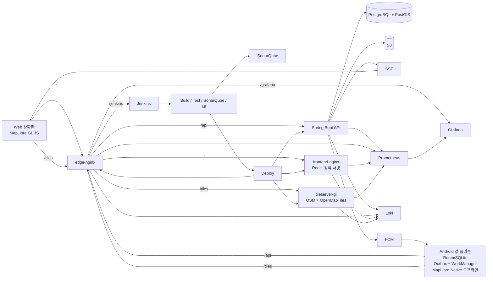

# Suri-Map Architecture

## 0. 문서 정보

- 문서 유형: Architecture Document (SDD: PRD → **Architecture** → Spec → Tasks → TDD)
- 대상 독자: 내부 개발팀 (6명, 풀스택 + Agentic Engineering)
- 작성일: 2026-04-23 (업데이트 2026-04-27, PRD v3 및 ADR archive 분리 반영)
- 상위 문서: [prd.md](./prd.md)
- 결정 근거: [adr.md](./adr.md)
- 기준 문서: [2026-04-15_requirements_definition.md](./2026-04-15_requirements_definition.md)
- 기준 인터뷰: [2026-04-24_police_in_person_interview.md](./2026-04-24_police_in_person_interview.md)

## 1. 시스템 개요

Suri-Map은 도심·도심 외곽·논밭·하천·산악 등 실종 수색 현장에서 지구대/파출소, 실종팀, 기동대 등 수색 참여자가 경로와 확인 구역을 공유하는 경찰 내부 운영 보조 솔루션이다. 현장 단말(Android 폴리폰)과 웹 상황판이 동일한 사건·OP 데이터를 공유하며, 통신 불안정 환경을 전제로 **오프라인 우선 + 복구 동기화** 구조를 택한다.

### 1.1 핵심 설계 원칙

1. **오프라인 우선** — 현장 단말은 서버 연결 없이도 기록을 지속할 수 있어야 한다.
2. **기록 유실 방지** — 단말 로컬 DB에 먼저 저장하고 서버는 사후 동기화한다.
3. **Device 기준 경로 기록** — 수색 경로의 주체는 개인이 아니라 팀 업무폰 또는 순찰차 업무폰이다.
4. **단순 복구 가능 구조 > 분산 고가용성** — MVP 5주 일정과 단일 EC2 전제를 따른다.
5. **OP 기반 인수인계** — 경로·마커·구역 상태·메모·AI 요약은 수색 차수(OP) 단위로 묶는다.
6. **현장 입력 중심 / 지휘 상황판 중심** — 모바일과 웹의 역할을 분리한다.
7. **자동 판단 금지** — 확인 누락 확정, 다음 수색 구역 추천, 위험도 판단은 시스템이 수행하지 않는다.
8. **운영 보조 시스템** — 공식 사건/개인정보의 장기 보존 원본은 112 계열 시스템에 두고, MVP는 mock/seed 사건으로 시연한다.

### 1.2 상위 컴포넌트

#### 개념도 (ASCII)

```
┌─────────────────────────────┐       ┌──────────────────────────────┐
│ Android 앱 (폴리폰)         │       │ Web 상황판 (공개 도메인/PC)  │
│ - 세션/GPS/마커 입력       │       │ - OP·경로·구역·마커 시각화   │
│ - Room/SQLite + Outbox      │       │ - MapLibre GL JS            │
│ - WorkManager 재전송        │       │ - SSE 실시간 반영           │
│ - MapLibre Native (오프라인)│       └──────────────┬───────────────┘
└──────────────┬──────────────┘                      │
               │ REST API (재전송 가능)              │ REST + SSE
               │ FCM 푸시 수신                       │ 타일 요청
               │ 타일 요청                           │
               ▼                                     ▼
        ┌──────────────────────────────────────────────────┐
        │ edge-nginx (Reverse Proxy, HTTPS 종료)           │
        │   /  → frontend-nginx                            │
        │   /api → Spring Boot                             │
        │   /tiles → tileserver-gl                         │
        │   /jenkins, /grafana → 관리 도구 (내부 접근)     │
        └──────────────┬───────────────────────────────────┘
                       │
        ┌──────────────┼────────────────┬──────────────┬──────────┐
        ▼              ▼                ▼              ▼          ▼
  ┌──────────────┐ ┌─────────────┐ ┌──────────────┐ ┌────────┐ ┌─────┐
  │ Spring Boot  │ │ tileserver  │ │ PostgreSQL   │ │ S3     │ │ FCM │
  │ (mock 사건/  │ │ -gl         │ │ + PostGIS    │ │ (사진) │ │     │
  │ 동기화/실시간)│ │ (OSM/MVT)   │ └──────────────┘ └────────┘ └─────┘
  └──────┬───────┘ └─────────────┘
         │
         ▼
     FCM (서버 → 앱 푸시)
```

#### 배포 / 파이프라인 전체도 (Mermaid)



## 2. 배포 구조

### 2.1 물리 구성

- **단일 EC2 xlarge 1대**
- **Docker Compose** 기반 오케스트레이션
- 서비스별 컨테이너 이미지 분리 (개별 롤백 가능)

### 2.2 컨테이너 구성

| 컨테이너 | 역할 |
|---|---|
| `edge-nginx` | 외부 진입점, HTTPS 종료, Reverse Proxy, 경로 라우팅 |
| `frontend-nginx` | React 빌드 정적 파일 서빙 |
| `spring-boot` | mock/seed 사건 가져오기, 도메인 API, 동기화 API, SSE 엔드포인트 |
| `tileserver-gl` | 자체 타일 서버 (OSM + OpenMapTiles). Android/Web 공통 베이스맵 제공, 사건별 지도 기준 범위 타일 소스 |
| `postgres` (PostGIS 확장) | 영속 볼륨 + 백업 전략 |
| `jenkins` | CI/CD 파이프라인 |
| `sonarqube` | 정적 분석 + Quality Gate |
| `prometheus` + `grafana` + `loki` | 메트릭/로그 관찰 |

### 2.3 외부 의존

- **S3**: 단서 사진, 첨부 파일 저장 (SSE-KMS, presigned URL TTL 15분)
- **FCM (Firebase Cloud Messaging)**: 서버 → Android 푸시 채널
- **112/실종프로파일링 mock·seed**: MVP/시연용 사건 및 실종자 기본 정보 원천. 실제 경찰 시스템 직접 연동은 MVP 범위 외 (ADR-0030)

### 2.4 배포 원칙

- 프론트엔드는 `frontend-nginx` 이미지 단위로 롤백
- 백엔드는 `spring-boot` 이미지 단위로 롤백
- DB는 영속 볼륨 + `pg_dump` 정기 백업 (주기는 운영 측과 확정 필요)
- 비밀값은 `.env` 대신 AWS SSM Parameter Store 또는 Secrets Manager 사용

### 2.5 단일 노드 리스크와 대응

- **리소스 경합**: Jenkins/SonarQube/Spring Boot/Postgres 동거 → Docker resource limit 설정
- **단일 장애점**: MVP 단계에서는 수용. 장기적으로 CI/CD·App·DB 분리 검토
- **DB 백업**: 볼륨 스냅샷 + `pg_dump` 이중화 (상세는 운영 Runbook)

## 3. Android 앱 아키텍처

### 3.1 역할

Android 앱은 **서버에 띄우는 대상이 아니라** 현장 폴리폰에 설치되는 클라이언트다.

- GPS 수집 (5초 주기, ADR-0020)
- 수색 세션 시작/일시정지/재개/종료 (FR-34, ADR-0025, ADR-0029)
- 현장 마킹 입력 — **앱 전용** (단서/발견/지형/지원 요청/재확인 필요/수색 제외·확인 완료, ADR-0026)
- **현재 active OP(Operational Period)** 기준 세션·경로·마커 기록 (ADR-0029)
- 팀 업무폰/순찰차 업무폰(Device) 기준 경로 기록 (FR-33, ADR-0025)
- 로컬 저장
- 네트워크 복구 시 서버 동기화
- 사진 업로드
- **미전송 큐 대시보드** (FR-28): 저장됐지만 서버 미반영 항목 수·종류·재시도 상태 표시
- **로컬 자체 경고** (FR-29): GPS 중단 / 배터리 저하 / 지도 미다운로드를 서버 의존 없이 감지해 배너·토스트 표시
- **바텀 시트 기반 마킹 목록 UI** (FR-30): 엄지 중심 조작, 유형별·시간순 정렬
- **운용 중 업무폰 궤도 강조** (FR-25): 앱 지도에서 현재 단말(Device)의 경로를 다른 단말과 구분되는 스타일로 렌더링
- **단순 지도 보기 모드** (FR-26): 현장 집중 모드에서 비핵심 오버레이를 최소화
- **사건 오프라인 패키지 사전 적재** (FR-31, ADR-0028): 사건 메타·실종자·OP·담당 구역·초기 마커·지도 기준 범위·타일을 단일 다운로드 흐름으로 적재

### 3.2 오프라인 우선 스택

| 컴포넌트 | 역할 |
|---|---|
| `Room/SQLite` | 수색 세션, GPS raw point, 마커, 구역 상태, OP 상태, 동기화 상태 로컬 저장 |
| `Outbox Table` | 서버 미전송 작업 큐 |
| `WorkManager` | 네트워크 복구 시 자동 재전송 |
| `Idempotency Key` | 중복 전송 방지 |
| `Version / Sync Status` | 충돌 및 상태 관리 |
| `MapLibre Native Android SDK` | 자체 타일 서버 연결, 사건별 지도 기준 범위 타일 다운로드·관리 |
| `FCM` | 서버 푸시 수신 (지원 요청 / 실종자 발견 알림 등) |

### 3.3 동기화 흐름

1. 수색 세션 조작, 현장 입력 또는 GPS 이벤트 발생 (현재 active OP + 현재 Device 기준)
2. 단말 로컬 DB에 먼저 저장 (state: `pending`)
3. Outbox 테이블에 작업 등록
4. 네트워크 가능 시 WorkManager가 서버 재전송
5. 서버는 idempotency key로 중복 요청 제거
6. 성공 시 로컬 상태 `synced` 변경
7. 실패 시 재시도 정책에 따라 재전송 (지수 백오프)

### 3.4 충돌 정책

- 동시 편집은 **last-write-wins**
- 충돌 판정 기준: **서버 수신 시각(`server_ts`)** — ADR-0012 참조
- 모든 이벤트는 `client_ts` / `server_ts` / `clock_offset_ms` 3필드 병기
  - 화면 표시 시각: `client_ts` (사용자가 기록한 시점)
  - 충돌 판정: `server_ts`
  - 오류 분석·조작 탐지: `clock_offset_ms`
- 단말 로컬 DB는 서버 동기화 완료 확인 후 삭제

### 3.5 오프라인 UX 보강

- **장시간 오프라인 시 세션 상태 표시**: 일정 시간 이상 서버 미도달 상태가 지속되면 앱 상단에 "오프라인 / 기록 중" 상태 배너 표시 (사용자가 기록이 유실되지 않음을 인지할 수 있게)
- **사진 업로드 실패 로컬 임시 보관**: 사진 첨부 시 네트워크 실패 또는 서버 오류가 발생하면 단말에 임시 보관하고 Outbox와 동일하게 복구 시 재전송. 로컬 임시 파일은 서버 업로드 성공 확인 후 삭제

### 3.6 오프라인 지도 전략

- **타일 소스**: 자체 타일 서버(`tileserver-gl`, OSM + OpenMapTiles 기반) — ADR-0024 참조
- **사건별 지도 기준 범위 다운로드**: 사건 가져오기 또는 지도 기준 범위 조정 후 해당 범위의 타일을 다운로드
- 경찰청 Wi-Fi 또는 사전 준비 네트워크에서 자체 타일 서버로부터 타일 자동 다운로드 (진행률 표시)
- 기본 베이스맵: OpenMapTiles 기반 범용 실종 수색 스타일. 도심·외곽·논밭·하천·산악을 모두 지원하는 가독성을 우선한다.
- 등산로/임도 오버레이: 산악 시나리오 보조 레이어로 유지하되 MVP 필수 전제는 아님
- 위성/항공사진: MVP 범위 외
- 미완료 시 상황판에 경고 배지
- 라이선스: OSM ODbL에 따른 attribution 표시 필수
- **사전 적재는 타일 단독이 아니라 사건 오프라인 패키지의 일부** — 사건 메타·실종자·OP·담당 구역·초기 마커·지도 기준 범위와 함께 단일 흐름으로 다운로드 (ADR-0028)

### 3.7 배터리 관리

- GPS 수집 5초 / 전송 10초 배치 (ADR-0020) — 수집은 로컬 기록, 전송은 네트워크 호출 최소화
- 백그라운드 기록 유지, 화면 off 상태 허용
- 상시 소켓 연결 지양 (서버 → 단말은 FCM 사용)

## 4. Web 상황판 아키텍처

### 4.1 역할

지휘본부 상황판. 현장 입력이 아니라 **상황 파악과 판단 보조** 중심이다.

- 지도 기준 범위 지정·수정, 구역 분할/할당/완료, 새 OP 열기 — **웹 전용 조작** (ADR-0026)
- 차량/도보 구간 수동 보정 — **웹 전용 조작** (FR-33, ADR-0026)
- 마커 생성 불가 (조회/수정/삭제만) — 생성은 앱 전용. 단, 초기 기준점 마커는 웹에서 추가·수정 가능 (ADR-0026)
- 사건별 **Operational Period(OP) 리스트** 표시, active OP 기본 표시 + 이전 OP 중첩 비교 (ADR-0029)
- 자동 사각지대 하이라이트는 제공하지 않고 OP별 경로·완료 구역·재확인 마커·메모로 판단 보조 (FR-23, ADR-0027)
- 단말 통신 품질·최신성 시각화 (FR-24): 단말 위치 점에 마지막 동기화 경과를 색·외곽선·라벨(`12분 전`)로 인코딩, 별도 알림 없음
- 운용 중 업무폰/순찰차 업무폰 궤도 강조 (FR-25): 현재 단말 또는 선택 단말 경로를 구분
- 단순 지도 보기 모드 (FR-26): 오버레이 최소화 토글
- 초기 뷰포트 최적화 (FR-27): 지도 기준 범위·최근 활동 위치 기준으로 진입 시 자동 포커싱
- 인수인계 메모와 AI 수색 이력 요약 표시 (FR-37, FR-39, ADR-0029)
- **오프라인 패키지 적재 미완료 경고 배지** (FR-31, ADR-0028): 사건 배정 단말 중 패키지 적재가 미완료인 단말을 상황판에서 식별 가능하도록 팀/단말 목록·위치 점에 배지 표출

### 4.2 기술 스택

- React 18+ SPA (TypeScript) — ADR-0014
- MapLibre GL JS (자체 타일 서버 `/tiles` 사용)
- EventSource (SSE) 기반 실시간 반영

### 4.3 데이터 흐름

- 초기 로딩: REST API로 사건 데이터 + 지도 기준 범위 + active OP/OP 리스트 + 경로·마커·구역·메모 요약 취득
- 실시간 변화: SSE 스트림으로 팀/순찰차 위치, 마커, 구역 상태, OP 전환, 메모, 알림 이벤트 수신
- OP 비교: 선택한 OP들의 세션·경로·마커·구역 이력을 중첩 표시
- 단말 상태: 단말 위치 점에 `last_sync_ts` 메타를 병기하여 경과 시간으로 시각 인코딩 (FR-24)
- 오프라인 우선 구조는 적용하지 않음 (데스크톱 브라우저 전제)

## 5. 백엔드 (Spring Boot)

### 5.1 책임

- mock/seed 사건 가져오기 어댑터 (ADR-0030)
- 사건/Device/수색 세션/incident membership/OP assignment/부대/팀/구역/마커/OP/메모 도메인 API
- 사건 종료 lifecycle 관리 — 종료는 terminal 처리, 사용자 재오픈 UI/API 없음 (ADR-0022)
- 동기화 API (idempotency 처리 포함)
- GPS raw point 수신, 경로/구간 저장, 차량/도보 자동 분류 및 수동 보정 API
- OP 기반 AI 수색 이력 요약 생성 및 템플릿 fallback
- SSE 엔드포인트 (상황판용)
- FCM 발송 (지원 요청 / 실종자 발견 강조 알림)
- 주요 도메인 이력 및 운영 로그 기록
- **채널별 조작 경계 검증** (ADR-0026): 마커 생성은 앱 전용, 구역 완료·지도 기준 범위·OP·차량/도보 보정은 웹 전용. 서버는 역할 + 클라이언트 출처로 거부
- 자동 사각지대 하이라이트는 제공하지 않음 (ADR-0027)

### 5.2 API 경계

- `REST API (JSON)` — 단말·웹 공통 진입
- `SSE` — 서버 → 웹 상황판 단방향 스트림
- **WebSocket은 MVP 범위 외** (SSE로 충분)

### 5.3 모듈 경계 원칙

**계층(Android/Backend/Web) 기반 모듈 분리는 하지 않는다.** 대신 **도메인 기능 단위**로 수직 슬라이스 개발 (예: 하나의 API 엔드포인트 개발 시 백엔드/웹 UI/Android UI를 함께 처리).

이유: 5주 일정에 6명이 풀스택 Agentic Engineering으로 개발하며, 계층 분리는 후반 통합 시 충돌 위험이 크다.

### 5.4 인증/세션

- 계정 발급은 경찰 IT 부서가 일괄 관리 (자체 회원가입 UI 없음)
- 웹: 표준 세션
- Android: 팀 계정 또는 순찰차 계정 장기 로그인 유지 (사건 종료 또는 배정 해제 시 자동 로그아웃)
- 웹 상황판 세션과 폴리폰 앱 세션은 병행 가능. 동일 채널 내 중복 로그인 정책은 Spec 단계에서 확정
- **팀/순찰차/지휘 계정**: 현장 앱은 팀 계정 또는 순찰차 계정, 웹 지휘 기능은 지휘 계정으로 로그인 (ADR-0031)
- 폴리폰은 팀/순찰차 계정 기준으로 교대 사용하며, 수색 경로 주체는 Device로 기록 (ADR-0025)
- 권한은 `소속(실종팀/지원 부서/지구대·파출소) × 직급/직책` + 사건별 현장 지휘관 역할로 결정 (PRD §8.4, ADR-0026)

## 6. 데이터 계층

### 6.1 저장소 선택

- **PostgreSQL + PostGIS 확장**
  - 근거: 이동 경로(LineString)와 수색 완료 구역(Polygon)을 다른 공간 객체로 다뤄야 함
  - 경로·구역·마커 저장, OP별 공간 조회, 지도 렌더링 범위 필터링에 공간 연산 필요
- **Redis는 MVP에서 도입하지 않음** (상세는 ADR)

### 6.2 핵심 엔티티

| 엔티티 | 설명 |
|---|---|
| `incident` | 사건 1건 단위. `external_incident_id(mock/seed)`와 지도 기준 범위(`map_boundary`) 포함. Suri-Map 내부 운영 세션의 최상위 객체이며, 종료 후 재오픈은 지원하지 않음 |
| `missing_person` | 실종자 기본 정보의 **운영 캐시**. 사건 진행 중에만 active DB/단말에 유지되며, 원본 시스템은 112 계열 시스템으로 가정하되 MVP는 mock/seed 사용 |
| `unit` | 실종팀, 기동대 등 지원 부서, 지구대/파출소를 포함하는 조직 단위. DB 시드 |
| `team` | 팀, Unit에 소속. **DB 시드로 선등록, 관리 UI 없음** (PRD §6.5) |
| `account` | 팀 계정·순찰차 계정·지휘 계정. 속성: 소속(실종팀/지원 부서/지구대·파출소), 계정 유형, 연결 Team/Device/역할 |
| `incident_membership` | 사건 수준 참여/접근 권한 관계. 사건 ↔ 부대/팀/계정 연결을 관리하며, **현장 지휘관 역할은 사건당 N개 계정**으로 여기서 표현한다 (ADR-0026). 실종팀 지휘 계정은 여러 `incident`에 동시 참여 가능 |
| `op_assignment` | OP(차수) 수준 담당 배정. `op_id`를 가지며, 특정 OP에서 어떤 팀/계정이 어떤 구역(SearchArea)을 맡는지 기록한다. OP 전환 시 이전 배정은 보존하고 새 OP에 새 행을 생성한다 (ADR-0029) |
| `device` | 팀 업무폰 또는 순찰차 업무폰. 경로 기록 주체이며 오프라인 패키지 상태, 마지막 동기화 시각, 팀/차량 연결을 추적 (ADR-0025) |
| `operational_period` | 사건 내 수색 차수/인수인계 히스토리 레이어. UI에서는 `차수`로 표시되며, 사건당 active OP는 1개만 유지 (ADR-0029) |
| `search_session` | Device가 수색 시작부터 종료까지 만든 1회 기록 단위. OP에 귀속되며 시작/일시정지/재개/종료 상태를 가짐 |
| `search_area` | 수색 구역의 현재 폴리곤/현재 상태/누적 수색 횟수 |
| `search_area_history` | 구역 상태의 OP별 이력. 완료 계정/완료 시각/회차별 상태를 기록 (ADR-0029) |
| `search_path` | Device 기준 수색 경로 LineString. `session_id`, `device_id`, `op_id`로 귀속 |
| `path_segment` | `search_path`의 차량/도보/unknown 구간. 자동 분류 결과와 웹 수동 보정 이력을 기록 |
| `marker` | 단서/발견/지형/지원 요청/재확인 필요/수색 제외·확인 완료 Point. 작성 주체는 로그인 계정이며 `op_id`로 OP에 귀속 |
| `handover_memo` | OP·경로·구역 단위 인수인계 메모. 작성 계정과 작성 시각을 기록 |
| `ai_summary` | OP 또는 세션 기준 수색 이력 요약. 실패 시 템플릿 요약 결과를 저장 가능 |
| `sync_event` | 동기화 이벤트 (idempotency key 포함) |
| `location_access_log` | 위치정보 접근 기록 (6개월 보관) |

**정리**
- `incident_membership` = 이 사건에 **어느 계정·팀·부대가 참가하고 접근 가능한가**
- `op_assignment` = **이번 차수(OP)** 에서 어느 팀/계정이 어느 구역을 맡는가
- `device` / `search_session` = 어떤 업무폰·순찰차 업무폰이 언제 수색했는가
- 각 도메인 이력의 `account_id` = 어느 팀·순찰차·지휘 계정이 조작·작성·확인했는가
- 따라서 사건 참가자는 OP가 바뀌어도 유지될 수 있고, 이번 OP에서 담당 구역이 없는 참가자도 존재할 수 있다

### 6.3 공간 데이터 타입

| 객체 | 타입 |
|---|---|
| 이동 경로 | `LineString` |
| 차량/도보 구간 | `LineString` |
| 수색 완료 구역 | `Polygon` |
| 지도 기준 범위 | `Polygon` |
| 단서 / 발견 / 지형 / 지원 요청 / 재확인 필요 / 수색 제외·확인 완료 | `Point` |

### 6.4 파일 저장

- 첨부 본문은 **S3에 저장**, DB에는 메타데이터(`incident_id`, `file_type`, `uploader`, `captured_at`, `lat`, `lng`, `storage_key`)만 저장
- **사진 업로드는 앱 마커 생성 흐름에서만 허용** (FR-20, ADR-0026). 웹 상황판에서는 사진 업로드 불가 (조회만)
- 사진 제약: 최대 10장/단서, 10MB/파일, 2048px 장변 리사이징, JPEG 85%
- EXIF: 원본은 보존, 리사이징 사본은 제거
- **AWS 권한 미확보 개발 단계 대응**: 구현은 S3 기준으로 진행하되, 권한 확보 전까지는 로컬 디스크 저장을 개발용 fallback으로 유지. 운영 배포 전 S3로 전환

## 7. 실시간 반영 채널

### 7.1 채널 분리 원칙

모바일과 웹은 네트워크 특성이 다르므로 실시간 채널을 분리한다.

| 방향 | 채널 | 이유 |
|---|---|---|
| Android → Server | REST API + 재전송 | 오프라인/약전파 환경에서 상시 소켓 불안정 |
| Server → Web 상황판 | SSE | 데스크톱 브라우저 전제, 단방향 이벤트로 충분 |
| Server → Android | FCM Push | 배터리/연결 비용 절감, 지원 요청/실종자 발견 알림 용도 |

### 7.2 반영 지연 목표

- 마커/구역 상태 변경 반영: 3초 이내 (온라인 기준)
- 상황판 팀 업무폰/순찰차 업무폰 위치 갱신: 10초 주기

### 7.3 알림 발송 정책 (지원 요청 / 실종자 발견)

- **지원 요청 수신자**: 실종팀 간부 + 현장 지휘관 우선
- **실종자 발견 수신자**: 해당 사건에 배정된 계정/단말 전원
- **채널 조합**:
  - 웹 상황판 포그라운드: SSE 이벤트 (`event: alert.support_request`, `event: alert.person_found`) → 토스트 + 인앱 배너로 표출
  - Android 포그라운드: 동일 SSE 대체 경로 없으므로 FCM 데이터 메시지 기반 인앱 배너
  - Android 백그라운드: FCM notification 푸시 (OS 레벨 알림 보장)
- **실종자 발견 이벤트**는 별도 이벤트 타입으로 구분하여 클라이언트가 강조 UI(색·소리)를 분리 적용
- **범위 외**: 알림 읽음 상태 관리, 재발송 ACK (PRD §8.3)

## 8. 보안 / 법적 준수

### 8.1 데이터 보존

| 데이터 | 기간 | 근거 |
|---|---|---|
| 업무폰·순찰차 위치·경로 좌표 | 사건 종료 후 동기화 완료 확인 뒤 파기. SSAFY 시연·개발 데이터는 복구 확인을 위해 24시간 soft delete 후 파기 *(PRD §11.1 법무 검토 대기)* | 위치정보법 §23 ("지체 없이 파기") |
| 위치정보 접근 로그 | 6개월 이상 | 위치정보법 |
| 실종자 개인정보/사진 (운영 캐시) | 사건 종료 시 active DB/단말에서 즉시 제거 | Suri-Map은 운영 보조 시스템이며, 장기 보존 원본은 112 계열 시스템 |
| **단서/증거 사진, 마커** | 사건 파일과 함께 보관 (실종자 정보와 별도 수명주기) | 경찰 내부 규정 (운영 전 법무 확인 — PRD §11.1) |
| 사건 메타(비식별 운영 메타) | 종료 후에도 운영 이력 조회 범위에서 보관 | 운영 회고 목적 |

*주: 업무폰·순찰차 위치 좌표의 시연·개발 데이터 24시간 soft delete 유예가 위치정보법 §23 "지체 없이 파기" 요건에 저촉되는지 운영 전 법무 검토 필요 (PRD §11.1)*
*주: 공식 사건 기록과 실종자 개인정보의 장기 보존 책임은 112 계열 시스템에 있으며, Suri-Map은 운영 중 캐시만 관리한다 (ADR-0022).*

**단말 로컬 삭제 트리거** (책임 주체: Android 앱)
- **원칙: 서버 동기화 완료 확인이 선행되지 않은 데이터는 삭제하지 않는다** (PRD §8.5)
- 개별 이벤트 단위: 서버로부터 `sync_event.acked_at` 응답 수신 후 해당 로컬 행 삭제
- 사건 종료 시 (서버가 FCM 데이터 메시지로 `event: incident.closed` 브로드캐스트):
  1. 앱은 먼저 미전송 Outbox를 **flush 시도** (WorkManager 즉시 실행)
  2. flush 성공한 항목만 로컬에서 삭제
  3. flush 실패·오프라인으로 미전송된 항목은 **로컬에 보존**, 다음 온라인 복구 시 재전송 후 ack 기반 삭제
  4. 서버 ack가 확인된 영역부터 점진적으로 오프라인 패키지·실종자 캐시 삭제
- 단말 장기 미가동 후 복귀: 앱 재기동·재로그인 직후 서버에서 배정 상태·사건 상태를 재확인. 미전송 Outbox 존재 시 flush 선행 → ack 확인된 것만 삭제
- 삭제 실패·flush 실패 재시도는 WorkManager가 담당하며, 3회 이상 실패 시 로컬 자체 경고(FR-29)로 사용자 알림. **사용자가 수동으로 앱을 지워도 서버는 이미 ack한 데이터만 권위 있는 기록으로 간주**

### 8.2 운영 로그 / 접속기록

- 운영 로그와 접속기록은 MVP 사용자 화면 요구사항이 아니며, 별도 조회 UI를 제공하지 않는다 (PRD §8.7).
- Nginx access/error 로그와 Spring Boot 구조화 로그는 Loki에 수집한다 (§10.2).
- 사건·OP·구역·마커·메모 등 주요 도메인 변경은 각 도메인 이력 테이블에 `account_id`, 시각, 대상 객체를 기록한다.
- 접속기록/보안 로그의 보관 대상, 보관 기간, 월 1회 점검 필요 여부는 운영 전 법무 검토에서 확정한다 (PRD §11.1).

### 8.3 저장 보안

- S3: SSE-KMS 서버측 암호화, presigned URL TTL 15분
- DB 접근: VPC 내부 한정
- 비밀값: SSM Parameter Store 또는 Secrets Manager

## 9. CI/CD

### 9.1 브랜치 전략

- **Git Flow** 기반
- Feature 브랜치 네이밍: `feature/티켓번호-기능`
- 6명이 각자 Agentic Engineering으로 병렬 개발 → 머지 충돌 최소화를 위해 도메인 수직 슬라이스 단위로 작업 분배

### 9.2 파이프라인 순서

1. 정적 분석 (SonarQube)
2. 단위 테스트 / 통합 테스트
3. 테스트 커버리지 게이트
4. k6 성능 게이트 (P95 응답 시간, 에러율)
5. 빌드 산출물 생성
6. 스테이징 배포
7. 운영 배포

### 9.3 게이트 실패 시

- 테스트 실패, SonarQube Quality Gate 미달, k6 기준 미달 → 배포 차단
- 헬스 체크 실패 → 롤백 또는 배포 중단

## 10. 관찰성

### 10.1 메트릭 (Prometheus + Grafana)

- Spring Boot Actuator + Micrometer
- API 응답 시간, 동기화 성공/실패율, 재전송 큐 적체량
- 위치 이벤트 처리량
- DB CPU/메모리/디스크
- Nginx 4xx/5xx 비율, 앱 서버 메모리/GC

### 10.2 로그 (Loki)

- Nginx Access/Error
- Spring Boot 구조화 로그 (JSON)

### 10.3 알림

- Alertmanager → 슬랙 또는 메신저

## 11. 확장성 고려

### 11.1 MVP 단계에서 의도적으로 도입하지 않는 것

- Redis (캐시/pub-sub/분산 락)
- Kafka/RabbitMQ
- 다중 인스턴스 / 수평 확장
- WebSocket fan-out

### 11.2 도입 시점 기준

- 다중 Spring Boot 인스턴스 운영 필요 → Redis (세션 공유/pub-sub)
- 실시간 이벤트 처리량 증가 → 메시지 브로커
- CI/CD·App·DB 리소스 경합 심화 → 노드 분리

## 12. 검토 필요 항목

- [ ] 차량/도보 자동 구간 분리 임계값과 최소 지속 시간
- [ ] mock 위치와 실제 GPS를 섞는 시연 방식
- [ ] 112/실종프로파일링 mock·seed 데이터 필드 확정
- [ ] 지도 기준 범위 기본값과 오프라인 타일 용량 산정
- [ ] AI 수색 이력 요약 품질 기준과 템플릿 fallback 문구
- [ ] S3 접근 권한 확보 경로 (경찰 측 AWS 계정 정책)
- [ ] `pg_dump` / 볼륨 백업 / 스냅샷 주기
- [ ] Jenkins / Grafana / SonarQube 관리 경로의 인증과 접근 제어
- [ ] 부대(Unit)·팀(Team)·지구대/파출소 시드 데이터 확보 경로
- [ ] 직책(title) 시드 데이터 확보 경로 및 `실종팀 간부/기동대장/제대장/지구대·파출소 팀장·당직자` 자동 부여 규칙 매핑

## 13. 결정 근거

각 기술 선택의 상세 근거는 [adr.md](./adr.md) 참조.

주요 결정:
1. 단일 EC2 + Docker Compose (분산 구조 대신 단순 복구, ADR-0001)
2. PostgreSQL + PostGIS (공간 데이터 1급 취급, ADR-0002)
3. MapLibre 통일 (Android Native + Web GL JS) + 자체 타일 서버 + 사건별 지도 기준 범위 (ADR-0004, ADR-0024)
4. Outbox 패턴 + WorkManager + Idempotency Key (오프라인 동기화, ADR-0003)
5. SSE (웹) + FCM (앱) 실시간 채널 분리 (ADR-0005)
6. Redis 미도입 (MVP 범위, ADR-0006)
7. 도메인 수직 슬라이스 모듈 경계 (횡단 관심사 예외 허용, ADR-0007)
8. 시계 보정: `client_ts` + `server_ts` 병기 (ADR-0012)
9. JDK 17 + Kotlin + React SPA (ADR-0013, ADR-0014)
10. MVP 계정 모델은 팀/순찰차/지휘 계정 (ADR-0031)
11. Device 기준 경로 기록 + 운영 계정 조작 주체 (ADR-0025)
12. 지휘 권한과 채널별 조작 경계 v3 (ADR-0026)
13. 자동 사각지대 하이라이트 폐기 (ADR-0027)
14. 사건 오프라인 패키지 사전 적재 v3 (ADR-0028)
15. GPS 수집 5초 / 전송 10초 배치 (ADR-0020)
16. OP 기반 인수인계와 AI 요약 (ADR-0029)
17. 사건 종료는 terminal, 실종자 정보 원본은 112에 두고 Suri-Map은 운영 캐시만 유지 (ADR-0022)
18. 웹 상황판은 공개 도메인 기반 데스크톱 브라우저로 제공 (ADR-0023)
19. 112/실종프로파일링 mock·seed 사건 가져오기 (ADR-0030)
20. ADR 본문과 archive 분리 (ADR-0032)
