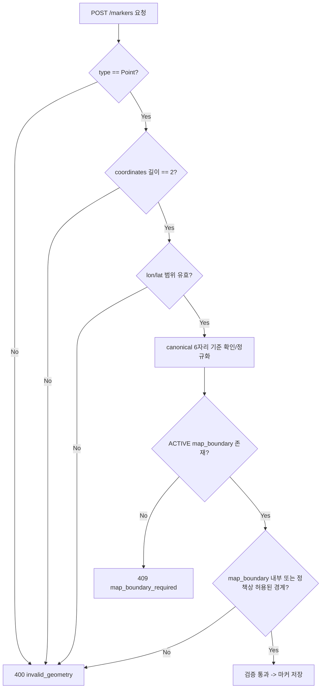

# L5-05 · 지도·수색차수 좌표 규격 — L5가 소비하는 S2 Geometry 계약

상태: 초안. 담당: L5. 소비 대상: S2 (Map Boundary & Search Area), L3 구현.

## 1. 목적

L5 마커 위치 검증 시 S2/L3가 제공하는 좌표계, geometry fixture, `MapBoundaryQuery` 소비 계약을 정리한다.

마커 `location`은 L5 소유 `Point(EPSG:4326)`이며, 현재 사건의 ACTIVE `map_boundary` 안에 있어야 한다. S2/L3는 마커를 저장하지 않고, L5가 검증에 사용할 지도 기준 범위 query와 canonical fixture를 제공한다.

---

## 2. 좌표계 규격

| 항목 | 값 |
|---|---|
| CRS | `EPSG:4326` (WGS84) |
| 좌표 순서 | GeoJSON 표준 `[longitude, latitude]`, 코드 표현은 `[lon, lat]` |
| Canonical precision | 소수점 6자리. 6자리를 초과하면 초과 자릿수를 반올림해 6자리로 맞춘다 |
| L5 저장 타입 (`marker.location`) | `GEOGRAPHY(Point,4326)` |
| S2 저장 타입 (`map_boundary.geometry`) | `GEOMETRY(Polygon,4326)` |
| S2 저장 타입 (`search_area.geometry`) | `GEOMETRY(Polygon,4326)` |

### 2.1 좌표 범위

| 축 | 최소 | 최대 |
|---|---:|---:|
| Longitude | `-180.000000` | `180.000000` |
| Latitude | `-90.000000` | `90.000000` |

### 2.2 하네스 기준 지도 Envelope

```text
minLon = 126.900000
minLat = 37.500000
maxLon = 127.080000
maxLat = 37.620000
```

---

## 3. 좌표 변환·정규화 규칙

### 3.1 S2/L3 기준 규칙

1. CRS는 `EPSG:4326`만 허용한다.
2. 좌표 순서는 `[lon, lat]`이다.
3. canonical precision은 소수점 6자리다.
4. 좌표가 소수점 6자리를 초과하면 7번째 자리부터 반올림해 6자리로 맞춘다.
5. Polygon은 ring closure가 필요하다.
6. 연속 중복점은 제거한다.
7. geometry가 기준을 만족하지 못하면 `400 invalid_geometry`로 거부한다.

### 3.2 Precision 정규화

L5 marker 입력 좌표가 6자리를 초과하면 반올림해 소수점 6자리 값으로 정규화한다.

```text
[126.9565007,37.5712007] -> [126.956501,37.571201]
```

이 정규화는 반올림이다. 반올림 후에도 좌표 범위, Point 형식, boundary 포함 조건을 만족하지 못하면 `invalid_geometry`로 거부한다.

### 3.3 L5 마커 Point 검증 규칙

```text
1. location.type == "Point"
2. coordinates.length == 2
3. 좌표 순서는 [lon, lat]
4. lon은 -180..180, lat은 -90..90
5. null, NaN, 빈 좌표, 추가 point 배열은 invalid_geometry
6. precision이 6자리를 초과하면 초과 자릿수를 반올림해 canonical 6자리로 맞춤
7. 현재 ACTIVE map_boundary 내부인지 검증
```

### 3.4 검증 실패 에러

모든 geometry 검증 실패는 동일 에러 코드로 수렴한다.

```json
{
  "error": "invalid_geometry"
}
```

HTTP status는 `400`이다.

---

## 4. MapBoundaryQuery 소비 계약

L5는 마커 생성 시 S2/L3가 제공하는 `MapBoundaryQuery`를 소비한다.

### 4.1 S2/L3 제공 포트

```java
public interface MapBoundaryQuery {
    /**
     * incidentId 기준 ACTIVE map_boundary를 조회한다.
     * 없으면 Optional.empty()를 반환한다.
     */
    Optional<MapBoundaryQueryResult> of(UUID incidentId);
}
```

`Optional.empty()`는 boundary가 없다는 의미다. 호출자는 이를 `409 map_boundary_required`로 변환해야 한다. `op_required`는 current OP가 없을 때 쓰는 S8 에러이며, boundary 없음에 사용하지 않는다.

### 4.2 S2/L3 제공 결과 Shape

```java
public record MapBoundaryQueryResult(
        UUID id,
        UUID incidentId,
        String status,
        long version,
        GeoJsonPolygon geometry,
        List<BigDecimal> bbox,
        Instant updatedAt
) {}
```

문서 기준 필드:

| 필드 | 의미 |
|---|---|
| `id` | ACTIVE map_boundary ID |
| `incidentId` | 사건 ID |
| `status` | 항상 `ACTIVE` |
| `version` | boundary 버전 |
| `geometry` | Canonical GeoJSON Polygon |
| `bbox` | `[minLon, minLat, maxLon, maxLat]` |
| `updatedAt` | 마지막 변경 시각 |

L5 내부에서 별도 `MapBoundary` DTO로 변환할 수는 있지만, S2/L3 제공 계약 DTO는 `MapBoundaryQueryResult` shape를 기준으로 해야 한다.

### 4.3 마커 위치 포함 검증

S2/L3 계약은 `MapBoundaryQuery.of(incidentId)`로 ACTIVE boundary geometry를 제공하는 것이다. L5 marker Point가 boundary 내부인지 검증하는 로직은 L5 소유다.

L5 marker Point 포함 검증은 `ST_Covers(boundary, point)`를 채택한다.

| 채택 함수 | 의미 |
|---|---|
| `ST_Covers(boundary, point)` | boundary 내부 또는 외곽선 위 point 허용 |

L3의 현재 Polygon containment 구현도 boundary-inclusive 정책으로 `ST_Covers`를 사용한다. L5도 외곽선 위 marker를 허용하므로 아래 기준으로 검증한다.

```sql
SELECT ST_Covers(
    mb.geometry::geometry,
    ST_SetSRID(ST_MakePoint(:lon, :lat), 4326)
)
FROM map_boundary mb
WHERE mb.incident_id = :incidentId
  AND mb.status = 'ACTIVE'
```

---

## 5. Geometry Fixture

### 5.1 정상 Fixture

| 이름 | 타입 | 좌표 |
|---|---|---|
| 기준 map_boundary | Polygon | `[[126.948000,37.565000],[126.968000,37.565000],[126.968000,37.579000],[126.948000,37.579000],[126.948000,37.565000]]` |
| 기준 search_area | Polygon | `[[126.952000,37.568000],[126.961000,37.568000],[126.961000,37.575000],[126.952000,37.575000],[126.952000,37.568000]]` |
| 기준 marker | Point | `[126.956500,37.571200]` |

### 5.2 실패 Fixture

| 이름 | 값 또는 의미 | 실패 사유 |
|---|---|---|
| `coord-outside-envelope` | `[127.200000,37.571200]` | 하네스 envelope 밖 |
| `coord-latlon-swapped` | `[37.571200,126.956500]` | lon/lat 순서 뒤바뀜 |
| `point-null-nan` | `[null, NaN]` 또는 빈 좌표 | 유효하지 않은 Point |
| `polygon-unclosed` | 이름 고정 | Polygon ring 미폐합 |
| `polygon-self-intersecting` | 이름 고정 | 자기 교차 Polygon |
| `polygon-too-small-under-400m2` | 이름 고정 | 최소 면적 미만 |

### 5.3 정규화 Fixture

| 이름 | 입력 | 정규화 결과 |
|---|---|---|
| `precision-over-6dp` | `[126.9565007,37.5712007]` | `[126.956501,37.571201]` |

### 5.4 L3 Fixture Source

| Java fixture | 용도 |
|---|---|
| `GeometryFixtures` | CRS, bbox, canonical boundary/area/marker 좌표, invalid 좌표 |
| `BoundaryAreaFixtures` | incident/boundary/area/OP1 고정 ID, 상태, 이벤트 fixture |
| `QueryFixtures.mapBoundaryQueryResult()` | `MapBoundaryQuery.of` mock 결과 |

---

## 6. L5 마커 생성 시 Geometry 검증 흐름



---

## 7. 기준 문서

- `docs/spec/specs/S2.json`
- `docs/spec/specs/S5.json`
- `docs/spec/boundaries.md`
- `docs/spec/harness-scenarios.md`
- `docs/tasks/L3-tasks.md`
