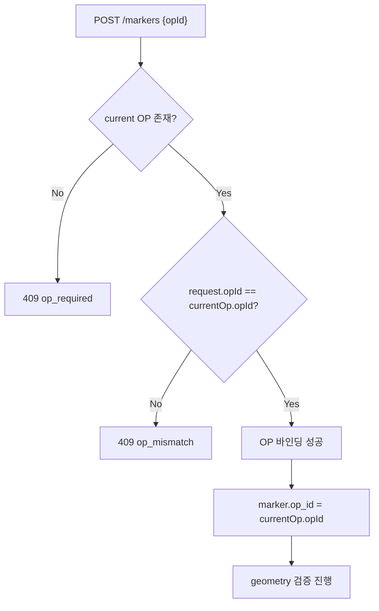

# L5-06 · 수색차수 조회 DTO 확정 — L5가 소비하는 S8 OP 계약

상태: 초안. 담당: L5. 소비 대상: S8 (Operational Period & Handover), L3 구현.

## 1. 목적

L5 마커 생성 시 현재 OP(수색차수)를 확인하기 위해 S8/L3가 제공하는 current OP 조회 계약을 정리한다.

마커는 반드시 현재 ACTIVE OP에 귀속되어야 한다. S8/L3는 current OP query와 `@RequireCurrentOp` guard 계약을 제공하고, L5는 이를 소비해 marker write를 검증한다.

---

## 2. Current OP Query 계약

### 2.1 기준 문서 계약명

S8 기준 문서의 제공 계약명:

```
OperationalPeriodQuery.current(incidentId)
OperationalPeriodQuery.list(incidentId)
```

현재 L3 Java 구현의 OP 조회 포트:

```java
public interface OperationalPeriodQuery {
    /**
     * incidentId 기준 현재 ACTIVE OP를 조회한다.
     * OP1 bootstrap 이전이면 Optional.empty().
     */
    Optional<CurrentOpResult> current(UUID incidentId);

    /**
     * incidentId 기준 OP 목록을 sequenceNo 오름차순으로 조회한다.
     */
    List<OperationalPeriodRow> list(UUID incidentId);
}
```

### 2.2 CurrentOpResult

현재 OP 단건 조회 결과는 `CurrentOpResult` shape를 기준으로 한다.

```java
public record CurrentOpResult(
        UUID opId,
        UUID incidentId,
        String status,
        int sequenceNo,
        Instant startedAt,
        Instant endedAt,
        String reason,
        long version
) {}
```

| 필드 | 의미 |
| --- | --- |
| `opId` | current OP ID |
| `incidentId` | 사건 ID |
| `status` | `ACTIVE` 또는 `CLOSED` |
| `sequenceNo` | 사건 내 OP 순번. OP1은 `1`, OP2는 `2` |
| `startedAt` | OP 시작 시각 |
| `endedAt` | OP 종료 시각. ACTIVE OP는 `null` |
| `reason` | `BOOTSTRAP`, `SHIFT_CHANGE`, `RE_SEARCH`, `NEW_AREA`, `OTHER` |
| `version` | OP row version |

`OperationalPeriodDto`라는 넓은 DTO 이름은 current OP 소비 계약에는 사용하지 않는다. `reasonMemo`, `openedByAccountId`, `openedByChannel`, `clientTs`, `serverTs`, `clockOffsetMs`는 현재 `OperationalPeriodQuery.current` output shape에 포함되지 않는다.

### 2.3 OP 목록 계약

S8 기준 문서에는 OP 목록 계약도 존재한다.

```
OperationalPeriodQuery.list(incidentId)
output: OperationalPeriodRow[] sorted by sequenceNo ASC
```

문서상 `OperationalPeriodRow` shape:

```
opId
incidentId
status
sequenceNo
startedAt
endedAt
reason
version
```

### 2.4 문서 범위 외 추가 제공 계약

아래 메서드는 현재 S8 기준 문서에는 명시되어 있지 않지만, L5가 단건 OP ID 조회 메서드를 요청하여, 추가 구현 예정이다.

```java
Optional<OperationalPeriodRow> findById(UUID opId);
```

---

## 3. Current OP 조회 API

### 3.1 Request

```
GET /incidents/{incidentId}/operational-periods
Authorization: Bearer {token}
```

### 3.2 Response (200 OK)

S8 API 문서 기준 응답은 사건 OP 목록과 current OP ID를 제공한다.

```json
{
  "currentOpId": "88888888-8888-8888-8888-888888880001",
  "items": [
    {
      "id": "88888888-8888-8888-8888-888888880001",
      "sequenceNo": 1,
      "status": "ACTIVE",
      "reason": "BOOTSTRAP"
    }
  ]
}
```

주의:

- API schema의 `items`는 `id`, `sequenceNo`, `status`, `reason` 중심으로 정의되어 있다.
- service contract의 `OperationalPeriodQuery.list` row shape는 `opId`, `incidentId`, `startedAt`, `endedAt`, `version`까지 포함한다.
- API response와 internal query result shape를 같은 DTO로 단정하지 않는다.

### 3.3 Errors

| HTTP | Code | 상황 |
| --- | --- | --- |
| 403 | `channel_not_allowed` | 허용되지 않은 채널 |
| 403 | `incident_access_denied` | 사건 접근 권한 없음 |
| 403 | `team_not_assigned` | 팀 미배정 |

---

## 4. L5에서의 OP 사용 방식

### 4.1 마커 생성 시 OP 바인딩

```
1. POST /markers request body의 opId는 필수다.
2. @RequireCurrentOp가 서버 current OP를 조회한다.
3. current OP가 없으면 409 op_required.
4. request.opId와 current OP가 다르면 409 op_mismatch.
5. 검증이 통과하면 marker는 current OP에 귀속된다.
```

### 4.2 Marker Entity의 OP 참조

L5 marker row는 S5 문서 기준으로 current OP context를 저장한다.

```java
marker.op_id = currentOp.opId
marker.incident_id = currentOp.incidentId
```

### 4.3 Marker Query OP 필터

Marker query 포트는 L5 소유다. L5 내부 query 문서에서 정의한다.

S8/L3가 제공하는 것은 marker query가 아니라 current OP query와 guard 계약이다.

---

## 5. OP Fixture

### 5.1 L3 Fixture Source

| Java fixture | 용도 |
| --- | --- |
| `OperationalPeriodFixtures.currentOpResult()` | OP1 bootstrap 이후 current OP query fixture |
| `OperationalPeriodFixtures.currentOpListRow()` | OP1 bootstrap 이후 current OP list row fixture |
| `CurrentOpGuardFixtures.opRequiredGuard()` | current OP 없음 실패 fixture |
| `CurrentOpGuardFixtures.opMismatchGuard()` | request opId와 current OP 불일치 실패 fixture |
| `OperationalPeriodFixtures.previousOpAfterTransition()` | SC-10 전환 후 CLOSED OP1 fixture |
| `OperationalPeriodFixtures.newOpAfterTransition()` | SC-10 전환 후 ACTIVE OP2 fixture |

### 5.4 Current OP Fixture 예제

```json
{
  "opId": "88888888-8888-8888-8888-888888880001",
  "incidentId": "aaaaaaaa-aaaa-aaaa-aaaa-aaaaaaaa0001",
  "status": "ACTIVE",
  "sequenceNo": 1,
  "startedAt": "2026-04-28T00:00:00Z",
  "endedAt": null,
  "reason": "BOOTSTRAP",
  "version": 1
}
```

---

## 6. L5 마커 생성 시 OP 검증 흐름



---

## 7. 기준 문서

- `docs/spec/specs/S8.json`
- `docs/spec/specs/S5.json`
- `docs/spec/boundaries.md`
- `docs/tasks/L3-tasks.md`
- `docs/tasks/L5-tasks.md`
