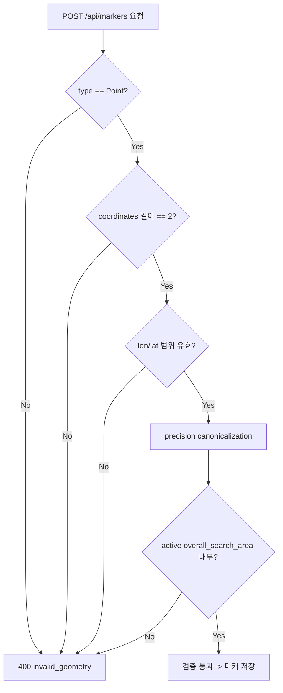

# L5-05 · 마커 좌표 검증 계약

상태: 초안. 담당: L5. 소비 대상: S2 (SearchAreaQuery.overallOf).

## 1. 목적

L5 마커 위치 검증 시 S2/L3가 제공하는 좌표계와 common geometry rule을 정리한다.
마커 `location`은 `GEOMETRY(Point, 4326)`이며, 현재 active `overall_search_area` (`search_area.area_level = OVERALL`) 안에 포함되어야 한다.

## 2. 좌표계 규격

| 항목 | 값 |
|---|---|
| CRS | **EPSG:4326** (WGS84) |
| 좌표 순서 | GeoJSON 표준: **[longitude, latitude]** |
| Precision | 소수점 **6자리** canonical 값 |
| 저장 타입 (marker.location) | `GEOMETRY(Point, 4326)` |
| 검증 입력 | `SearchAreaQuery.overallOf(incidentId)`가 반환하는 active `overall_search_area` Polygon |

### 2.1 좌표 범위

| 축 | 최소 | 최대 |
|---|---|---|
| Longitude | -180.000000 | 180.000000 |
| Latitude | -90.000000 | 90.000000 |

### 2.2 하네스 기준 지도 Envelope

```text
minLon = 126.900000
minLat = 37.500000
maxLon = 127.080000
maxLat = 37.620000
```

## 3. 좌표 변환·정규화 규칙

### 3.1 정규화 절차

1. CRS 확인: EPSG:4326이 아니면 `400 invalid_geometry` 거부
2. 좌표 순서: `[lon, lat]` 순서 강제
3. Precision 정규화: 소수 6자리 canonical 값 사용
4. Point는 단일 좌표쌍만 허용
5. null, NaN, 빈 좌표 거부

### 3.2 L5 마커 Point 검증 규칙

```text
1. type == "Point" (필수)
2. coordinates.length == 2 (정확히 [lon, lat])
3. lon ∈ [-180, 180], lat ∈ [-90, 90]
4. null, NaN, 빈 좌표 거부
5. 추가 point 배열 포함 시 거부
6. precision > 6자리이면 canonical 값으로 정규화 후 검증
7. 현재 active overall_search_area 내부 포함 확인
```

### 3.3 검증 실패 에러

```json
{
  "error": "invalid_geometry"
}
```

HTTP 400.

## 4. SearchAreaQuery 소비 계약

L5는 마커 생성 시 S2가 제공하는 `SearchAreaQuery.overallOf(incidentId)`를 소비한다.

```java
public interface SearchAreaQuery {
    Optional<OverallSearchAreaResult> overallOf(String incidentId);
}
```

```json
{
  "id": "osa-precinct-001-v1",
  "incidentId": "inc-precinct-first-001",
  "status": "ACTIVE",
  "version": 1,
  "geometry": {
    "type": "Polygon",
    "coordinates": [
      [
        [126.948000, 37.565000],
        [126.968000, 37.565000],
        [126.968000, 37.579000],
        [126.948000, 37.579000],
        [126.948000, 37.565000]
      ]
    ]
  },
  "bbox": [126.948000, 37.565000, 126.968000, 37.579000]
}
```

`overallOf`가 active row를 찾지 못하면 S2 기준 `409 overall_search_area_required`다. L5 marker 생성은 current OP guard (`op_required`, `op_mismatch`)와 geometry validation을 분리해서 검증한다.

### 4.1 마커 위치 포함 검증

```sql
SELECT ST_Contains(
    sa.geometry::geometry,
    ST_SetSRID(ST_MakePoint(:lon, :lat), 4326)
)
FROM search_area sa
WHERE sa.incident_id = :incidentId
  AND sa.area_level = 'OVERALL'
  AND sa.status = 'ACTIVE'
```

## 5. Geometry Fixture (하네스 기준값)

### 5.1 정상 Fixture

| 이름 | 타입 | 좌표 |
|---|---|---|
| 정상 `overall_search_area` | Polygon | `[[126.948000,37.565000],[126.968000,37.565000],[126.968000,37.579000],[126.948000,37.579000],[126.948000,37.565000]]` |
| 정상 `search_area` | Polygon | `[[126.952000,37.568000],[126.961000,37.568000],[126.961000,37.575000],[126.952000,37.575000],[126.952000,37.568000]]` |
| 정상 marker | Point | `[126.956500,37.571200]` |

### 5.2 실패 Fixture

| 이름 | 실패 사유 |
|---|---|
| `coord-outside-envelope` | `[127.200000,37.571200]` — 하네스 envelope 밖 |
| `coord-latlon-swapped` | `[37.571200,126.956500]` — lon/lat 뒤바뀜 |
| `point-null-nan` | `[null, NaN]` 또는 빈 좌표 |
| `precision-over-6dp` | `[126.9565007,37.5712007]` — canonical 정규화 후 재검증 |

## 6. L5 마커 생성 시 Geometry 검증 흐름


