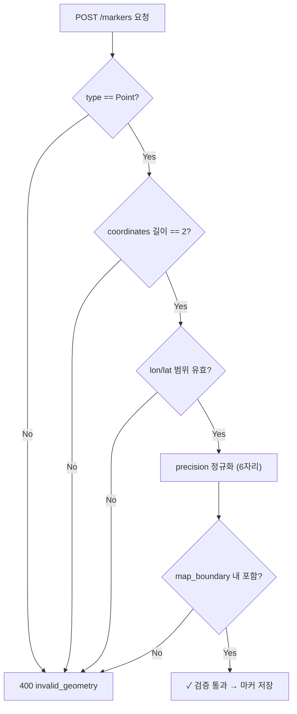

# L5-05 · 지도·수색차수 좌표 규격 — L5가 소비하는 S2 Geometry 계약

상태: 초안. 담당: L5. 소비 대상: S2 (Map Boundary & Search Area).

## 1. 목적

L5 마커 위치 검증 시 S2/L3가 제공하는 좌표계·geometry rule을 정리한다.
마커 `location`은 `Point(EPSG:4326)` 타입이며, `map_boundary` 안에 포함되어야 한다.

---

## 2. 좌표계 규격

| 항목 | 값 |
|---|---|
| CRS | **EPSG:4326** (WGS84) |
| 좌표 순서 | GeoJSON 표준: **[longitude, latitude]** |
| Precision | 소수점 **6자리** (약 0.11m) |
| 저장 타입 (marker.location) | `GEOGRAPHY(Point, 4326)` |
| 저장 타입 (map_boundary.geometry) | `GEOMETRY(Polygon, 4326)` |

### 2.1 좌표 범위

| 축 | 최소 | 최대 |
|---|---|---|
| Longitude | -180.000000 | 180.000000 |
| Latitude | -90.000000 | 90.000000 |

### 2.2 하네스 기준 지도 Envelope

```
minLon = 126.900000
minLat = 37.500000
maxLon = 127.080000
maxLat = 37.620000
```

---

## 3. 좌표 변환·정규화 규칙

### 3.1 정규화 절차

1. CRS 확인: EPSG:4326이 아니면 `400 invalid_geometry` 거부
2. 좌표 순서: `[lon, lat]` 순서 강제
3. Precision 정규화: 소수 6자리 truncate (반올림 아님)
4. Ring 폐합: Polygon은 첫 좌표 == 마지막 좌표
5. 연속 중복점 제거

### 3.2 L5 마커 Point 검증 규칙

```
1. type == "Point" (필수)
2. coordinates.length == 2 (정확히 [lon, lat])
3. lon ∈ [-180, 180], lat ∈ [-90, 90]
4. null, NaN, 빈 좌표 거부
5. 추가 point 배열 포함 시 거부
6. precision > 6자리이면 정규화 후 검증
7. map_boundary 내 포함 확인 (ST_Contains)
```

### 3.3 검증 실패 에러

모든 geometry 검증 실패는 동일 에러 코드:

```json
{
  "error": "invalid_geometry"
}
```
HTTP 400.

---

## 4. MapBoundaryQuery 소비 계약

L5는 마커 생성 시 S2가 제공하는 `MapBoundaryQuery`를 소비한다:

```java
// S2가 제공하는 port (L3 구현)
public interface MapBoundaryQueryPort {
    /**
     * 사건의 현재 ACTIVE map_boundary를 반환한다.
     * boundary가 없으면 Optional.empty() → L5는 op_required 또는 적절한 에러.
     */
    Optional<MapBoundary> findActive(UUID incidentId);
}
```

```java
// MapBoundary DTO
public record MapBoundary(
    UUID id,
    UUID incidentId,
    Geometry geometry,    // Polygon, EPSG:4326
    String status,        // "ACTIVE"
    long version
) {}
```

### 4.1 마커 위치 포함 검증

```sql
-- PostGIS 기준 검증 쿼리
SELECT ST_Contains(
    mb.geometry::geometry,
    ST_SetSRID(ST_MakePoint(:lon, :lat), 4326)
)
FROM map_boundary mb
WHERE mb.incident_id = :incidentId
  AND mb.status = 'ACTIVE'
```

---

## 5. Geometry Fixture (하네스 기준값)

### 5.1 정상 Fixture

| 이름 | 타입 | 좌표 |
|---|---|---|
| 기준 map_boundary | Polygon | `[[126.948000,37.565000],[126.968000,37.565000],[126.968000,37.579000],[126.948000,37.579000],[126.948000,37.565000]]` |
| 기준 search_area | Polygon | `[[126.952000,37.568000],[126.961000,37.568000],[126.961000,37.575000],[126.952000,37.575000],[126.952000,37.568000]]` |
| 기준 marker | Point | `[126.956500, 37.571200]` |

### 5.2 실패 Fixture

| 이름 | 실패 사유 |
|---|---|
| `coord-outside-envelope` | `[127.200000, 37.571200]` — envelope 밖 |
| `coord-latlon-swapped` | `[37.571200, 126.956500]` — lon/lat 뒤바뀜 |
| `point-null-nan` | `[null, NaN]` 또는 빈 좌표 |
| `precision-over-6dp` | `[126.9565007, 37.5712007]` — 정규화 후 재검증 |

---

## 6. L5 마커 생성 시 Geometry 검증 흐름


