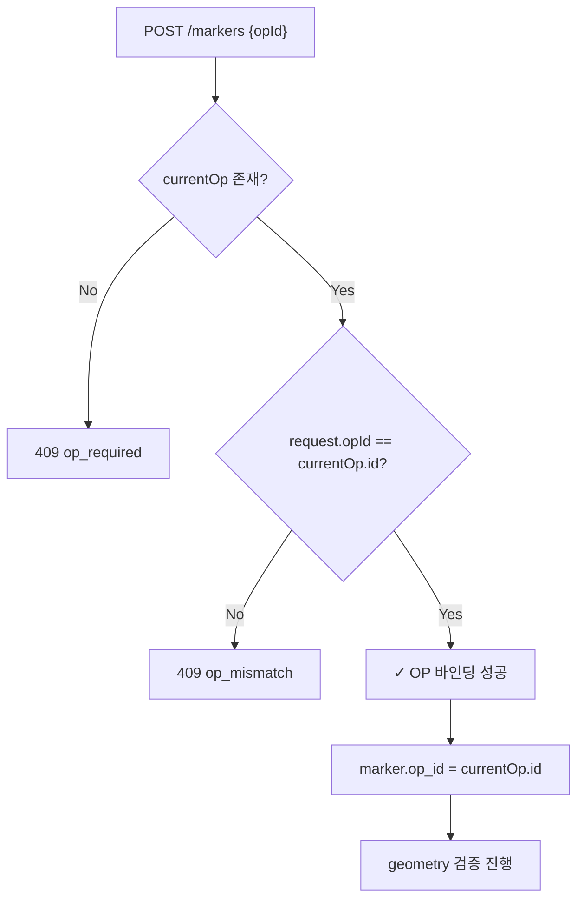

# L5-06 · 수색차수 조회 DTO 확정 — L5가 소비하는 S8 OP 계약

상태: 초안. 담당: L5. 소비 대상: S8 (Operational Period & Handover).

## 1. 목적

L5 마커 생성 시 현재 OP(수색차수)를 확인하기 위해 S8/L3가 제공하는 OP 조회 계약을 정리한다.
마커는 반드시 현재 active OP에 귀속되어야 한다.

---

## 2. Current OP Query 계약

### 2.1 OperationalPeriodQueryPort (S8 소유)

```java
public interface OperationalPeriodQueryPort {
    /**
     * 사건의 현재 ACTIVE OP를 반환한다.
     * ACTIVE OP가 없으면 Optional.empty().
     */
    Optional<OperationalPeriodDto> findCurrentOp(UUID incidentId);
    
    /**
     * 특정 OP를 ID로 조회한다.
     */
    Optional<OperationalPeriodDto> findById(UUID opId);
    
    /**
     * 사건의 전체 OP 목록을 sequence_no 순으로 반환한다.
     */
    List<OperationalPeriodDto> listByIncident(UUID incidentId);
}
```

### 2.2 OperationalPeriodDto

```json
{
  "id": "uuid",
  "incidentId": "uuid",
  "sequenceNo": 1,
  "status": "ACTIVE | CLOSED",
  "reason": "BOOTSTRAP | SHIFT_CHANGE | RE_SEARCH | NEW_AREA | OTHER",
  "reasonMemo": "string | null",
  "openedByAccountId": "uuid | null",
  "openedByChannel": "SYSTEM | WEB",
  "openedAt": "2026-04-28T09:00:00+09:00",
  "closedAt": "2026-04-28T18:00:00+09:00 | null",
  "version": 1,
  "clientTs": "2026-04-28T09:00:00+09:00",
  "serverTs": "2026-04-28T09:00:00+09:00",
  "clockOffsetMs": 0
}
```

---

## 3. Current OP 조회 API (S8 소유, L5 소비)

### 3.1 Request

```
GET /incidents/{incidentId}/operational-periods
Authorization: Bearer {token}
```

### 3.2 Response (200 OK)

```json
{
  "currentOpId": "op-precinct-001-op1",
  "items": [
    {
      "id": "op-precinct-001-op1",
      "sequenceNo": 1,
      "status": "ACTIVE",
      "reason": "BOOTSTRAP",
      "version": 1
    }
  ]
}
```

### 3.3 Errors

| HTTP | Code | 상황 |
|---|---|---|
| 403 | `channel_not_allowed` | 채널 불일치 |
| 403 | `incident_access_denied` | 사건 접근 불가 |
| 403 | `team_not_assigned` | 팀 미배정 |

---

## 4. L5에서의 OP 사용 방식

### 4.1 마커 생성 시 OP 바인딩

```
1. 요청의 opId가 필수 (POST /markers request body)
2. @RequireCurrentOp가 opId == 현재 active OP인지 검증
3. 불일치 시 409 op_mismatch 반환
4. active OP가 없으면 409 op_required 반환
```

### 4.2 마커 entity의 OP 참조

```java
// marker 테이블
marker.op_id = currentOp.id   // UUID, NOT NULL
marker.incident_id = currentOp.incidentId
```

### 4.3 마커 조회 시 OP 필터

```java
// MarkerQuery.byIncident - OP별 필터 지원
public interface MarkerQueryPort {
    List<MarkerDto> findByIncident(UUID incidentId, UUID opId);  // opId nullable → 전체
    List<MarkerDto> findByIncident(UUID incidentId);              // 사건 전체
}
```

---

## 5. OP Fixture (하네스 기준값)

| Fixture ID | incidentId | sequenceNo | status | reason |
|---|---|---|---|---|
| `op-precinct-001-op1` | `inc-precinct-first-001` | 1 | ACTIVE | BOOTSTRAP |
| `op-precinct-001-op2` | `inc-precinct-first-001` | 2 | ACTIVE | SHIFT_CHANGE |

### 5.1 OP Fixture 예제 JSON

```json
{
  "id": "op-precinct-001-op1",
  "incidentId": "inc-precinct-first-001",
  "sequenceNo": 1,
  "status": "ACTIVE",
  "reason": "BOOTSTRAP",
  "reasonMemo": null,
  "openedByAccountId": null,
  "openedByChannel": "SYSTEM",
  "openedAt": "2026-04-28T09:00:00+09:00",
  "closedAt": null,
  "version": 1,
  "clientTs": "2026-04-28T09:00:00+09:00",
  "serverTs": "2026-04-28T09:00:00+09:00",
  "clockOffsetMs": 0
}
```

---

## 6. L5 마커 생성 시 OP 검증 흐름


