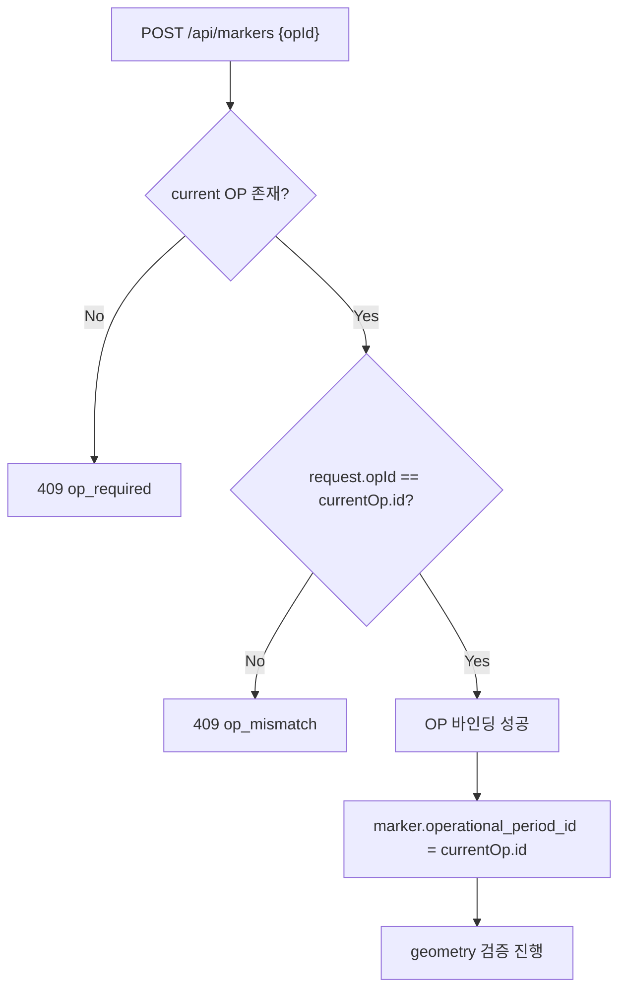

# L5-06 · Current OP 조회 계약

상태: 초안. 담당: L5. 소비 대상: S8 (Operational Period & Handover).

## 1. 목적

L5 마커 생성 시 현재 OP(수색차수)를 확인하기 위해 S8/L3가 제공하는 OP 조회 계약을 정리한다.
마커는 반드시 서버 current OP에 귀속되어야 한다.

## 2. Current OP Query 계약

### 2.1 OperationalPeriodQuery (S8 소유)

```java
public interface OperationalPeriodQuery {
    Optional<OperationalPeriodDto> findCurrentOp(String incidentId);

    Optional<OperationalPeriodDto> findById(String opId);

    List<OperationalPeriodDto> listByIncident(String incidentId);
}
```

### 2.2 OperationalPeriodDto

```json
{
  "id": "op-precinct-001-op1",
  "incidentId": "inc-precinct-first-001",
  "sequenceNumber": 1,
  "status": "ACTIVE | ENDED",
  "reason": "INITIAL | RE_SEARCH | AREA_CHANGED | OTHER",
  "reasonMemo": "string | null",
  "openedByAccountId": "uuid | null",
  "openedByChannel": "SYSTEM | WEB",
  "openedAt": "2026-04-28T09:00:00+09:00",
  "endedAt": "2026-04-28T18:00:00+09:00 | null",
  "version": 1
}
```

## 3. Current OP 조회 API (S8 소유, L5 소비)

### 3.1 Request

```http
GET /api/incidents/{incidentId}/operational-periods
Authorization: Bearer {token}
```

### 3.2 Response (200 OK)

```json
{
  "currentOpId": "op-precinct-001-op1",
  "items": [
    {
      "id": "op-precinct-001-op1",
      "sequenceNumber": 1,
      "status": "ACTIVE",
      "reason": "INITIAL",
      "version": 1
    }
  ]
}
```

### 3.3 Errors

| HTTP | Code | 상황 |
|---|---|---|
| 403 | `channel_not_allowed` | 채널 불일치 |
| 403 | `incident_access_denied` | 사건 접근 불가 |
| 403 | `team_not_assigned` | 팀 미배정 |

## 4. L5에서의 OP 사용 방식

```text
1. `POST /api/markers` request body의 `opId`는 필수다.
2. `@RequireCurrentOp`가 request `opId`와 서버 current OP가 같은지 검증한다.
3. current OP가 없으면 `409 op_required`를 반환한다.
4. request `opId`와 서버 current OP가 다르면 `409 op_mismatch`를 반환한다.
5. L5는 OP 생성, OP 전환, OP assignment write를 소유하지 않는다.
```

## 5. 마커 entity의 OP 참조

```text
marker.operational_period_id = currentOp.id
marker.incident_id = currentOp.incidentId
```

## 6. MarkerQuery OP 필터

```java
public interface MarkerQuery {
    List<MarkerDto> byIncident(String incidentId, MarkerFilters filters);
}
```

`filters.opId`가 있으면 OP별 marker evidence를 반환하고, 없으면 사건 전체 marker를 반환한다. S3-2 board와 S8 OP history는 같은 `id/status/version/opId/policePhoneId` 필드를 비교한다.

## 7. OP Fixture (하네스 기준값)

| Fixture ID | incidentId | sequenceNumber | status | reason |
|---|---|---|---|---|
| `op-precinct-001-op1` | `inc-precinct-first-001` | 1 | ACTIVE | INITIAL |
| `op-precinct-001-op2` | `inc-precinct-first-001` | 2 | ACTIVE | RE_SEARCH 또는 AREA_CHANGED |

### 7.1 OP Fixture 예제 JSON

```json
{
  "id": "op-precinct-001-op1",
  "incidentId": "inc-precinct-first-001",
  "sequenceNumber": 1,
  "status": "ACTIVE",
  "reason": "INITIAL",
  "reasonMemo": null,
  "openedByAccountId": null,
  "openedByChannel": "SYSTEM",
  "openedAt": "2026-04-28T09:00:00+09:00",
  "endedAt": null,
  "version": 1
}
```

## 8. L5 마커 생성 시 OP 검증 흐름


