# Suri-Map DB Design ERD

이 문서는 `db-design-readable.md`의 최종 엔티티 관계를 Mermaid ERD로 표현한다.

- 백엔드 PostgreSQL 엔티티 수: 27
- Android Room 로컬 엔티티: `android_outbox`, `android_sync_status`는 백엔드 ERD에서 제외
- 이 ERD는 팀 공유용 관계도이며, 상세 타입, nullable, 제약, 인덱스는 후속 Flyway migration 작성 시 이 문서와 spec 문서를 함께 기준으로 확정한다.

```mermaid
erDiagram
    incident ||--o| missing_person : has
    incident ||--o{ incident_assignment : has
    account ||--o{ incident_assignment : assigned
    incident ||--o{ operational_period : has

    account ||--o{ refresh_token : issues
    police_phone ||--o{ refresh_token : uses
    account ||--o{ fcm_token : registers
    police_phone ||--o{ fcm_token : owns

    incident ||--o| incident_data_purge : schedules
    incident ||--o{ location_data_access_audit : audits
    account ||--o{ location_data_access_audit : accesses
    police_phone ||--o{ location_data_access_audit : accesses

    operational_period ||--o{ duty_shift : has
    incident_assignment ||--o{ duty_shift : works
    police_phone ||--o{ duty_shift : used_in

    operational_period ||--o{ search_area : contains
    search_area ||--o{ search_area : parent_of
    search_area ||--o{ search_area_assignment : assigned
    account ||--o{ search_area_assignment : receives
    account ||--o{ search_area_assignment : assigns
    search_area ||--o{ search_area_history : changes
    account ||--o{ search_area_history : changes

    duty_shift ||--o{ search_path : records
    search_path ||--o{ search_path_segment : splits
    account ||--o{ search_path_segment : corrects

    operational_period ||--o{ marker : has
    duty_shift ||--o{ marker : creates
    account ||--o{ marker : creates
    police_phone ||--o{ marker : creates
    marker ||--o{ photo : has
    marker ||--o| marker_notification : derives

    operational_period ||--o{ handover_memo : has
    duty_shift ||--o{ handover_memo : context
    account ||--o{ handover_memo : writes

    operational_period ||--o{ search_history_summary : has
    duty_shift ||--o{ search_history_summary : summarizes
    account ||--o{ search_history_summary : requests

    incident ||--o{ idempotency_record : scopes
    police_phone ||--o{ idempotency_record : sends

    incident ||--o{ offline_package_manifest : has
    operational_period ||--o{ offline_package_manifest : packages
    search_area ||--o{ offline_package_manifest : overall_area
    offline_package_manifest ||--o{ offline_package_installation : installed_as
    police_phone ||--o{ offline_package_installation : installs

    incident ||--o{ event_dispatch_job : emits
    event_dispatch_job ||--o{ event_dispatch_target : targets
    event_dispatch_job ||--o| sse_replay_event : stores

    incident {
        UUID id PK
        VARCHAR source_incident_id UK
        VARCHAR title
        VARCHAR status
        TIMESTAMPTZ opened_at
        TIMESTAMPTZ closed_at
        UUID closed_by_account_id FK
        BIGINT version
    }

    missing_person {
        UUID incident_id PK,FK
        VARCHAR display_name
        TEXT photo_object_key
        TEXT appearance_text
        VARCHAR last_seen_location_text
        TIMESTAMPTZ last_seen_at
        TIMESTAMPTZ imported_at
    }

    incident_assignment {
        UUID id PK
        UUID incident_id FK
        UUID account_id FK
        VARCHAR incident_role
        TIMESTAMPTZ assigned_at
        TIMESTAMPTZ revoked_at
    }

    account {
        UUID id PK
        VARCHAR login_id UK
        TEXT password_hash
        VARCHAR display_name
        VARCHAR account_type
        VARCHAR organization_type
        VARCHAR status
    }

    refresh_token {
        UUID id PK
        UUID account_id FK
        UUID police_phone_id FK
        TEXT token_hash
        TIMESTAMPTZ expires_at
        TIMESTAMPTZ revoked_at
    }

    police_phone {
        UUID id PK
        VARCHAR phone_code UK
        VARCHAR display_name
        VARCHAR status
        TIMESTAMPTZ last_heartbeat_at
        TIMESTAMPTZ last_sync_at
    }

    fcm_token {
        UUID id PK
        UUID account_id FK
        UUID police_phone_id FK
        VARCHAR app_instance_id
        TEXT token_hash
        TEXT token_ciphertext
        VARCHAR status
        BIGINT version
    }

    incident_data_purge {
        UUID id PK
        UUID incident_id FK
        VARCHAR status
        TIMESTAMPTZ closed_at
        TIMESTAMPTZ purge_due_at
        TIMESTAMPTZ completed_at
    }

    location_data_access_audit {
        UUID id PK
        UUID incident_id FK
        VARCHAR account_id FK
        UUID police_phone_id FK
        VARCHAR access_channel
        VARCHAR access_purpose
        TIMESTAMPTZ accessed_at
        TIMESTAMPTZ retention_until
    }

    operational_period {
        UUID id PK
        UUID incident_id FK
        INTEGER sequence_number
        VARCHAR status
        VARCHAR reason
        TEXT reason_memo
        UUID started_by_account_id FK
        UUID ended_by_account_id FK
        TIMESTAMPTZ started_at
        TIMESTAMPTZ ended_at
        BIGINT version
        TIMESTAMPTZ created_at
        TIMESTAMPTZ updated_at
    }

    duty_shift {
        UUID id PK
        UUID operational_period_id FK
        UUID incident_assignment_id FK
        UUID police_phone_id FK
        VARCHAR status
        TIMESTAMPTZ started_at
        TIMESTAMPTZ ended_at
    }

    search_area {
        UUID id PK
        UUID operational_period_id FK
        UUID parent_search_area_id FK
        VARCHAR name
        VARCHAR area_level
        GEOMETRY geometry
        VARCHAR status
        BIGINT version
    }

    search_area_assignment {
        UUID id PK
        UUID search_area_id FK
        UUID assigned_account_id FK
        UUID assigned_by_account_id FK
        TIMESTAMPTZ assigned_at
        TIMESTAMPTZ revoked_at
        VARCHAR status
    }

    search_area_history {
        UUID id PK
        UUID search_area_id FK
        VARCHAR change_type
        VARCHAR previous_status
        VARCHAR next_status
        GEOMETRY previous_geometry
        GEOMETRY next_geometry
        UUID changed_by_account_id FK
    }

    search_path {
        UUID id PK
        UUID duty_shift_id FK
        VARCHAR status
        TIMESTAMPTZ started_at
        TIMESTAMPTZ ended_at
        GEOMETRY geometry
        BIGINT version
    }

    search_path_segment {
        UUID id PK
        UUID search_path_id FK
        VARCHAR movement_type
        VARCHAR movement_type_source
        GEOMETRY geometry
        TIMESTAMPTZ started_at
        TIMESTAMPTZ ended_at
        UUID corrected_by_account_id FK
        TIMESTAMPTZ corrected_at
        BIGINT version
        TIMESTAMPTZ created_at
        TIMESTAMPTZ updated_at
    }

    marker {
        UUID id PK
        UUID operational_period_id FK
        UUID duty_shift_id FK
        VARCHAR marker_type
        VARCHAR support_request_type
        GEOMETRY location
        TEXT memo
        TIMESTAMPTZ occurred_at
        UUID created_by_account_id FK
        UUID police_phone_id FK
        VARCHAR marker_source
        VARCHAR status
        BIGINT version
    }

    photo {
        UUID id PK
        UUID marker_id FK
        TEXT object_key UK
        VARCHAR status
        TIMESTAMPTZ attached_at
        VARCHAR content_type
        BIGINT size_bytes
        CHAR checksum_sha256
        TIMESTAMPTZ upload_url_expires_at
        BIGINT version
    }

    marker_notification {
        UUID id PK
        UUID marker_id FK,UK
        VARCHAR notification_type
        VARCHAR recipient_rule
        UUID_ARRAY recipient_account_ids
        UUID_ARRAY recipient_police_phone_ids
        JSONB notification_payload
    }

    handover_memo {
        UUID id PK
        UUID operational_period_id FK
        VARCHAR memo_target_type
        UUID memo_target_id
        TEXT content
        UUID created_by_account_id FK
        UUID duty_shift_id FK
    }

    search_history_summary {
        UUID id PK
        UUID operational_period_id FK
        UUID duty_shift_id FK
        VARCHAR generation_status
        TEXT content
        CHAR source_data_hash
        UUID requested_by_account_id FK
        BIGINT version
    }

    idempotency_record {
        UUID id PK
        UUID client_operation_id
        UUID incident_id FK
        UUID police_phone_id FK
        VARCHAR idempotency_key UK
        CHAR request_body_hash
        VARCHAR idempotency_status
        TIMESTAMPTZ replay_expires_at
    }

    offline_package_manifest {
        UUID id PK
        UUID incident_id FK
        INTEGER manifest_version
        UUID operational_period_id FK
        UUID overall_search_area_id FK
        CHAR manifest_hash
        JSONB manifest_payload
    }

    offline_package_installation {
        UUID id PK
        UUID offline_package_manifest_id FK
        UUID police_phone_id FK
        UUID last_reported_by_account_id FK
        VARCHAR status
        BIGINT version
    }

    event_dispatch_job {
        UUID id PK
        UUID event_id UK
        UUID incident_id FK
        VARCHAR event_type
        JSONB payload
        VARCHAR source_entity_type
        UUID source_entity_id
        VARCHAR dispatch_status
    }

    sse_replay_event {
        UUID id PK
        UUID event_dispatch_job_id FK,UK
        UUID incident_id FK
        BIGINT replay_sequence
        JSONB envelope
        VARCHAR replay_status
    }

    event_dispatch_target {
        UUID id PK
        UUID event_dispatch_job_id FK
        VARCHAR target_type
        TEXT target_identifier
        BOOLEAN is_required
        VARCHAR dispatch_status
        INTEGER attempt_count
    }
```

