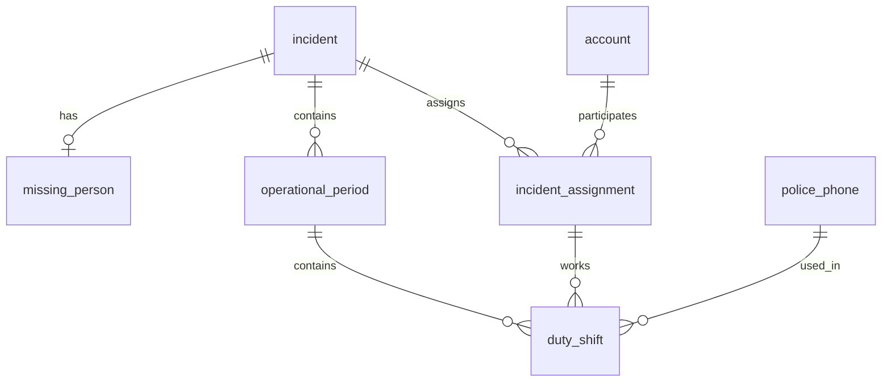
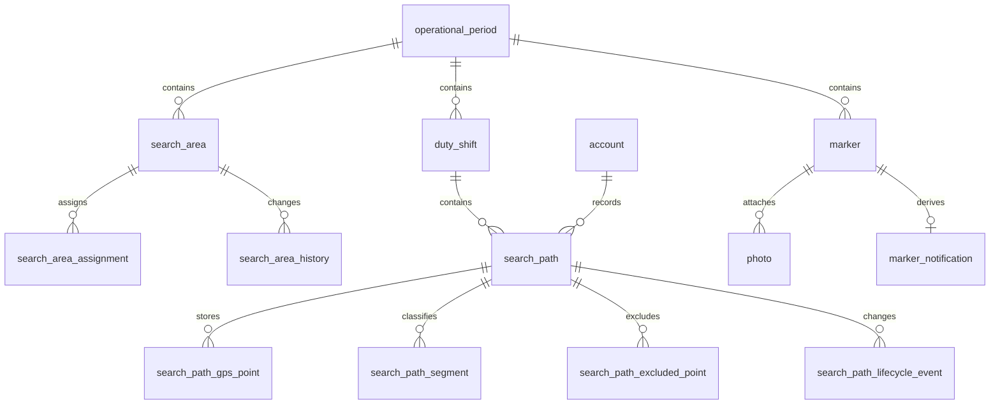
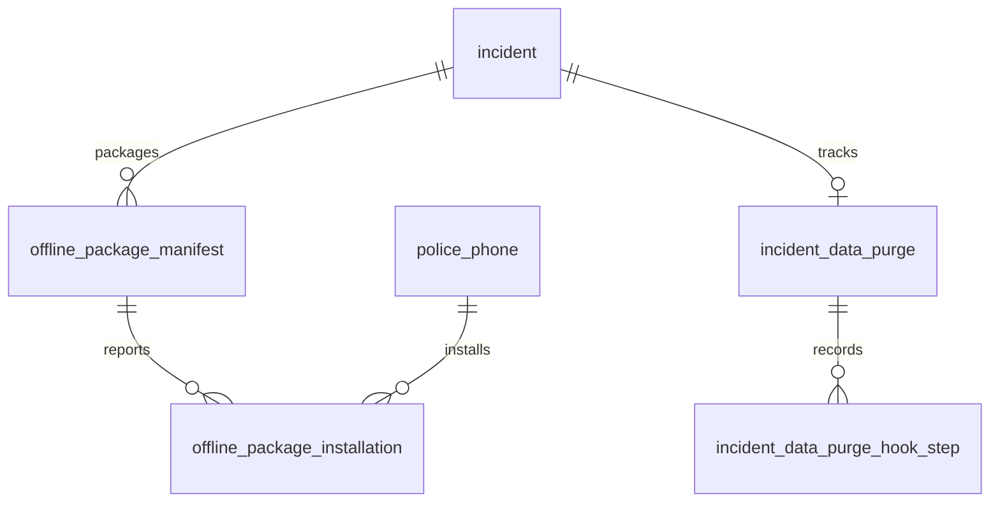

# 주요 DB 관계

업무 기록이 어떻게 연결되는지 빠르게 찾기 위한 관계도다. 2026-09-21의 migration·Mapper를 대조했으며, 모든 테이블·컬럼을 펼친 물리 ERD나 실제 배포 DB의 추출 결과는 아니다.

선은 코드에서 사용하는 관계다. **외래 키 제약이 모두 있다는 뜻은 아니다.** 타입·제약은 [migration](../../backend/src/main/resources/db/migration/), 업무 의미와 설계·구현 차이는 [읽기 문서](./db-design-readable.md)에서 확인한다.

## 사건·배정·근무 구간

`||`는 하나, `o|`는 없거나 하나, `o{`는 없거나 여러 개를 뜻한다. 근무 구간의 업무폰 맥락과 경로를 기록한 계정을 분리해서 읽는다.

```mermaid
erDiagram
    incident ||--o| missing_person : has
    incident ||--o{ incident_assignment : assigns
    account ||--o{ incident_assignment : participates
    incident ||--o{ operational_period : contains

    operational_period ||--o{ duty_shift : contains
    incident_assignment ||--o{ duty_shift : works
    police_phone ||--o{ duty_shift : used_in
```

## 현장 기록과 상세 데이터

```mermaid
erDiagram
    operational_period ||--o{ search_area : contains
    search_area ||--o{ search_area_assignment : assigns
    search_area ||--o{ search_area_history : changes

    operational_period ||--o{ duty_shift : contains
    duty_shift ||--o{ search_path : contains
    account ||--o{ search_path : records
    search_path ||--o{ search_path_gps_point : stores
    search_path ||--o{ search_path_segment : classifies
    search_path ||--o{ search_path_excluded_point : excludes
    search_path ||--o{ search_path_lifecycle_event : changes

    operational_period ||--o{ marker : contains
    marker ||--o{ photo : attaches
    marker ||--o| marker_notification : derives
```

- 사건 ID는 경로 행에 직접 있는 것이 아니라 `search_path → duty_shift → operational_period`로 조회한다.
- 구역의 상위 구역·담당 계정, 마커의 작성 계정·근무 맥락은 선이 겹치지 않도록 생략했다. 해당 관계는 [본문](./db-design-readable.md)에 남겼다.
- `photo`는 마커 생성 전에 업로드를 준비할 수도 있다. 위 연결을 이미 존재하는 마커 행의 FK 보장으로 해석하지 않는다.
- 메모 대상과 비교 차수의 JSON 목록은 단일 대상의 FK 관계가 아니므로 그림에서 생략했다. [메모·요약·비교의 의미](./db-design-readable.md#마커사진인수인계)를 확인한다.

## 설치 상태와 파기 결과

```mermaid
erDiagram
    incident ||--o{ offline_package_manifest : packages
    offline_package_manifest ||--o{ offline_package_installation : reports
    police_phone ||--o{ offline_package_installation : installs

    incident ||--o| incident_data_purge : tracks
    incident_data_purge ||--o{ incident_data_purge_hook_step : records
```

이 관계는 패키지 준비 성공이나 개인정보 파기 완료의 증거가 아니다. 서버 상태 보고·실제 단말 자료·대상별 처리 결과를 함께 확인한다.

## 그림에서 제외한 옛 설계

- `event_dispatch_job`은 실제 DB 테이블이지만 옛 그림의 `event_dispatch_target`·`sse_replay_event` 테이블은 구현되지 않았다. 메모리 재전송 이력과 DB 작업 상태의 차이는 [이벤트 전달 기록](../features/event-delivery.md)에 남겼다.
- Android Room은 서버 DB와 별개다. 실제 `android_outbox_row`·`android_sync_status`와 추가 로컬 엔티티는 [로컬 저장 설명](./db-design-readable.md#android-로컬-저장)에서 확인한다.
- 전체 컬럼 도식과 당시 표기는 [기존 ERD 원문](https://github.com/sonic8-8/suri-map/blob/3cd777752e2178ebb3470e6f749b1521ce404e7a/docs/db-design/db-design-erd.md)으로 복원한다. 생략된 관계가 불필요하다거나 기존 요구를 폐기했다는 뜻은 아니다.
