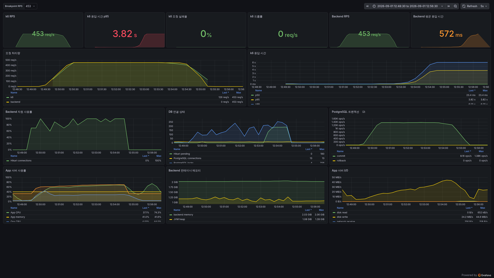

# Issue #8 서버 Breakpoint Test 결과

## 결론

- 현재 Hetzner 개발 환경에서 `/api/search-paths/batch`의 5분 지속 Breakpoint 경계는 **453 RPS 통과 / 454 RPS 반복 실패**였다.
- 453 RPS에서는 HTTP 오류와 `dropped_iterations`가 없었고, 요청 135,901건과 GPS 좌표 815,406개가 누락·중복 없이 저장됐다.
- 454 RPS에서는 부하 발생기 드롭 없이 HTTP 실패가 두 실행에서 각각 1건, 5건 발생했다.
- 이 값은 아래 환경과 요청 형태에 종속된 서버 기술 한계다. 업무폰 468대의 수용량, 운영 안전 처리량이나 SLA를 뜻하지 않는다.

## 시험 조건

| 항목 | 조건 |
| --- | --- |
| 일시 | 2026-09-01 |
| 대상 | `POST /api/search-paths/batch` |
| 부하 모델 | k6 `constant-arrival-rate`, RPS별 독립 실행 |
| 지속 시간 | 최종 경계에서 5분 |
| 요청 데이터 | 요청당 GPS 좌표 6개, 좌표 간격 2.5초 |
| 요청 상한 시간 | 10초 |
| Fixture·최대 VU | 독립된 requester 6,000개, `preAllocatedVUs: 6000` |
| App 서버 | 16 vCPU, 32,089,160 KiB RAM |
| Ops 부하 발생기 | 4 vCPU, 7,937,232 KiB RAM |
| Backend 이미지 | `sha256:9d97c62d7b52dbd6449fd36085e298f57e783d40620a4d2a1e847cc943c1cc70` |
| PostgreSQL | `postgis/postgis:16-3.4-alpine` |
| k6 이미지 | `grafana/k6@sha256:e7eeddf1ce2361df6920d925297f487c0ba549c44be242c6a9c22f28d9b08efa` |

성공 조건은 모든 응답 검사 통과, `dropped_iterations == 0`, 부하 발생기 CPU 80% 이하·메모리 90% 미만과 저장 결과 무결성이다. HTTP 응답 시간에는 별도 SLA를 두지 않았지만, Android 네트워크 기본값과 같은 10초 안에 응답하지 못하면 실패로 처리했다.

## 경계 탐색 결과

1분 탐색에서는 765 RPS가 통과하고 766 RPS가 반복 실패했다. 그러나 마지막 성공값을 5분 동안 실행하자 765, 764, 715, 660 RPS도 실패했다. 짧은 시험 결과를 서버 한계로 확정하지 않고 5분 조건으로 다시 좁혔다.

5분 탐색은 `440 통과 → 550 실패 → 495 실패 → 467 실패 → 453 통과 → 460 실패 → 456 실패 → 454 반복 실패` 순서로 진행했다.

| 목표 RPS | RUN_ID | 결과 | HTTP 요청 | HTTP 실패 | 드롭 | p95 | p99 | 최대 | 최대 사용 VU |
| ---: | --- | --- | ---: | ---: | ---: | ---: | ---: | ---: | ---: |
| 453 | `20260901T034924Z` | 통과 | 135,901 | 0 | 0 | 3.82초 | 6.05초 | 8.01초 | 2,441 |
| 454 | `20260901T042842Z` | 실패 | 132,450 | 1 | 0 | 5.78초 | — | 10초 | 3,963 |
| 454 | `20260901T043632Z` | 실패 | 135,882 | 5 | 0 | 5.88초 | — | 10초 | 3,497 |

실패 실행은 엄격한 check threshold가 실패한 시점에 중단될 수 있으므로 요청 수를 목표 RPS와 5분의 곱으로 해석하지 않았다. 454 RPS 두 실행 모두 `dropped_iterations`는 0이어서 부하 발생기의 VU 부족이 아니라 서버 응답 실패로 판정했다.

## 453 RPS 저장 결과

| 항목 | 기대값 | 실제값 |
| --- | ---: | ---: |
| 요청 처리 완료 기록 | 135,901 | 135,901 |
| 고유 `Idempotency-Key` | 135,901 | 135,901 |
| GPS 좌표 | 815,406 | 815,406 |
| 고유 `pointId` | 815,406 | 815,406 |
| 제외 좌표 | 0 | 0 |

DB 검증 결과는 `PASS`였다. Backend와 PostgreSQL 컨테이너는 전체 시험 동안 재시작되거나 OOM 종료되지 않았다.

## 453 RPS 서버 지표

아래 값은 `20260901T034924Z` 실행 시작부터 최종 metric 반영까지 310초 구간만 계산했다. 대시보드 이미지는 부하 전후 상태까지 보여주기 위해 2026-09-01 12:48:30~12:56:30 KST를 표시한다.

| 지표 | 최댓값 또는 증가량 |
| --- | ---: |
| App CPU | 68.44% |
| App 메모리 | 41.55% |
| Ops CPU | 43.95% |
| Ops 메모리 | 70.16% |
| HikariCP active | 10 |
| HikariCP pending | 190 |
| HikariCP connection acquire | 1.56초 |
| HikariCP connection timeout | 0건 |
| PostgreSQL backend | 13 |
| PostgreSQL 전체 lock | 256 |
| PostgreSQL deadlock | 0건 |
| PostgreSQL rollback | 0건 |
| PostgreSQL temp bytes | 0 bytes |
| App host disk write | 약 8.64GB |
| DB 크기 증가 | 약 679MB |

App CPU보다 먼저 HikariCP 커넥션 10개가 모두 사용되고 대기 요청이 최대 190개까지 늘었다. 따라서 이번 실행에서 가장 먼저 관찰된 포화 신호는 데이터베이스 커넥션 풀이었다. 이 병목은 [Issue #15](../../issues/15-offline-search-path-replay-delay.md)에서 계속 추적한다.

PostgreSQL exporter에는 SQL별 실행 시간이 없었고 `pg_stat_statements`도 활성화돼 있지 않았다. 전체 lock 지표에는 `granted` 구분이 없어 256개를 잠금 대기 수로 해석할 수 없다. 이 두 값은 이번 결과로 주장하지 않는다.

## 보존한 자료

| 자료 | 서버 경로 | SHA-256 |
| --- | --- | --- |
| 453 RPS k6 로그 | `/srv/ops/k6/results/search-path-batch-breakpoint-453rps-5m-20260901T034924Z-k6.log` | `3030a8f2a25ea528becd48af3ef558ea56afbf15ba7fcf0acd138a965641eedf` |
| 453 RPS DB 검증 | `/srv/apps/suri-map/load-test/results/search-path-batch-breakpoint-453rps-5m-20260901T034924Z-db.log` | `5cf1b0d970cf9d80eb57930c8f32ad203a815ac7fedfb7c30e62cacbfd034a03` |
| 454 RPS 1차 k6 로그 | `/srv/ops/k6/results/search-path-batch-breakpoint-454rps-5m-20260901T042842Z-k6.log` | `6a6e0905bba5e77aab9eff4783762fedf6c17c225d8452cc293cc4e7a039ea90` |
| 454 RPS 2차 k6 로그 | `/srv/ops/k6/results/search-path-batch-breakpoint-454rps-5m-20260901T043632Z-k6.log` | `b5e526d0dca1460b96f8d916f2da89ee6006aa803fdb269e3dc51301e69e0325` |
| 453 RPS Grafana 이미지 | `/srv/ops/k6/results/issue-8-server-breakpoint-test.png` | `72d564ee57dd7ce2034b42ea7a3e1f51dac29d8bc38524261709b4356a358271` |
| 시험 전 DB 백업 | `/srv/apps/suri-map/backups/suri-map-before-load-20260901T003952Z.dump` | `0b3ab40e5d26b5f37bd1a01b12c2e0e3c70eebd0724f59547f817d0fc2aa5c28` |

기존 dashboard JSON의 저장소·서버 hash가 같음을 먼저 확인했다. 이후 실제로 수집하지 않는 Backend histogram 쿼리를 평균 응답 시간으로 고치고 `Breakpoint RPS` 필터를 추가한 저장소 버전을 임시 provisioning했다. 운영 Grafana의 인증·설정·dashboard 파일은 변경하지 않았다. 동일한 Prometheus에 연결한 일회성 Grafana 13.0.2와 공식 image renderer로 2560×1440 PNG를 만들고 `Breakpoint RPS=453`을 선택했다.

검증 뒤 부하 테스트 전용 DB 행, Keycloak 사용자·client와 App·Ops의 requester token 파일을 삭제하고 잔여 개수가 0임을 확인했다. 위 DB 백업과 결과 로그는 복구·재검증 자료로 보존했다.
