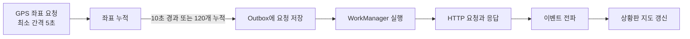

# [Android] GPS 수집 주기 5초, 전송 주기 10초에 대한 근거 부족 문제

## 문제 배경

- 문서와 Android 수색 기록 화면은 GPS 수집과 서버 전송을 `GPS 5초 / 전송 10초`라는 하나의 기준처럼 표시합니다.
- 실제 코드는 GPS 좌표를 최소 5초 간격으로 요청하며, `10초`는 HTTP 주기가 아니라 Outbox 저장 조건으로 사용합니다.
- 이 Issue를 열 당시에는 현장 경로, 배터리 사용량과 상황판에서 허용할 위치 지연을 근거로 두 값을 검증한 기록이 없었습니다.

현재 설정에서 경로 누락이나 과도한 배터리 소모가 발생한다고 확인된 것은 아닙니다. 따라서 이 Issue는 설정 오류를 수정하는 작업이 아니라, 수집·저장·전송·표시를 구분하고 단계별 기준과 선택 근거를 검증하는 작업입니다.

### 문제의 영향: 경로·배터리·상황판 지연을 판단할 기준 부재

GPS 수집 주기는 지도에 그려지는 경로의 모양과 배터리 사용량에 영향을 줍니다. 좌표 묶음 저장과 HTTP 요청 조건은 네트워크 요청 수와 오프라인 상태에서 업무폰에 쌓이는 요청 수에 영향을 줍니다. 서버 응답 뒤 이벤트 전파와 상황판 표시까지 걸리는 시간은 지휘관이 보는 대원 위치의 지연을 결정합니다.

각 단계를 구분하지 않으면 `10초 전송`을 10초마다 HTTP 요청이 시작되거나 10초 안에 상황판이 갱신된다는 의미로 오해할 수 있습니다. 측정 근거가 없으면 5초가 보행과 차량의 경로를 표현하면서 배터리 제약도 만족하는지, 현재 저장·전송 구조가 현장에서 허용할 위치 지연과 복구 시간을 만족하는지 판단할 수 없습니다.

### 외부 자료의 한계: 제품과 이동 조건마다 다른 주기 사용

확인한 공개 자료에는 수리맵에 그대로 적용할 수 있는 공통 주기가 없었습니다.

- 인접 공공안전 분야의 [소방공무원 현장 소방활동 안전관리에 관한 규정](https://law.go.kr/LSW/admRulInfoP.do?admRulSeq=2100000264370&chrClsCd=010202&lsId=70663)과 [재난현장 표준작전절차](https://www.daegu.go.kr/cmsh/daegu.go.kr/119/files/%EC%9E%AC%EB%82%9C%ED%98%84%EC%9E%A5%ED%91%9C%EC%A4%80%EC%9E%91%EC%A0%84%EC%A0%88%EC%B0%A8.pdf)는 현장 통신과 대원 위치 관리를 요구하지만 초 단위 GPS 주기는 정하지 않습니다.
- [CalTopo/SARTopo](https://training.caltopo.com/all_users/mobile/tracks)는 이동 속도에 따라 2.5초·5초·10초·30초 기록 설정을 구분하고, [ATAK](https://github.com/deptofdefense/AndroidTacticalAssaultKit-CIV/blob/main/atak/ATAK/app/src/main/java/com/atakmap/comms/ReportingRate.java)은 이동 속도에 따라 보고 주기를 조정합니다. [ArcGIS Field Maps](https://doc.arcgis.com/en/field-maps/android/use-maps/track.htm)는 이동 상태와 충전 여부에 따라 위치 요청과 업로드 방식을 바꿉니다.
- [Android 공식 안내](https://developer.android.com/develop/sensors-and-location/location/battery)는 위치 정확도·수집 빈도·전달 지연과 배터리 사용량의 관계를 설명하고, 서비스 목적을 만족하는 범위에서 가능한 한 긴 주기를 사용하도록 권합니다.

따라서 외부 값은 비교 자료로만 사용하고, 수리맵의 사용자·이동 속도·통신 환경과 위치 정보의 사용 목적을 기준으로 직접 측정해야 합니다.

### 실제 처리 구조: `10초 전송`은 HTTP 주기가 아닌 Outbox 저장 조건

[LocationRecorder](../../android/app/src/main/java/com/surimap/core/location/LocationRecorder.kt)는 수색 중 GPS 좌표를 최소 5초 간격으로 요청합니다. [SearchPathGpsBatchRecorder](../../android/app/src/main/java/com/surimap/feature/search/data/SearchPathGpsBatchRecorder.kt)는 첫 번째 대기 좌표부터 10초가 지난 뒤 새 좌표가 들어오거나 좌표가 120개 쌓이면 요청 묶음을 Outbox에 저장합니다. Outbox는 서버 전송을 기다리는 요청을 업무폰에 보관하는 공간입니다.

실제 HTTP 요청은 Android의 백그라운드 작업 도구인 WorkManager가 실행된 뒤 시작합니다. 서버 응답 뒤에도 이벤트 전파와 상황판 지도 갱신이 남으므로 `10초`만으로 전체 위치 지연을 설명할 수 없습니다.

### 문제 해결: 체크리스트

다음 조건을 모두 만족하면 이 Issue를 닫습니다.

- [ ] 도보와 차량에서 비교할 GPS 수집 주기를 정하고, 반복 실기기 측정이나 외부 자료로 확인한 근거와 한계를 기록합니다.
- [ ] GPS 수집, 좌표 묶음 저장, HTTP 응답과 앱의 완료 기록, 상황판 반영을 구분해 측정하고 각 단계의 허용 기준을 정합니다.
- [x] 업무폰 468대의 순차 전송을 모델링해 30분치 요청을 재전송하면서 새 요청도 처리하고, 정한 복구 시간 안에 누락과 중복 없이 마칩니다.
- [ ] 최종 GPS 수집·전송 기준과 선택 근거를 기준 문서에 반영하고, 아직 확인하지 못한 범위를 후속 작업으로 연결합니다.

## 원인 분석과 선택지

### 원인: 목적이 다른 네 단계를 하나의 기준으로 기록

확인된 원인은 GPS 수집부터 상황판 표시까지를 하나의 `5초·10초` 결정으로 다룬 문서 구조입니다. 각 단계는 목적과 관측값이 다르므로 다음과 같이 나누어 기준을 정해야 합니다.

| 단계 | 확인할 값 | 영향을 받는 항목 |
| --- | --- | --- |
| GPS 수집 | 이동 조건별 좌표 간격과 경로 모양 | 경로 표현, 배터리 사용량 |
| 좌표 묶음 저장 | 시간·좌표 수 조건과 저장 시각 | 요청 묶음 크기, 업무폰 대기 요청 수 |
| HTTP 요청과 앱 완료 기록 | 요청·응답·`ACKED` 시각과 재시도 | 네트워크 요청, 온라인 전송과 오프라인 복구 |
| 이벤트 전파와 상황판 표시 | 서버 응답부터 지도 표시까지의 시간 | 지휘관이 보는 대원 위치 지연 |

### 대안 비교: 외부 기본값 복사보다 수리맵 조건의 직접 측정

| 방법 | 장점 | 한계 | 적용 방향 |
| --- | --- | --- | --- |
| 외부 서비스의 기본값 적용 | 빠르게 초기 값을 정할 수 있음 | 사용자·이동 속도·통신 방식과 위치 사용 목적이 다름 | 비교 자료로만 사용 |
| 수리맵 조건에서 직접 측정 | 현장 조건과 각 단계의 결과를 연결할 수 있음 | 반복 측정과 현장 경험자의 판단이 필요함 | 최종 기준을 정하는 방법으로 사용 |

### 선택 방향: 같은 조건의 비교와 현장 허용 기준 결합

같은 업무폰과 이동 경로에서 GPS 수집 주기만 바꾸며 좌표 사이 거리, 경로 모양과 배터리 사용량을 비교합니다. 수집 주기를 정한 뒤에는 좌표 묶음 저장, HTTP 요청과 앱 완료 기록, 이벤트 전파와 상황판 표시 시간을 차례로 측정합니다. 현직 경찰관이나 수색 지휘 경험자에게는 대원 위치가 몇 초 이상 늦게 보일 때 업무에 문제가 되는지 확인합니다.

오프라인 복구는 업무폰 468대가 30분치 요청을 순차 재전송하면서 새 요청도 만드는 조건으로 따로 검증합니다. 이번 Issue에서는 직접 측정 결과와 현장 허용 기준을 함께 사용해 최종 GPS 수집·전송 기준을 정하고, 확인하지 못한 범위는 후속 작업으로 연결합니다.

# 댓글

## 변경 내용과 트레이드오프

- 2026년 7월 14일, Galaxy A21s (`SM-A217N`)에서 위치 수신부터 Outbox 처리까지 처음 측정했습니다.
- 실내 정지 조건에서는 GPS 좌표가 들어오지 않았고, 네트워크 위치는 평균 `19,991ms` 간격으로 들어왔습니다.
- 앱 기록상 Outbox 요청 10건은 모두 첫 처리 시도 후 `ACKED` 상태가 됐습니다.
- HTTP 요청·응답 시각과 야외 GPS를 측정하지 않았으므로, 이번 결과만으로 충족한 Issue #8 해결 기준은 없습니다.

### 측정 범위: 앱 내부 처리 단계까지만 확인

| 항목 | 값 |
| --- | --- |
| 측정일 | 2026년 7월 14일 |
| 업무폰 | Galaxy A21s (`SM-A217N`) |
| 운영체제 | Android `12` |
| 앱 버전 | `0.1.0` |
| 네트워크 | Wi-Fi |
| 이동 조건 | 실내 정지 |

Outbox는 서버 전송을 기다리는 요청을 업무폰에 보관하는 공간입니다. 이번 측정에서는 다음 두 자료를 대조했습니다.

- `android_outbox_row` 테이블: Outbox 요청의 상태와 처리 시도 횟수
- `adb logcat`: 위치 수신, WorkManager 작업 등록·예약, Worker의 요청 읽기 시작 시각

이 자료로 앱 내부의 위치 수신부터 Outbox 처리 시작까지는 구분할 수 있지만, HTTP 요청 시작과 서버 응답 시각은 확인할 수 없습니다.

### 전송 단계 구분: `10초`는 Outbox 저장 조건

앱은 GPS와 네트워크 위치를 모두 최소 5초 간격으로 요청합니다. 그러나 Android가 실제 좌표를 제공하는 간격은 위치 제공자와 실행 환경에 따라 달라질 수 있습니다.

코드의 `10초`는 HTTP 전송 주기가 아닙니다. 첫 번째 대기 좌표를 수집한 뒤 10초 이상 지난 새 좌표가 들어오고 좌표가 2개 이상 모이거나, 좌표가 `120개` 쌓이면 요청을 Outbox에 저장합니다. 실제 HTTP 요청은 WorkManager가 실행된 뒤 시작합니다.

## 검증 결과

### 위치 수신 결과: 네트워크 위치 평균 19,991ms

이번 측정에서는 GPS 좌표가 기록되지 않고 네트워크 위치만 기록됐습니다.

| 측정값 | 결과 |
| --- | ---: |
| 평균 수신 간격 | `19,991ms` |
| 최소 수신 간격 | `19,882ms` |
| 최대 수신 간격 | `20,004ms` |
| Outbox 요청 한 건의 좌표 수 | 2개 |
| 새 Outbox 요청 시작 간격 | 평균 `39,992ms` |

네트워크 위치가 약 20초 간격으로 들어와 좌표 2개를 담은 새 Outbox 요청은 평균 약 40초 간격으로 시작됐습니다. 이 결과는 네트워크 위치와 Outbox 저장 간격을 보여 줄 뿐, GPS 수신 간격이나 HTTP 요청 간격을 뜻하지 않습니다.

### Outbox 처리 결과: 요청 10건 모두 첫 시도 ACKED

아래 시간은 모두 마지막 좌표를 받은 시점부터 계산했습니다. 같은 기준점에서 잰 누적 시간이므로 서로 더하지 않습니다.

| 마지막 좌표 수신 뒤 단계 | 평균 시간 |
| --- | ---: |
| WorkManager 작업을 기기 데이터베이스에 등록 | `89ms` |
| Android가 WorkManager 작업을 예약 | `131ms` |
| Worker가 저장된 요청을 읽기 시작 | `278ms` |

`OutboxWorker`의 전체 실행 시간은 평균 `1,313ms`, 최소 `1,226ms`, 최대 `1,478ms`였습니다. 이 값은 Worker 자체의 실행 시간이며 위 세 누적 시간에 더하지 않습니다.

Outbox 요청 10건은 모두 `attemptCount = 1`인 상태에서 `ACKED`로 바뀌었습니다. `ACKED`는 앱이 요청 처리를 완료했다고 기록한 상태이고, `attemptCount`는 처리 시도 횟수입니다. 이 기록만으로 실제 HTTP 요청 횟수나 서버 응답 횟수는 알 수 없습니다.

### 해결 기준: 이번 측정만으로 충족한 항목 없음

실내 정지 조건에서 GPS 좌표가 들어오지 않아 실제 GPS 수신 간격을 확인하지 못했습니다. 야외 이동 경로, 지도 표현, 배터리 사용량, 같은 조건의 반복 결과도 측정하지 않았습니다.

HTTP 요청 시작과 응답 시각도 따로 기록하지 않았습니다. 당시 앱은 Outbox 처리를 시작하기 전에 확인한 시각을 요청 완료 때 다시 확인하지 않고 `serverAckTs`에 저장했으므로, 이 값으로 HTTP 응답 시간이나 서버 ACK 시각을 계산할 수 없었습니다.

따라서 이번 측정만으로 충족한 Issue #8 해결 기준은 없습니다. 당시 후속 작업으로 HTTP 요청·응답 시각 계측, `serverAckTs`의 의미와 저장 방식 수정, 같은 업무폰을 이용한 야외 이동 반복 측정을 남겼습니다.

# 댓글

## 변경 내용과 트레이드오프

- Galaxy A21s에서 2.5초 수집 주기로 측정한 요청률은 업무폰 한 대당 약 0.067 RPS였습니다.
- 경찰 1,394명을 1,400명으로 반올림하고, 6명당 한 팀과 팀당 업무폰 2대를 가정해 전체 업무폰을 468대로 계산했습니다.
- 초기 혼합 부하는 실시간 31.4 RPS와 재전송 188.1 RPS를 합친 219.5 RPS를 반올림해 220 RPS로 잡았고, 2,200 RPS는 서버 한계를 찾기 위한 상한으로만 두었습니다.
- 목표 RPS를 유지하는 open arrival-rate 방식은 용량 탐색에는 적합하지만 업무폰별 순차 전송을 재현하지 못하므로, 이후 실행한 복구 테스트에서는 사용하지 않았습니다.

> 이 댓글은 2026년 7월 28일 작성한 초기 부하 테스트 계획입니다. 이후 확정한 순차 전송 모델과 실행 결과는 세 번째 댓글을 기준으로 확인합니다.

### 입력 근거: Galaxy A21s 한 대에서 0.067 RPS 측정

| 항목 | 측정값 |
| --- | ---: |
| 측정일 | 2026년 7월 28일 |
| GPS 수집 주기 | 2.5초 |
| 측정 시간 | 31분 27초 |
| 좌표 수 | 704개 |
| HTTP 요청 수 | 125건 |
| 업무폰 한 대의 요청률 | 약 0.067 RPS |
| 요청 한 건의 평균 좌표 수 | 5.6개 |

RPS는 서버가 1초 동안 받는 HTTP 요청 수입니다. 이 실기기 측정값을 업무폰 수와 통신 단절·복구 시간에 적용해 초기 부하를 계산했습니다.

### 규모 산정: 가정한 업무폰 468대에서 혼합 부하 220 RPS 도출

[행정안전부의 2023년 7월 23일 호우 대처상황 보고](https://www.mois.go.kr/cmm/fms/FileDown.do?atchFileId=FILE_00119575qmgJd5m&fileSn=0)는 2023년 7월 19일 경찰 1,394명이 5개 지역의 수색을 지원했다고 기록합니다. 초기 계획에서는 이를 1,400명으로 반올림하고, 경찰관 6명을 한 팀으로 가정해 올림한 234개 팀을 사용했습니다. 각 팀이 현장 업무폰 1대와 순찰차 업무폰 1대를 사용한다고 가정해 전체 업무폰을 468대로 잡았습니다.

| 부하 | 계산 | 결과 |
| --- | ---: | ---: |
| 실시간 요청 | 468대 × 0.067 RPS | 31.4 RPS |
| 30분치 요청을 5분에 재전송 | 468대 × 0.067 RPS × 1,800초 ÷ 300초 | 188.1 RPS |
| 혼합 부하 | 31.4 RPS + 188.1 RPS | 219.5 RPS → 220 RPS |

팀당 6명, 팀당 업무폰 2대, 통신 단절 30분과 복구 5분은 테스트를 위해 정한 조건이며 확인된 운영 기준이 아닙니다. 경찰관 14,000명도 예상 사용자 수가 아닙니다. [Grafana k6 스트레스 테스트 안내](https://grafana.com/docs/k6/latest/testing-guides/test-types/stress-testing/)처럼 스트레스 부하에 정해진 배수는 없으므로, 220 RPS의 10배인 2,200 RPS는 서버 용량의 상한을 찾기 위한 값으로만 두었습니다.

### 모델 선택: 용량 탐색을 위한 open arrival-rate 방식

초기 계획은 [open model의 arrival-rate 방식](https://grafana.com/docs/k6/latest/using-k6/scenarios/concepts/open-vs-closed/)으로 응답 시간과 관계없이 목표 RPS에 맞춰 요청을 시작하는 것이었습니다. 이 방식은 일정한 요청률로 서버 한계를 찾기 쉽지만, 같은 업무폰의 앞 요청이 끝난 뒤 다음 요청을 보내는 Android Outbox의 순차 전송은 재현하지 못합니다.

요청 데이터는 업무폰마다 테스트 계정과 수색 경로를 하나씩 배정하고, 같은 경로에 시간순으로 보내도록 계획했습니다. k6 반복 한 번에는 실기기와 비슷하게 좌표 약 6개를 담은 요청 한 건만 두고, `Idempotency-Key`는 요청마다 새로 만들기로 했습니다.

`dropped_iterations`와 k6 실행기의 CPU·메모리도 확인해 요청을 정한 시각에 시작하지 못하면 서버와 실행기 중 원인을 먼저 구분하기로 했습니다. 실행기와 서버는 가능한 한 분리하고, 같은 컴퓨터를 사용하면 양쪽의 CPU와 메모리를 함께 기록하도록 계획했습니다.

이 트레이드오프 때문에 최종 복구 검증에서는 목표 RPS를 강제로 만드는 대신 업무폰 한 대에 가상 사용자 한 명을 대응시킨 순차 전송 모델을 사용했습니다. 해당 모델과 실행 결과는 세 번째 댓글에 정리했습니다.

### 실행 계획: Smoke Test부터 2,200 RPS 상한까지 확장

[Grafana k6 Test Types](https://grafana.com/docs/k6/latest/testing-guides/test-types/)가 권하는 순서에 따라 다음 단계를 계획했습니다.

| 순서 | 확인할 내용 | 요청량 |
| ---: | --- | ---: |
| 1 | Smoke Test로 인증, 데이터, 스크립트 확인 | 최소 요청 |
| 2 | 실시간 경로 요청 처리 확인 | 31.4 RPS |
| 3 | 통신 복구 직후 밀린 요청 처리 확인 | 31.4 RPS에서 220 RPS로 올려 5분 유지 |
| 4 | 기준보다 높은 부하에서 성능 변화 확인 | 440 RPS와 880 RPS를 별도 실행 |
| 5 | 긴 경로와 장시간 실행에서 자원이 계속 늘어나는지 확인 | 31.4 RPS로 8시간 이상 |
| 6 | 앞선 테스트 통과 뒤 서버 처리 한계 확인 | 최대 2,200 RPS까지 천천히 증가 |

## 검증 결과

### 계획 상태: 실제 부하 테스트 결과 없음

이 댓글에서 확정한 것은 입력값, 가정, 부하 계산과 실행 순서입니다. 220 RPS와 2,200 RPS는 계획한 요청량이지 측정된 처리량이 아닙니다. 실제 응답 시간, 오류율, 좌표 누락·중복 결과가 없으므로 당시에는 Issue #8의 해결 기준을 충족했다고 판단하지 않았습니다.

### 판정 항목: HTTP 결과·저장 정합성·서버 자원

- [Checks](https://grafana.com/docs/k6/latest/using-k6/checks/)로 상태 코드와 응답 내용을 확인하도록 계획했습니다.
- [Thresholds](https://grafana.com/docs/k6/latest/using-k6/thresholds/)에는 합의한 응답 시간과 오류율만 넣고, 정하지 않은 기준은 예제에서 복사하지 않기로 했습니다.
- 좌표 누락과 중복은 전송 기록과 PostgreSQL 저장 결과를 비교해 확인하기로 했습니다.
- HTTP RPS, 응답 시간, 오류율, PostgreSQL이 1초 동안 완료한 트랜잭션 수인 TPS, CPU, 메모리, 데이터베이스 커넥션 수, 잠금 대기, 쿼리 시간을 함께 기록하기로 했습니다.

# 댓글

## 변경 내용과 트레이드오프

- 보행 조건의 GPS 수집 주기는 5초로 정했습니다.
- 업무폰 468대의 순차 전송을 모델링한 혼합 복구 테스트는 정한 재전송 목표를 충족했습니다.
- 차량 조건의 수집 주기와 앱 전체에 적용할 최종 수집 주기는 아직 정하지 않았습니다.
- 같은 이동 조건의 배터리 비교, 상황판 표시까지의 시간, 현장에서 허용할 위치 지연과 서버 최대 처리량은 아직 확인하지 않았습니다.

따라서 이번 댓글은 보행 조건의 선택 근거와 468대 복구 검증 결과를 기록하지만 Issue #8 전체를 완료 처리하지는 않습니다.

### 전송 단계 구분: `10초 전송`은 HTTP 주기가 아닌 Outbox 저장 조건

문서에는 `GPS 5초 / 전송 10초`가 하나의 기준처럼 적혀 있지만, 실제 처리는 다음 네 구간으로 나뉩니다. 이번 작업에서는 네 구간을 서로 다른 측정 대상으로 다뤘습니다.

| 구간 | 이번 작업에서 확인한 범위 |
| --- | --- |
| GPS 수집 | 보행 5초·10초 직접 비교, 차량 비교는 미실행 |
| 좌표 묶음 저장 | 10초 경과 또는 120개 누적 조건 확인, 저장 시간은 미측정 |
| HTTP 요청과 앱 완료 기록 | 요청 시작·서버 응답·`ACKED` 저장 시각 분리 |
| 이벤트 전파와 상황판 표시 | 이번 측정에서 제외 |

`10초 전송`은 10초마다 HTTP 요청을 보내는 타이머가 아닙니다. 첫 번째 대기 좌표부터 10초가 지난 뒤 새 좌표가 들어오거나 좌표가 120개 쌓이면 요청 묶음을 Outbox에 저장합니다. Outbox는 보내지 못한 요청을 업무폰에 보관하는 공간입니다. 실제 HTTP 요청은 Android의 백그라운드 작업 도구인 WorkManager가 실행된 뒤 시작합니다.

이 차이를 측정할 수 있도록 HTTP 요청 시작, 서버 응답 도착, 앱 데이터베이스의 `ACKED` 저장 시각을 따로 기록했습니다. `ACKED`는 앱이 서버 응답 처리를 마쳤다고 기록한 상태입니다. `serverAckTs`도 Outbox 처리 시작 시각이 아니라 서버 응답을 받은 뒤의 시각을 저장하도록 바로잡았습니다.

### 측정 범위: 보행 직접 비교, 차량·배터리 추가 검증

Galaxy A21s `SM-A217N`, Android 12에서 같은 야외 보행 경로를 걸으며 5초와 10초 수집 결과를 각각 세 차례 비교했습니다. 좌표 사이 거리와 방향 전환 구간의 경로 모양을 함께 확인했습니다.

차량은 수리맵에서 직접 비교하지 않았습니다. [CalTopo/SARTopo](https://training.caltopo.com/all_users/mobile/tracks)의 2.5초 권장값은 비교 자료로만 사용했습니다. 차량 조건의 2.5초와 5초는 같은 조건에서 직접 측정한 뒤 결정합니다.

2.5초와 5초 앱의 배터리 사용량도 예비 측정했지만 GPS 동작 시간과 좌표 제공자가 달랐습니다. 수집 주기만의 차이로 볼 수 없어 보행 5초의 선택 근거에서는 제외했고, 같은 이동 조건에서 다시 측정합니다.

### 복구 모델: k6 가상 사용자 468명으로 Outbox 순서 재현

2026년 8월 15일 Hetzner 개발 환경에서 소규모 사전 실행을 마친 뒤, 업무폰 한 대에 k6 가상 사용자(VU) 한 명을 대응시켰습니다. 각 VU는 앞 요청의 응답을 받은 뒤 다음 요청을 보내 Android Outbox의 순차 전송을 모델링했습니다. 물리 단말 468대로 측정한 결과는 아닙니다.

각 업무폰 모델은 30분치 재전송 요청 120건을 먼저 처리하고, 복구 중 15초마다 생기는 새 요청 20건을 같은 순서 뒤에 추가했습니다. 요청 한 건에는 2.5초 간격 GPS 좌표 6개를 담았습니다. 전체 요청은 `468 × 140 = 65,520건`이고, 이 가운데 재전송 요청은 `468 × 120 = 56,160건`입니다.

전체 65,520건을 5분으로 나눈 218.4 RPS는 테스트 규모를 설명하는 계산값입니다. RPS는 1초 동안 처리하는 HTTP 요청 수이며, k6가 이 요청률을 강제로 주입하지 않았습니다. 5분은 이번 테스트의 재전송 목표이고 전체 실행 제한은 5분 30초였습니다. 둘 다 현장 복구 기준이나 서비스 수준 협약(SLA)은 아닙니다.

이 모델은 Android Outbox와 같은 순차 요청 흐름에서 복구 시간과 데이터 무결성을 확인할 수 있지만 서버 최대 처리량은 알려주지 않습니다. 최대 처리량은 고정 요청률을 사용하는 별도 용량 테스트에서 확인합니다.

## 검증 결과

### 해결 기준: 4개 중 1개 충족

현재 해결 기준 4개 중 혼합 복구 검증 1개를 충족했습니다.

- [ ] **도보·차량 수집 주기와 근거:** 보행 5초의 근거와 한계는 기록했지만 차량 주기는 아직 비교하지 않았습니다.
- [ ] **단계별 시간과 허용 기준:** GPS 수집 결과와 HTTP 응답·앱 완료 기록은 분리했지만 좌표 묶음 저장 시간, 상황판 반영 시간과 각 구간의 현장 허용 기준은 남아 있습니다.
- [x] **468대의 30분치 재전송과 새 요청 처리:** k6 가상 사용자 468명으로 순차 전송을 모델링해 재전송을 목표 시간 안에 마쳤고, 누락과 중복이 없음을 확인했습니다.
- [ ] **최종 기준 문서화와 후속 작업 연결:** 차량·배터리·상황판·용량 검증 뒤 최종 주기와 선택 근거를 기준 문서에 반영해야 합니다.

### 보행 수집 주기 결정: 방향 전환 표현을 근거로 5초 선택

기기가 보고한 위치 오차 값이 5m 이하인 GPS 좌표가 두 번 연속 들어온 이후를 비교했습니다. 이 구간에서 좌표 사이 최대 거리는 5초가 12.5~15.0m, 10초가 17.4~19.5m였습니다.

10초 기록은 1차와 3차에서 실제로 돌아간 건물 바깥 경계를 안쪽으로 잘라 표시했고, 5초 기록은 같은 두 회차에서 그 경계를 넘지 않았습니다. 그러나 2차에서는 두 주기 모두 GPS 위치가 한쪽으로 치우쳐 같은 건물 경계를 지났습니다. 건물 경계 통과나 좌표 사이 거리만으로 합격 여부를 판단하지 않은 이유입니다.

실제 경로와의 정량 오차는 측정하지 않았습니다. 이번 테스트에서 확인한 것은 세 회차에서 반복된 방향 전환 표현 차이입니다. 이를 근거로 보행 수집 주기를 5초로 정했습니다. 자세한 값은 로컬 검증 문서 `_workspace/gps-interval-field-test/walk-5s-10s-summary.md`에 기록했습니다.

### 배터리 비교의 한계: 주기별 우위 판단 불가

GPS 동작 1분당 사용량은 2.5초 앱이 0.816mAh, 5초 앱이 0.817mAh였습니다. 그러나 두 측정의 GPS 동작 시간과 좌표 제공자가 달랐으므로 어느 주기가 배터리를 덜 쓰는지는 판단하지 않았습니다. 측정 조건과 한계는 로컬 검증 문서 `_workspace/gps-interval-field-test/battery-interval-comparison.md`에 기록했습니다.

### 온라인 전송 결과: 요청 9건 모두 첫 Outbox 처리에서 완료

2026년 7월 15일 같은 기기와 배포 서버에서 온라인 수색 경로 요청 9건을 측정했습니다. 9건 모두 첫 Outbox 처리 시도 뒤 `ACKED`가 됐습니다.

| 측정 구간 | 평균 | 중앙값 | 최소 | 최대 |
| --- | ---: | ---: | ---: | ---: |
| 요청 시작 → 서버 응답 | 1,279ms | 1,193ms | 1,099ms | 1,620ms |
| 서버 응답 → `ACKED` 저장 | 7ms | 미기록 | 4ms | 12ms |

`adb logcat`의 HTTP 시각 기록과 Room 데이터베이스의 `android_outbox_row`를 대조해 계산했습니다. 이 값에는 서버 응답 뒤 이벤트 전파와 상황판 표시 시간이 포함되지 않습니다.

### 혼합 복구 결과: 재전송 56,160건을 4분 14초에 완료

재전송 요청 56,160건은 가장 늦은 업무폰 모델에서도 4분 14초에 끝나 5분 목표를 충족했습니다. 새 요청을 포함한 전체 65,520건은 약 5분 6초에 끝났습니다.

| 항목 | 결과 |
| --- | ---: |
| 전체 요청 | 65,520건 완료 |
| 재전송 요청 | 56,160건 완료 |
| 가장 늦은 업무폰 모델의 재전송 완료 | 4분 14초 |
| 전체 실행 시간 | 약 5분 6초 |
| 평균 처리량 | 213.95 RPS |
| HTTP 응답 시간 | p95 3.92초, 최대 7.24초 |
| 실패 요청·제외 좌표 | 0건 |

HTTP 응답 시간의 95번째 백분위수(p95)는 3.92초였습니다. 이는 요청의 95%가 3.92초 안에 응답받았다는 뜻입니다. 이번 테스트에는 HTTP 응답 시간 합격 기준을 두지 않았습니다.

PostgreSQL에는 업무폰 모델별 경로 468개, 경로별 구간 140개와 좌표 840개가 저장됐습니다. 전체 구간은 65,520개, 전체 좌표는 393,120개였습니다. 중복된 `Idempotency-Key`와 시간 구간은 없었고, 서버 응답 뒤 변경 이벤트를 전달하는 작업 65,520건도 모두 완료됐습니다.

복구 중 생긴 새 요청은 먼저 쌓인 재전송 요청 뒤에서 기다렸습니다. 전송 시작 지연은 p95 3분 32초, 최대 3분 59초였습니다. 이 값은 HTTP 응답 시간 p95 3.92초와 다른 측정값입니다. 현장에서 허용할 기준이 아직 없어 이 지연만으로 새 결함을 확정하지 않았습니다.

HikariCP 커넥션 풀의 커넥션 10개를 모두 사용했고, 커넥션을 기다린 요청은 최대 190개였습니다. 애플리케이션 서버 CPU는 최대 68.85%였습니다. 데이터베이스 연결 시간 초과, PostgreSQL 롤백과 교착 상태는 발생하지 않았습니다. 테스트 종료 뒤 커넥션 대기는 4초 만에 0으로 돌아왔고, Backend 최대 응답 시간 지표는 2분 10초 뒤 테스트 전 수준으로 돌아왔습니다.

재현 방법은 로컬 문서 `infra/k6/README.md`에 기록했습니다. 서버 지표는 아래 [Grafana 검증 이미지](https://github.com/sonic8-8/suri-map/blob/f67a7d6954f56f7066a17aa3ee3d6a151e12a4bf/docs/evidence/backend/issue-8-mixed-load-test.png)에 기록했습니다. 원본 k6 결과는 Ops 서버의 `/srv/ops/k6/results/mixed-468-20260814T152749Z.json`과 같은 이름의 `.log`에 보관했습니다. 검증 뒤 테스트 데이터와 부하 테스트용 인증 정보는 삭제했습니다.

### 남은 검증: 차량·배터리·상황판·서버 용량

- 차량 조건에서 2.5초와 5초 수집 결과를 직접 비교합니다.
- 같은 이동 조건에서 2.5초와 5초 앱의 배터리 사용량을 비교합니다.
- HTTP 요청 시작부터 상황판 경로 표시까지의 전체 시간을 측정하고, 현장 경험자가 허용할 위치 지연을 정합니다.
- 고정 요청률로 서버 최대 처리량을 측정합니다. 새 병목이 확인되면 별도 Issue로 분리해 해결한 뒤 다시 측정합니다.
- 최종 GPS 수집·전송 기준과 선택 근거를 기준 문서에 반영하고, 미확인 범위를 후속 작업으로 연결합니다.

Issue #8은 위 작업과 최종 문서화가 끝날 때까지 열어 둡니다. 데이터베이스 커넥션 풀 포화는 [Issue #15](https://github.com/sonic8-8/suri-map/issues/15)에서 계속 추적합니다.

# 댓글

## 변경 내용과 트레이드오프

- 2026년 9월 1일, Hetzner 개발 환경에서 `/api/search-paths/batch`의 Breakpoint Test (서버 처리 한계 시험)를 고정 요청률로 진행했습니다.
- 1분 시험에서는 765 RPS가 통과했지만 같은 부하를 5분 유지하자 실패했습니다. 짧은 시험값을 처리 한계로 확정하지 않고 5분 조건에서 통과값과 실패값을 다시 좁혔습니다.
- 현재 시험 조건에서 5분간 오류 없이 처리한 마지막 값은 453 RPS였고, 454 RPS에서는 두 차례 모두 HTTP 실패가 발생했습니다. 세 실행 모두 `dropped_iterations`는 0건이었습니다.
- 이 결과는 현재 서버 사양과 요청 형태에서 서버 처리 한계를 탐색한 결과입니다. 업무폰 468대의 수용량, 운영 안전 처리량이나 서비스 수준 협약(SLA)을 뜻하지 않습니다.

### 시험 목적: 순차 복구와 분리한 서버 처리 한계 측정

앞선 혼합 복구 시험은 k6 가상 사용자 한 명을 업무폰 한 대에 대응시키고, 앞 요청의 응답을 받은 뒤 다음 요청을 보내도록 구성했습니다. 이 방식은 Android Outbox의 순차 전송과 468대의 복구 완료 시간을 검증하지만, 응답이 느려지면 요청률도 함께 낮아져 서버의 처리 한계를 찾기 어렵습니다.

이번 시험은 k6의 `constant-arrival-rate` 실행기를 사용해 서버 응답 시간과 관계없이 목표 RPS에 맞춰 요청을 시작했습니다. RPS는 서버에 1초 동안 보내는 HTTP 요청 수입니다. 이 방식은 서버 처리 한계를 찾는 데 적합하지만 업무폰별 요청 순서는 재현하지 않습니다. 두 시험은 같은 결과를 중복 측정하는 것이 아니라 각각 복구 흐름과 고정 요청률에서의 실패 시작점이라는 다른 질문에 답합니다.

### 부하 조건: 요청당 좌표 6개와 최대 VU 6,000명

요청 한 건에는 2.5초 간격의 GPS 좌표 6개를 담았습니다. 2.5초는 차량 조건에서 검토 중인 가장 짧은 수집 주기로, 좌표가 가장 자주 생성되는 부하를 가정하기 위해 사용했습니다. 각 VU에는 서로 다른 테스트 계정과 수색 경로를 배정했고, 같은 VU는 맡은 경로에 시간순으로 좌표 묶음을 보냈습니다.

목표 요청률을 유지할 수 있도록 테스트 계정·업무폰·수색 경로를 묶은 requester fixture 6,000개와 k6 가상 사용자(VU) 6,000명을 준비했습니다. `dropped_iterations`는 k6가 정한 시각에 요청을 시작하지 못한 횟수입니다. 최종 세 실행에서는 이 값이 모두 0이었으므로 454 RPS의 실패를 VU 부족으로 보지 않았습니다.

| 항목 | 조건 |
| --- | --- |
| App 서버 | 16 vCPU, 약 32GB RAM |
| Ops 부하 발생기 | 4 vCPU, 약 8GB RAM |
| 부하 모델 | k6 `constant-arrival-rate`, RPS별 독립 실행 |
| 최종 확인 실행 시간 | 각 5분 |
| 요청 데이터 | 요청당 GPS 좌표 6개, 좌표 간격 2.5초 |
| HTTP 요청 상한 시간 | 10초 |
| Requester fixture·사전 할당 VU | 6,000개·6,000명 |

HTTP 요청 상한 시간 10초는 현재 Android 네트워크 기본값에 맞춘 실패 판정 조건이며, 합의한 응답 시간 기준이나 SLA는 아닙니다.

### 처리 한계 탐색: 1분 결과를 5분 시험으로 재검증

1분 탐색에서는 `765 RPS 통과 / 766 RPS 반복 실패`가 나왔습니다. 그러나 765 RPS를 5분 동안 실행하자 실패했고, 764·715·660 RPS도 같은 조건에서 실패했습니다. 짧은 실행에서는 드러나지 않았던 실패가 지속 시간을 늘렸을 때 나타났으므로 1분 결과는 서버 처리 한계로 확정하지 않았습니다.

5분 시험은 `440 통과 → 550 실패 → 495 실패 → 467 실패 → 453 통과 → 460 실패 → 456 실패 → 454 반복 실패` 순서로 범위를 좁혔습니다. 마지막 통과값과 실패값이 1 RPS 차이가 날 때까지 확인했습니다. 이에 따라 453 RPS를 마지막 통과값, 454 RPS를 반복 실패가 시작된 값으로 기록했습니다.

## 검증 결과

### 최종 측정 결과: 453 RPS 통과, 454 RPS 반복 실패

| 목표 RPS | 결과 | HTTP 요청 | HTTP 실패 | `dropped_iterations` | p95 | 최대 응답 시간 | 최대 사용 VU |
| ---: | --- | ---: | ---: | ---: | ---: | ---: | ---: |
| 453 | 통과 | 135,901건 | 0건 | 0건 | 3.82초 | 8.01초 | 2,441명 |
| 454 | 실패 | 132,450건 | 1건 | 0건 | 5.78초 | 10초 | 3,963명 |
| 454 | 실패 | 135,882건 | 5건 | 0건 | 5.88초 | 10초 | 3,497명 |

454 RPS는 한 번의 우연한 실패로 판정하지 않고 fixture를 다시 준비해 재실행했습니다. 실패가 감지되면 k6가 실행을 중단하므로, HTTP 요청 수는 `목표 RPS × 5분`으로 해석하지 않았습니다. 두 실행 모두 부하 발생기 드롭 없이 HTTP 실패가 발생했으므로, 이번 조건에서는 454 RPS를 실패값으로 판정했습니다.

### 저장 결과: 요청 135,901건과 좌표 815,406개 일치

453 RPS 실행 뒤 k6 요청 수와 PostgreSQL 저장 결과를 대조했습니다.

| 항목 | 기대값 | 실제값 |
| --- | ---: | ---: |
| 요청 처리 완료 기록 | 135,901건 | 135,901건 |
| 고유 `Idempotency-Key` | 135,901개 | 135,901개 |
| GPS 좌표 | 815,406개 | 815,406개 |
| 고유 `pointId` | 815,406개 | 815,406개 |
| 제외 좌표 | 0개 | 0개 |

요청과 좌표의 누락·중복은 없었습니다. Backend와 PostgreSQL 컨테이너도 전체 시험 동안 재시작되거나 메모리 부족으로 종료되지 않았습니다.

### 포화 신호: 데이터베이스 커넥션 풀 대기 증가

453 RPS 통과 실행에서는 애플리케이션 CPU보다 데이터베이스 커넥션 풀이 먼저 포화 신호를 보였습니다.

HikariCP는 Backend가 PostgreSQL 커넥션을 재사용하기 위해 사용하는 데이터베이스 커넥션 풀입니다.

| 지표 | 최댓값 |
| --- | ---: |
| App CPU | 68.44% |
| App 메모리 | 41.55% |
| Ops CPU | 43.95% |
| Ops 메모리 | 70.16% |
| HikariCP 사용 중 커넥션 | 10개 |
| HikariCP 대기 요청 | 190개 |
| HikariCP 커넥션 획득 시간 | 1.56초 |
| HikariCP 커넥션 시간 초과 | 0건 |

커넥션 10개가 모두 사용됐고 대기 요청이 최대 190개까지 늘었습니다. 따라서 이번 실행에서 가장 먼저 관찰된 포화 신호는 데이터베이스 커넥션 풀이었습니다. 다만 SQL별 실행 시간은 수집하지 않았고 전체 lock 지표도 대기 여부를 구분하지 못하므로, 특정 쿼리나 잠금을 원인으로 단정하지 않습니다. 이 병목은 [Issue #15](https://github.com/sonic8-8/suri-map/issues/15)에서 계속 추적합니다.

[상세 측정 조건과 원본 자료의 SHA-256](https://github.com/sonic8-8/suri-map/blob/develop/docs/evidence/backend/issue-8-server-breakpoint-test.md)은 별도 검증 문서에 기록했습니다.

검증 뒤 부하 테스트 전용 데이터와 인증 정보는 삭제했고, 원본 로그와 시험 전 데이터베이스 백업은 재검증 자료로 보존했습니다.

### 해결 범위: 서버 처리 한계 측정 완료, Issue #8 유지

세 번째 댓글에서 남긴 고정 요청률 서버 처리 한계 측정은 완료했습니다. 그러나 이번 결과로 Issue 상단의 해결 기준을 추가로 충족하지는 않습니다. 453 RPS는 5분 동안 같은 크기의 요청을 보낸 결과이므로, 경로가 길어질 때 이전 좌표 조회와 경로 도형 재계산 비용이 어떻게 변하는지는 설명하지 못합니다.

다음에는 30분·8시간·24시간 분량의 경로를 준비하고 같은 요청률에서 경로 길이만 바꾸어 응답 시간과 PostgreSQL 작업량을 비교합니다. 이후 상황판 반영 시간과 읽기 부하를 측정하고, 현장 허용 기준을 확인해 GPS 수집 주기·좌표 묶음 기준·상황판 위치 지연·오프라인 복구 목표를 각각 확정합니다. Issue #8은 이 작업과 최종 문서화가 끝날 때까지 열어 둡니다.
