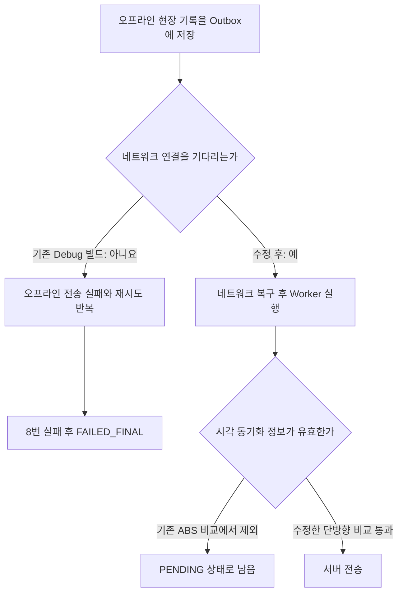

# [Android] 네트워크 복구 후 오프라인 현장 기록이 지도에 반영되지 않는 문제

## 문제 배경

수리맵 Android 앱은 통신이 끊겨도 수색 경로와 마커가 사라지지 않도록 현장 기록을 Room DB에 먼저 저장한다. 서버로 보내지 못한 요청은 Outbox에 쌓아 두고, 네트워크가 복구되면 WorkManager가 다시 전송한다.

하지만 실기기 테스트에서는 네트워크가 복구된 뒤 30분 이상 지나도 수색 경로가 지도에 나타나지 않았다. 여기서 `30분`은 허용 가능한 반영 시간이 아니라 실제로 기다린 시간이다. 사용자가 다시 로그인하거나 재전송 버튼을 누르지 않으면 기록이 서버에 전달되지 않았다.

현장 대원은 통신 상태를 계속 확인하며 같은 기록을 다시 보낼 수 없다. 전송이 멈추면 지휘 상황판과 다음 근무자는 이전 수색 경로를 확인할 수 없다. 따라서 네트워크 연결만 복구되면 Outbox에 저장된 기록이 자동으로 전송되어야 한다.

## 원인 분석과 선택지

2026년 7월 13일 Galaxy A21s 실기기와 배포 서버에서 Outbox 저장부터 서버 응답까지 시간을 나누어 측정했다. 온라인 요청 한 건은 Outbox 저장 후 `ACKED`가 되기까지 `1,701ms`가 걸렸다. 오프라인 요청 5건도 네트워크 복구 후 `3,605ms` 안에 모두 전송됐다. 서버의 중복 요청 확인은 건당 약 `33~57ms`였고, 변경 이벤트 전송 작업도 모두 `COMPLETED`로 끝났다.

이 결과로 서버 응답 시간과 요청을 한 건씩 보내는 구조는 30분 지연의 직접 원인에서 제외했다. 여러 GPS 묶음을 HTTP 요청 하나로 다시 합치는 기능도 추가하지 않았다. 실제 원인이 아닌 부분까지 바꾸면 중복 처리와 부분 실패 기준을 새로 만들어야 하기 때문이다.

확인된 원인은 두 가지다.

첫째, Debug 빌드는 WorkManager에 네트워크 연결 조건을 걸지 않았다. 네트워크가 끊긴 상태에서도 Worker가 실행됐고, 재시도 간격은 `10초 → 20초 → 40초 → 80초`로 늘어났다. 기존 DB에는 `network_unavailable` 오류로 8번 재시도한 뒤 `FAILED_FINAL`이 된 요청 2건이 남아 있었다. 지수 백오프로 8번째 시도에 도달하는 데에는 약 `21분 10초`가 걸렸다.

둘째, 나중에 시각 동기화에 성공해도 오래된 요청을 전송 후보에서 제외했다. SQL은 요청 시각과 동기화 시각의 차이에 `ABS`를 적용하고 `300,000ms` 이내인지 확인했다. 기존 DB의 미전송 요청 2건은 요청을 만든 뒤 각각 `440,690ms`, `582,463ms` 후에 시각을 다시 맞췄다. 유효한 최신 동기화 정보였지만 절댓값이 5분을 넘어서 전송 후보에서 빠졌다. 두 요청은 `PENDING`, `attemptCount=0` 상태였고 실행할 WorkManager 작업도 남아 있지 않았다.



## 변경 내용과 트레이드오프

Debug와 Release 모두 Outbox Worker가 네트워크 연결을 기다리도록 `NetworkType.CONNECTED`를 적용했다. 네트워크가 끊겨 있는 동안에는 재시도 횟수를 쓰지 않는다. 이 조건을 푸는 설정은 실제 사용처가 없어 함께 제거했다.

시각 동기화 조건은 `client_requested_at - clock_synced_at <= 300,000ms`로 바꿨다. 요청보다 5분 넘게 오래된 동기화 정보는 이전과 같이 차단한다. 요청을 만든 뒤 시각을 다시 맞춘 경우에는 최신 정보로 판단해 전송을 허용한다.

한 Outbox 요청을 여러 곳에서 예약해 전송 대상이 없는 Worker가 추가로 실행되는 현상도 확인했다. 데이터가 사라지는 원인은 아니므로 이번 변경에는 포함하지 않았다. 중복 예약이 배터리나 처리량에 영향을 주는지 측정한 뒤 별도 작업으로 다룬다.

## 검증 결과

네트워크 제약과 시각 동기화 조건은 각각 실패 테스트를 먼저 확인한 뒤 수정했다. 수정 후 `OutboxReplaySchedulerTest`와 `RoomLocalSyncServicesTest`가 통과했다. 요청보다 10분 오래된 동기화 정보는 계속 차단되고, 요청을 만든 뒤 10분 후에 시각을 다시 맞춘 경우에는 `ACKED`가 되는지도 함께 확인했다.

```text
cd android
./gradlew test

BUILD SUCCESSFUL
```

같은 실기기에서 Wi-Fi를 끈 채 35초 동안 수색 경로 요청 2건을 저장했다. 두 요청은 `PENDING`, `attemptCount=0`으로 유지됐고, 대기 중인 WorkSpec의 네트워크 조건은 `required_network_type=1`이었다. 이 시간 동안 Worker 실행 로그는 없었다.

Wi-Fi를 켠 뒤 약 `6.4초` 후 Worker가 자동으로 시작됐다. 오프라인 요청 2건은 약 `8.5초` 안에 모두 `ACKED`가 됐다. 최종 Room DB에는 Outbox 요청 17건이 모두 `ACKED`로 남았고 `PENDING`, `FAILED_FINAL` 요청은 없었다.

서버의 `GET /api/search-paths`도 `200`을 반환했다. 실기기에서 기록한 경로 `ed462fab-b30a-4a27-88ce-3e9c52fc96cc`는 `LineString`, `version=33`, `segmentCount=8`로 조회됐다. 이 결과로 네트워크 복구 후 Outbox 요청이 서버에 저장되고 수색 경로 조회 API에 반영되는 데까지 확인했다.

Web의 SSE 수신 시각, React Query 재조회 시각, 화면에 경로가 다시 그려지는 시각은 이번 측정에서 따로 기록하지 않았다. 화면 갱신까지 포함한 전체 시간을 주장하려면 이 세 단계를 추가로 측정해야 한다.
