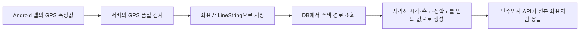

# [BE] 인수인계 타임라인 API가 GPS 수집 시각과 정확도를 실제와 다르게 반환하는 문제

## 문제 배경

수색 경로 패키지를 리팩토링하던 중 `SearchPathService.pointsFrom(...)`을 살펴보다가 DB에 없는 GPS 측정 정보를 임의 값으로 채우는 코드를 발견했다.

임의로 채운 값은 인수인계 타임라인 API에 쓰인다. 다음 근무자는 이 API에서 이전 수색 경로를 시간순으로 확인한다. API 명세에는 GPS 좌표마다 실제 수집 시각과 정확도를 반환하도록 적혀 있다.

Android 앱은 좌표를 보낼 때 다음 정보를 함께 전송한다.

- 좌표를 구분하는 `pointId`
- 단말이 좌표를 수집한 시각인 `clientTs`
- 이동 속도인 `speedMps`
- GPS 오차 범위인 `horizontalAccuracyM`

서버는 앱이 보낸 값으로 GPS 품질을 검사한 뒤 통과한 좌표만 수색 경로에 반영한다. 하지만 승인된 GPS 측정값은 DB에 따로 저장하지 않는다.

`search_path.geometry`에는 좌표를 선으로 이은 PostGIS `LineString`만 남는다. `LineString`에서 위도와 경도는 다시 읽을 수 있지만 `pointId`, 수집 시각, 속도, 정확도는 복원할 수 없다.

현재 `SearchPathService.pointsFrom(...)`은 사라진 값을 다음과 같이 새로 만든다.

```text
pointId             = db-point-001, db-point-002, ...
clientTs            = 경로 시작 시각부터 5초씩 더한 시각
speedMps            = 0
horizontalAccuracyM = 0
```

인수인계 타임라인 API는 새로 만든 값을 실제 GPS 측정값과 같은 형태로 반환한다. 응답만 봐서는 임의로 채운 값인지 알 수 없다.

이 응답으로 경로를 재생하면 실제와 다른 시간 간격으로 이동한 것처럼 보인다. 정확도 `0`도 값이 없다는 뜻이 아니라 오차가 거의 없다는 뜻으로 읽힌다. 이 때문에 다음 근무자는 수색 순서와 GPS 기록의 품질을 잘못 이해할 수 있다.



## 원인 분석과 선택지

원인은 지도 표시용 `LineString`과 GPS 측정 원본의 역할을 나누지 않은 데 있다. 지도에 선을 그릴 때는 좌표만 있으면 된다. 반면 시간순으로 경로를 재생하려면 좌표마다 수집 시각과 정확도가 필요하다. 두 데이터를 `LineString` 하나로 저장하면서 원본 측정 정보가 사라졌다.

검토한 선택지는 세 가지다.

### GPS 측정 원본과 지도 표시용 경로를 함께 저장

GPS 품질 검사를 통과한 측정값을 좌표 순서와 함께 저장한다. 지도 표시에는 기존 `search_path.geometry`의 `LineString`을 계속 사용한다.

이 방식은 DB를 다시 읽어도 앱이 보낸 값을 그대로 유지한다. 대신 저장되는 행이 늘어난다. 위치 기록은 민감한 정보이므로 사건 종료 후 함께 파기해야 한다.

### 인수인계 타임라인에서 좌표별 시각과 정확도 제거

완성된 `LineString`과 경로 시작·종료 시각만 제공한다. DB 구조는 단순해지지만 실제 수집 시각에 맞춘 재생과 좌표 정확도 표시는 포기해야 한다.

### DB에 없는 값을 지금처럼 임의 값으로 채움

DB를 바꾸지 않아도 된다는 장점이 있다. 하지만 실제값과 임의 값을 구분할 수 없어 인수인계 기록을 믿기 어렵다. 이 선택지는 제외한다.

수리맵은 이전 근무자의 경로를 실제 수집 시각에 맞춰 보여주는 기능을 유지한다. 구현 방향은 GPS 측정 원본과 지도 표시용 경로를 함께 저장하는 첫 번째 선택지로 정한다.
