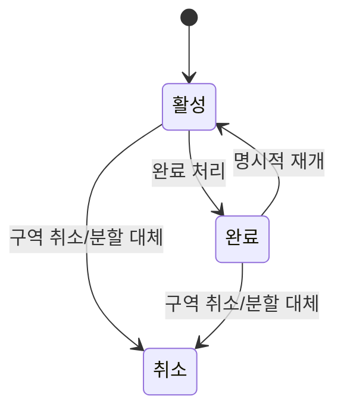

# Suri-Map PRD

> Source: Notion `자율_C106 / 문서 / 기획 / Suri-Map PRD`
> Original URL: https://www.notion.so/3482947a9611810b9979c59064d4bddf
> Snapshot Date: 2026-04-27

## 0. 문서 정보

- 문서 유형: Product Requirements Document (PRD)
- 대상 독자: 내부 개발팀 (SDD 작성 기준 문서)
- 작성일: 2026-04-20 (업데이트 2026-04-21 → 2026-04-27 v3 인터뷰 반영)
- 출시 목표: 2026-05-22 (금), 개발 기간 5주
- 기준 문서: [2026-04-15_requirements_definition.md](./2026-04-15_requirements_definition.md)
- 기준 인터뷰: [2026-04-24_police_in_person_interview.md](./2026-04-24_police_in_person_interview.md)
- 반영 항목 노트: [2026-04-26_prd_update_items.md](./2026-04-26_prd_update_items.md)
- 직전 버전 백업: [archive/prd-v2-2026-04-27.md](./archive/prd-v2-2026-04-27.md)
- 아키텍처: [architecture.md](./architecture.md)
- 결정 근거: [adr.md](./adr.md)
- v3 갱신 요약: 2026-04-24 경찰 대면 인터뷰 결과로 (1) 수색 범위를 도심·외곽·논밭·하천·산악 전반으로 확장, (2) 지구대/파출소 사용자를 주요 사용자에 포함, (3) 경로 기록 주체를 개인 GPS → 팀/순찰차 업무폰으로 재정의, (4) 수색 보고서 AI를 삭제하고 OP 기반 수색 이력 자동 요약을 P0 MVP로 승격. architecture/adr 반영 완료, spec/tasks는 후속 작성한다.

### 0.1 용어·약어

| 용어 | 의미 |
|---|---|
| 폴리폰 | 경찰 업무용 단말. 본 시스템의 현장 앱이 설치되는 기기 (팀 업무폰 또는 순찰차 업무폰의 물리적 형태) |
| 팀 업무폰 | 기동대·실종팀·지구대/파출소 등에서 팀 단위로 운용하는 폴리폰. 6인 1팀 단위로 1대 운용·교대 사용 전제. 본 시스템 경로 기록의 기본 주체 |
| 순찰차 업무폰 | 순찰차에 탑재되어 운용되는 폴리폰. 차량 이동 경로(차량 구간) 기록의 기본 주체. 팀 업무폰과 동일 모델일 수 있으며, 시스템이 GPS 속도 기반으로 자동 분리 |
| OP(Operation Period, 수색 차수) | 사건 내 수색 차수 단위 히스토리 레이어. 사건 가져오기 시 OP1 자동 생성, OP2 이후는 권한 보유자가 수동 생성. 근무 교대 자체는 DutyShift로 별도 기록 |
| DutyShift (근무 구간) | 특정 사건 배정 계정이 특정 폴리폰을 인수해 근무한 구간. OP와 분리해 업무폰 교대·근무 교대 맥락을 남긴다 |
| 실종팀 | 실종 사건 담당 수색 조직. 사건을 가져오고·종료하며 수색 운영을 지휘한다 |
| 지원 부서 | 112/실종프로파일링 또는 mock·seed 배정 결과로 사건에 투입되는 부대(기동대 등). 수색 업무는 실종팀과 동등하게 수행 |
| 지구대/파출소 | 신고 초동 대응 및 1차 수색을 담당하는 일선 조직. 실종 사건이 하루 이상 길어지거나 자살 의심이 있을 때 실종팀으로 인계. 본 시스템의 주요 사용자 |
| 현장 지휘관 | 사건의 지도 기준 범위·구역 분할·완료·차수 관리 권한을 가진 **역할**. 사건당 N명 지정 가능하며 **실종팀 간부, 기동대장, 제대장, 지구대/파출소 팀장 또는 당직자** 등이 112/실종프로파일링 또는 mock·seed 배정 결과와 시드 직책을 기반으로 자동 부여됨 |
| 간부 / 대원 | 시드 데이터의 직급 필드 기반 구분. 간부는 현장 지휘관 역할 자동 후보이며, 실종팀 간부는 사건 종료 등 실종 담당 권한을 가진다 |
| 부대(Unit) | 기동대 등 경찰 조직 단위. MVP에서는 별도 백엔드 엔티티가 아니라 외부 배정 결과와 계정·구역 정보로 필요한 범위만 표현 |
| 팀(Team) | 부대 하위 조직. MVP에서는 별도 백엔드 엔티티가 아니라 팀 계정·팀 업무폰·구역 배정 맥락으로 표현 |
| 사건(Incident) | 실종 신고 1건을 단위로 한 수색 활동의 최상위 객체. 시연·MVP에서는 112/실종프로파일링 mock·seed에서 배정받는 사건이며, 사용자가 직접 생성하지 않는다 |
| 상황판 | 웹 기반 공용 화면. 팀 경로·구역·마커·OP·인수인계 메모를 통합 시각화 |
| 인수인계 메모 | OP·근무 구간·경로·구역 단위로 남기는 정성적 메모(예: "외곽 농로 큰길만 확인", "CCTV 없음"). 카톡 등 비구조 공유를 대체 |
| 외부 수색 자산 | 드론·경찰견 등 본 시스템이 직접 제어하지 않는 외부 자산. MVP에서는 실제 투입·승인·장비 연동·수색 경로 표시를 다루지 않고, 무전·공식 채널로 전달한 요청 위치를 `지원 요청` 마커로 남기는 수준에 한정 |
| SDD | Spec-Driven Development. PRD → Architecture → Spec → Tasks → TDD |
| FR / NFR | Functional / Non-Functional Requirement |
| AC | Acceptance Criteria (수용 기준) |
| FCM | Firebase Cloud Messaging. 서버→Android 푸시 채널 |
| SSE | Server-Sent Events. 서버→웹 단방향 실시간 채널 |

## 1. 제품 개요

### 1.1 한 줄 정의

Suri-Map은 도심·도심 외곽·논밭·하천·산악 등 실종 수색 현장에서 지구대/파출소, 실종팀, 기동대 등 수색 참여자가 수색 경로와 확인 구역을 함께 보며 중복 수색과 인수인계 누락을 줄이는 경찰 내부 **운영 보조 솔루션**이다.

### 1.2 제품 성격

- Suri-Map은 **수색 보조 솔루션**이며, 경찰의 **112 공식 기록 시스템을 대체하지 않는다**.
- 사건 배정과 지원부대 배정의 원천은 112/실종프로파일링 계열 시스템이다. Suri-Map은 MVP/시연에서 해당 흐름을 mock·seed polling/import로 반영한다.
- 단서 마킹, 구역 완료 처리 등 본 시스템의 기록은 **공식 수사 기록이 아니다**. 정식 수사 증거 편입은 별도 프로세스를 따른다.
- 본 시스템의 역할은 **현장 공유와 운영 판단 보조**이다.

### 1.3 문제 정의

1. 실종팀은 `어느 팀·단말·순찰차가 어디를 수색했는지`를 실시간 구조화해서 보기 어렵다.
2. 현장에서는 무전으로 수색 완료를 전달하고, 실종팀은 이를 `반포 한강공원 일대 수색 완료` 같은 자유 텍스트로 112 시스템에 입력한다.
3. 결과적으로 `중복 수색`과 `어디를 확인했는지`를 빠르게 파악하기 어렵다.
4. 현장 수색 인력의 GPS는 현재 체계적으로 수집되지 않는다.
5. 근무 교대 시 인수인계가 `~일대 수색 완료` 같은 추상적 표현에 의존하며, 다음 근무자가 어디를 다시 수색해야 할지 판단이 어렵다 (2026-04-24 인터뷰 근거).
6. 도심·도심 외곽에서는 CCTV·차량 동선과 병행되지만, 골목·공터·건물 주변·CCTV 공백 지역의 확인 누락이 발생한다.

### 1.4 해결 접근

- 팀 업무폰/순찰차 업무폰 기준 자동 GPS 기록 (개인 GPS 전제 제거). 시스템이 GPS 속도 기반으로 차량 구간과 도보 구간을 자동 분리하고, 상황판에서 수동 보정 가능
- 웹 상황판에서 팀별 경로, 차량/도보 구간, 수색 완료 구역, NOTE 기반 재확인 메모, OP별 경로 히스토리 시각화
- OP(수색 차수) 기반 수색 히스토리 레이어로 인수인계와 재수색 판단 보조
- 통신 불안정을 전제로 한 오프라인 저장 + 복구 동기화
- 무전 및 112 공식 시스템 대체가 아닌 판단 보조 도구. 112/실종프로파일링 직접 연동은 MVP 범위 밖이며, MVP/시연에서는 mock·seed polling/import로 배정 사건과 배정 결과를 반영한다.

## 2. 목표와 성공 기준

### 2.1 비즈니스 목표

- 수색 현황을 `자유 텍스트 + 무전 기억`에만 의존하지 않도록 보조
- 현장 지휘관(실종팀 간부·지원 부서 간부·지구대/파출소 팀장 또는 당직자)이 중복 수색과 확인 누락 가능 구역을 더 빠르게 파악
- 기존 무전 및 공식 시스템 입력 흐름은 유지, 수색 운영 판단 보조에 집중

### 2.2 Acceptance 기준 (KPI 대체)

**기능 Acceptance**
- 시범 시나리오 end-to-end 1회 통과 (§5 참조)
- FR-01 ~ FR-35, FR-37, FR-39 각각의 Acceptance Criteria 통과 (§7 참조). 드론·경찰견은 실제 투입·승인·경로 표시가 아니라 FR-17의 `지원 요청` 위치 기록 마커 수준으로만 검증

**품질 Acceptance**
- 오프라인 30분 후 통신 복구 시 경로 포인트 유실 0건
- 단서 마커 생성 후 상황판 반영이 체감상 즉시 (온라인 기준)
- 사전 다운로드된 영역에서 오프라인 지도 정상 표시
- 통신 단절/복구를 반복해도 중복 생성 0건

**안정성 Acceptance**
- 현장 단말 2대 + 상황판 1대 동시 운용 시 1시간 연속 작동
- 통신 on/off 반복 10회 후 데이터 정합성 유지

### 2.3 시범 시나리오 검증 방법

- 개발팀 자체 시연 + 도심·도심 외곽·산악 중 대표 시나리오 1개 이상에서 2인 페어 시연
- 통과 판정 기준: §5.1의 12단계 전부 체크리스트 통과

## 3. 타겟 사용자

### 3.1 주요 사용자

**소속(Affiliation) × 직급(Rank) 2축으로 권한을 결정**한다. 실종팀과 지원 부서(기동대 등)는 상하 관계가 아닌 동등한 수색 조직이며, 차이는 **실종팀만 사건을 종료한다**는 점이다. 사건 배정과 지원부대 배정은 112/실종프로파일링 또는 mock·seed의 `incident_assignment` 결과로 반영한다. 지구대/파출소는 초동 대응과 1차 수색을 담당하며, 사건이 길어지거나 자살 의심이 있을 때 실종팀으로 인계한다 (2026-04-24 인터뷰 근거).

| 소속 | 직급 | 주 디바이스 | 계정 단위 | 주요 행동 |
|---|---|---|---|---|
| 실종팀 | 간부 | 폴리폰 앱 + 웹 상황판 | **실종팀 지휘 계정** | 현장 수색 + 배정 사건 가져오기·종료·현장 지휘관 확인, 지도 기준 범위·구역 분할·완료·차수 관리 |
| 실종팀 | 대원 | 폴리폰 앱 + 웹 상황판 | **실종팀 팀 계정** | 현장 수색 + mock·seed 배정 사건 확인·실종자 정보 입력/보완 + GPS 기록·마커 생성 |
| 지원 부서 (기동대 등) | 간부 (현장 지휘관) | 폴리폰 앱 + 웹 상황판 | **지원 부서 지휘 계정** | 현장 수색 + 지도 기준 범위·구역 분할·완료·차수 관리 (실종팀 간부와 동등) |
| 지원 부서 | 대원 | 폴리폰 앱 | **팀 계정** | 담당 구역 수색, GPS 경로 자동 기록, 마커 생성 |
| 지구대/파출소 | 경찰관 | 폴리폰 앱 (팀 업무폰·순찰차 업무폰) | **팀 계정 또는 순찰차 계정** | 초동 대응·1차 수색, 순찰차/도보 수색 경로 기록, 단서·운영 NOTE 마커 생성, 인수인계 메모 작성 |
| 지구대/파출소 | 팀장 또는 당직자 (현장 지휘관) | 폴리폰 앱 + 웹 상황판 | **지구대/파출소 지휘 계정** | 교대 인수인계, 이전 OP 수색 이력 확인, 새 OP 생성, 의심 구역 재확인 지시, 실종팀 인계용 수색 이력 정리 |

**"현장 지휘관" 역할**
- **사건당 복수(N명) 지정** 가능. 실종팀 간부, 기동대장, 제대장, 지구대/파출소 팀장 또는 당직자 등이 동등한 지휘 권한을 공유
- 지정 방식: 112/실종프로파일링 또는 mock·seed 배정 결과의 역할과 시드 데이터의 직책(기동대장·제대장·지구대 팀장 등)을 기반으로 자동 부여
- 실종팀 단독 수색 중에는 실종팀 간부가 현장 지휘관 역할을 겸임
- **지원 부대 배정 결과가 반영된 이후에도 실종팀 간부의 현장 지휘 권한은 그대로 유지**된다. 기동대장·제대장 합류 시 현장 지휘관이 추가되는 것이지 권한이 이양되는 것이 아니다
- 지구대/파출소 단계의 초동 대응 중에는 해당 지구대/파출소 팀장 또는 당직자가 현장 지휘관 역할을 수행하며, 사건 인계 후에도 새 OP 생성·인수인계 메모 권한을 유지한다 (인터뷰 근거)
- 현장 지휘 업무(구역 완료·차수 관리 등)는 **웹 상황판에서만 수행**하므로, 웹을 사용할 수 있는 위치(본부 PC, 지구대 PC 등)에서 처리한다. 폴리폰에서는 웹 상황판 접근을 지원하지 않는다

**간부·대원 구분 기준**
- 시드 데이터의 직급 필드로 결정 (상세 기준은 운영 측 협의 — §11 오픈 이슈)

**계정 모델 판단 근거**
- 현장 폴리폰은 팀 업무폰·순찰차 업무폰 형태로 여러 명이 교대 사용하므로, MVP는 개인 로그인보다 **팀/순찰차 운영 계정**을 우선한다.
- 현장 기록의 운영 책임 단위는 개인이 아니라 **팀·순찰차·지휘 역할**로 본다.
- **경로 주체와 계정 주체 정렬 원칙**: GPS 경로의 기록 주체는 팀 업무폰 또는 순찰차 업무폰이며, 같은 업무폰을 다음 근무자가 이어 사용해도 OP·세션 단위로 구분된다. 마커 작성·수정·삭제, OP 생성, 구역 완료, 메모 작성, 실종자 정보 조회·수정 등 주요 조작은 로그인한 **팀 계정·순찰차 계정·지휘 계정** 기준으로 남긴다. 개인 단위 조작자 식별은 MVP 이후 운영 전 법무·현장 UX 검토 대상으로 둔다.

### 3.2 사용 환경

- 단말: 폴리폰 (삼성 Galaxy S22 이상, Android 12+ 전제). 팀 업무폰·순찰차 업무폰의 물리적 형태로 운용
- 웹 상황판: 배포된 웹 URL로 접속하며, 로그인 및 사건 권한 확인 후 열람 가능
- 네트워크: 산악·도심 외곽·논밭·하천 등 통신 불안정 환경 전제. 도심에서는 CCTV 공백 지역 보조 운용. Wi-Fi/LTE 혼재
- 앱 설치: 사전 설치된 폴리폰 배포 전제. 현장 당일 신규 설치/회원가입 요구 금지

## 4. 범위

### 4.1 MVP 범위 포함

- 경찰 내부 사용 전제의 실종 수색 (도심·도심 외곽·논밭·하천·산악 전반)
- 112/실종프로파일링 mock·seed 배정 사건과 지원부대 배정 결과 polling/import, 지구대/파출소 초동 대응, 사건별 역할 기반 접근 제어
- 팀 업무폰/순찰차 업무폰 GPS 경로 자동 기록, 차량/도보 구간 자동 분리와 상황판 수동 보정, 순찰차 경로 레이어
- OP 기반 수색 히스토리·인수인계 뷰, 수색 경로 시작/일시정지/재개/종료, OP/근무 구간/경로/구역 단위 인수인계 메모
- 웹 상황판의 팀별 경로/구역/마커 시각화, 구역 분할·할당·완료 처리, OP별 경로 비교, 단말 최신성 표시
- 단서·발견·지형·운영·지원 요청 마커, 실종자 발견 전체 알림 및 지원 요청 지휘 라인 우선 알림
- 통신 불안정 환경 로컬 저장, 복구 동기화, 오프라인 지도 타일 캐시, 사건 오프라인 패키지 사전 적재, 미전송 큐/동기화 상태 표시
- 실종자 기본 정보 표시와 사건 종료 시 개인정보 제거
- 수색 이력 자동 요약 (OP/근무 구간/경로/마커/메모 기반 요약, 누락 판정·다음 구역 지시 금지)

### 4.1.1 후속 확장 후보 (MVP 안정화 이후)

1. 사건 타임라인 초안 (OP·경로·마커·메모 기반 요약의 시간순 재구성)
2. 등산로·지형 참고 레이어 (추천·자동 판단 기능 아님)

> 주: 기존 AI 보고서 초안과 과거 사례/RAG 기반 위험 구역 조회는 현장 니즈·데이터 확보·보안 리스크 대비 MVP 가치가 낮아 제외한다. 진입점/이탈로/차량 접근 가능 지점 레이어는 데이터셋 확보 가능성을 먼저 확인한 뒤 후속 범위로 판단한다. AI 기능은 P0 MVP의 `수색 이력 자동 요약`으로 한정한다.

### 4.2 MVP 범위 제외

- 공식 수색 기록 시스템(112) 대체
- 실제 경찰 시스템(112, 실종프로파일링) 직접 연동 — MVP/시연은 mock·seed로 가정
- 무전 대체
- 피구조자 전용 앱
- 민간 수색 인력 참여
- 군 포함 통합 플랫폼
- 외부 기관 시스템 직접 연동
- 스마트워치 전용 시연
- AI 전면 자동 판단 / 수색 누락 자동 확정 / 다음 수색 구역 자동 지시
- 수색 보고서 AI 초안 생성 (인터뷰 결과 니즈 약함, AI 활용은 수색 이력 요약으로만 한정)
- 무전 음성 인식 / 무전 자동 요약 AI
- 바디캠 라이브 영상 관제 (별도 제품 범위)
- GPS 대체 목적의 Bluetooth 측위 (근접 보조는 MVP 이후 기술 탐색 후보)
- Wi-Fi 신호 세기 기반 층수/높이/실내 위치 추정 및 결과 마커
- 드론·경찰견 출동 요청을 Suri-Map이 전송·승인하는 기능, 경로/확인 구역 표시, 장비 직접 제어·자동 위치 수집 (무전·공식 채널로 전달한 지원 요청 위치를 FR-17 마커로 기록하는 것은 범위)
- 소방과의 완전 통합 운영
- 자체 비밀번호 재설정/회원가입/계정 관리 UI
- 부대(Unit)/팀(Team) 편제 관리 UI (MVP에서는 별도 백엔드 엔티티와 관리 UI를 두지 않음, §6.5 참조)
- 폭행·주취자·교통사고 등 실종 외 신고 유형 (지구대 업무 맥락 설명 자료로만 사용)
- 예측 구간 (고사리, 버섯 등) 사전 마킹 (MVP 완료 후 데이터 수집 가능하면 추가)

## 5. 핵심 사용자 시나리오

### 5.1 시범 시나리오 (Acceptance 기준)

각 단계는 통과 판정 체크리스트로 사용.

| # | 단계 | Actor | 행동 | 결과 / 확인 |
|---|---|---|---|---|
| 1 | 배정 사건 가져오기 | 실종팀 간부 또는 지구대/파출소 팀장·당직자 | 112/실종프로파일링 mock·seed에 존재하는 배정 사건 및 실종자 기본 정보를 가져오기 | 사건이 `진행 중` 상태로 목록에 등록되고 필수 정보가 채워지며 `OP 1차`가 자동 생성됨 |
| 2 | 지원 부대 배정 결과 반영 | 시스템 | 112/실종프로파일링 mock·seed에서 추가 배정된 지원 부대 `incident_assignment`를 polling/import | 배정된 부대 소속 계정과 현장 지휘관 역할 보유 계정이 사건 접근 권한 획득 |
| 3 | 사건 오프라인 패키지 사전 적재 | 사건 배정 계정/단말 전원 | 사건 수색 맥락(도심·도심 외곽·논밭·하천·산악 등)에 맞는 지도 기준 범위를 확인·조정하고, 현장 투입 전 폴리폰이 사건 메타·실종자 정보·지도 타일을 한 번에 다운로드. 담당 구역이 이미 정해진 경우 해당 구역도 함께 다운로드 | 진행률 표시, 미완료 항목은 재시도 가능, 미완료 시 상황판에 경고 배지 |
| 4 | 구역 분할 / 할당 | 현장 지휘관 | 수색 범위와 담당 구역이 명확한 경우 웹 상황판 중심으로 팀별 담당 구역을 분할·할당하고, 필요 시 폴리폰으로 보조 확인 | 구역을 할당한 경우 각 팀과 소속 대원에게 담당 구역이 공유 |
| 5 | 수색 시작 및 GPS 기록 | 사건 배정 계정/단말 전원 | 현재 OP에서 `수색 시작`을 누르고 담당 구역 또는 지시받은 범위·경로를 수색 | 팀 업무폰/순찰차 업무폰 기준 위치·경로가 자동 기록·상황판 반영, 차량/도보 구간이 자동 분리되며, 운용 중인 업무폰 궤도는 별도 강조 스타일로 표시, 상황판 위치 점의 마지막 동기화 경과가 색·라벨로 표시 |
| 6 | 단서 또는 실종자 발견 | 사건 배정 계정 (앱) | 앱 바텀시트에서 마커 유형 원탭 선택 (위치·시간·작성 계정 자동, 메모·사진 선택 입력) | 상황판·다른 단말에 즉시 반영되며, 실종자 발견 마커는 상황판·단말 모두에 강조 알림 발생 |
| 7 | 통신 단절 | 사건 배정 계정/단말 중 1개 | 30분 이상 오프라인 상태가 지속돼도 데이터 유실 없이 기록 유지 | 앱이 업무폰 경로·마커 기록을 계속 로컬에 유지, 미전송 큐 대시보드에서 미전송 항목 수·종류 확인 가능 |
| 8 | 지원 요청 마커 생성 | 사건 배정 계정 (앱) | 진입 불가, 드론·경찰견·기타 지원 요청 등 무전·공식 채널로 전달한 지원 요청 위치를 마커로 기록 | 실종팀·현장 지휘관에게 상황판·단말 모두에 알림 도달 |
| 9 | 통신 복구 | 시스템 | 오프라인 동안 기록된 데이터가 통신 복구 시 곧바로 서버에 전송됨 | 오프라인 동안 기록된 업무폰/순찰차 업무폰 경로가 누락 없이 반영되고 중복 생성 0건, 미전송 큐 소진 과정이 단말에 시각적으로 표시되며, 복구 후 상황판 위치 점이 즉시 최신 상태로 갱신 |
| 10 | 구역 완료 처리 | 현장 지휘관 (실종팀 간부·지원 부서 간부·지구대/파출소 팀장 또는 당직자) | 무전으로 수색 완료 보고를 받으면 **웹 상황판에서** 구역 상태를 `완료`로 변경 (앱에서는 불가) | 웹 상황판과 모든 단말에 즉시 완료 표시, 구역 이력에 처리 계정과 시각 기록 |
| 11 | 인수인계 / 다음 투입 구역 판단 | 현장 지휘관 | 상황판에서 OP별 업무폰·순찰차 경로, 완료 처리된 구역, NOTE 기반 재확인 메모, 인수인계 메모, **수색 이력 자동 요약**을 확인한 뒤 필요 시 새 OP를 열고 다음 투입 구역 판단 | 이전 OP와 현재 OP를 겹쳐 보고, 수색 이력 요약으로 “어디 일대를 수색했는지”를 확인하며, 새 OP 생성 시 사유(재수색·수색 범위 변경·기타)가 기록됨. 근무 교대는 별도 DutyShift로 기록됨 |
| 12 | 사건 종료 | 실종팀 간부 | 사건 종료 (확인 다이얼로그, terminal — 재오픈 없음) | 실종자 개인정보/사진은 Suri-Map에서 즉시 제거(원본은 112), 업무폰·순찰차 위치/경로 좌표와 단말 로컬 기록은 동기화 완료 후 파기. SSAFY 시연·개발 데이터는 복구 확인을 위해 24시간 soft delete 후 파기 (§8.5 참조) |

### 5.2 As-Is 흐름 (Suri-Map이 보완)

1. 112 신고 접수 → 지역 경찰 초동 대응 → 실종팀 배정
2. 실종팀 단독 수색 → 범위가 넓거나 시간이 지체되면 기존 지휘·112 계열 흐름에서 지원 부서(기동대 등) 요청·배정
3. 현장 수색 인원 → 현장 지휘관(실종팀 간부·기동대장·제대장·지구대/파출소 팀장 또는 당직자 등) 간 무전 보고 → 실종팀이 112 시스템에 자유 텍스트로 수색 완료 지역 입력

Suri-Map은 3단계의 **공용 상황판·구조화된 현황**을 보완한다. 1~2와 무전 흐름은 유지하되, MVP/시연에서는 실제 경찰 시스템 직접 연동 대신 112/실종프로파일링 mock·seed의 배정 사건과 지원부대 배정 결과를 polling/import해 초기 입력을 줄인다.

## 6. 정보 구조

### 6.1 핵심 도메인 객체

| 객체 | 설명 |
|---|---|
| Incident (사건) | 실종 신고 1건 단위. MVP/시연에서는 112/실종프로파일링 mock·seed에서 polling/import한 배정 사건이며, 사용자가 직접 생성하지 않는다 |
| MissingPerson | 사건 수행 중 필요한 실종자 도메인 데이터. 임시 cache가 아니라 사건 운영에 필요한 정보이며, 사건 종료 시 Suri-Map active DB·API·오프라인 패키지에서 제거된다 |
| IncidentAssignment | 112/mock에서 내려온 사건-계정 배정 결과. Suri-Map 내부에서 지원부대 배정 워크플로우를 직접 관리하지 않고, 배정 결과만 접근권한 기준으로 반영한다 |
| Account | 팀 계정·순찰차 계정·지휘 계정. 개인이 아니라 운영 단위이며 `PolicePhone`과 분리된다 |
| PolicePhone | 현장 앱이 설치된 경찰 업무용 스마트폰. 계정은 조작 주체이고 폴리폰은 위치·경로를 기록한 물리 단말이다 |
| OperationalPeriod | 사건 내 수색 차수(OP). 수색 범위나 운영 방향이 바뀌는 큰 히스토리 레이어다 |
| DutyShift | 특정 사건 배정 계정이 특정 폴리폰을 인수해 근무한 구간. OP와 분리해 근무 교대·업무폰 교대 맥락을 남긴다 |
| SearchArea | OP 안의 지도상 수색 구역. `area_level = OVERALL | UNIT | TEAM` 계층을 사용하며, `OVERALL` 구역이 기존 지도 기준 범위 역할을 흡수한다 |
| SearchAreaAssignment | 수색 구역을 계정에 배정한 기록. 112 사건 배정인 `incident_assignment`와 별도다 |
| SearchAreaHistory | 구역 생성, 분할, 상태 변경, geometry 변경 이력 |
| SearchPath | `수색 시작`부터 `수색 종료`까지 기록된 하나의 GPS 경로. `duty_shift`에 속한다 |
| SearchPathSegment | 하나의 `search_path`를 차량·도보·알 수 없음 구간으로 나눈 결과. 상황판에서 수동 보정할 수 있다 |
| Marker | 지도 위 특정 위치에 남기는 현장 기록. 유형은 `CLUE`, `PERSON_FOUND`, `FIELD_CONDITION`, `SUPPORT_REQUEST`, `NOTE`를 기준으로 한다. 재확인 필요, 수색 제외/확인 완료 같은 운영 표현은 `NOTE`와 메모로 표현한다 |
| Photo | 마커에 첨부되는 사진 메타데이터. 파일 바이너리는 MinIO/S3 호환 저장소에 둔다 |
| MarkerNotification | 지원 요청 또는 실종자 발견 마커에서 파생되는 수신자·payload 스냅샷. 실제 SSE/FCM 전파 상태는 이벤트 전파 테이블이 다룬다 |
| HandoverMemo | OP·근무 구간·경로·구역·마커에 남기는 정성적 인수인계 메모 |
| SearchHistorySummary | OP 또는 근무 구간의 수색 기록 요약. 누락 판단이나 다음 구역 지시가 아니라 기록을 짧게 정리하는 AI 요약이다. 생성 실패 시 대체 요약 문장을 저장하지 않는다 |
| IdempotencyRecord | Android outbox 재전송과 백엔드 쓰기 요청 중복 처리를 위한 서버 멱등성 기록 |
| OfflinePackageManifest | 사건 오프라인 패키지 구성표 |
| OfflinePackageInstallation | 폴리폰별 오프라인 패키지 적재 상태 |
| EventDispatchJob / SseReplayEvent / EventDispatchTarget | 도메인 변경을 SSE refetch 신호와 FCM으로 전파하기 위한 이벤트 전파 작업·재전송 envelope·대상 상태 |
| IncidentDataPurge / LocationDataAccessAudit | 사건 종료 후 민감 데이터 파기 상태와 위치 데이터 접근 감사 기록 |

**관계 요약**
- `Incident`는 `MissingPerson`, `IncidentAssignment`, `OperationalPeriod`의 기준이다.
- `IncidentAssignment`는 `Incident`와 `Account`의 N:N 관계를 푼다.
- `OperationalPeriod`는 `DutyShift`, `SearchArea`, `Marker`, `HandoverMemo`, `SearchHistorySummary`를 묶는다.
- `DutyShift`는 하나의 `IncidentAssignment`와 하나의 `PolicePhone`을 연결하며, `SearchPath`와 앱 작성 맥락의 기준이다.
- `SearchArea`는 자기 참조 계층으로 전체 범위(`OVERALL`), 부대 권역(`UNIT`), 팀 구역(`TEAM`)을 표현한다.
- `SearchPath`는 여러 `SearchPathSegment`를 가지며, 차량·도보 구간 분리는 segment에서 다룬다.
- `Marker`는 여러 `Photo`를 가질 수 있고, 지원 요청·실종자 발견 마커는 `MarkerNotification`을 만들 수 있다.
- 상황판은 별도 상황판 read-model DB를 두지 않고 원본 테이블 기반 API 조회와 SSE refetch 신호로 최신 상태를 갱신한다.

### 6.2 수색 구역 상태 전이

*주: `접근 곤란`은 구역 상태가 아니라 지형 상태 레이어의 마커로 표시한다.*

### 6.3 마커 레이어 분리

- **단서/발견 레이어**: 단서 또는 실종자 발견 (위치, 시간, 보고 주체, 유형, 메모, 사진)
- **운영 메모 레이어**: `NOTE` 유형 마커와 인수인계 메모로 재확인 필요 / 수색 제외·확인 완료 같은 현장 표현을 남긴다
- **지형 상태 레이어**: 접근 곤란 지형 표시
- **지원 요청 레이어**: 드론 지원 요청 기록 / 경찰견 지원 요청 기록 / 기타 지원 요청 기록 등 무전·공식 채널로 전달한 지원 요청 위치. Suri-Map은 요청 위치를 지도에 기록·공유할 뿐, 출동 요청 전송·승인·장비 배정·인력 배정을 처리하지 않는다

*주: 지형/지원 요청 마커 용어 기준은 SDD 단계에서 현업 확인 후 확정.*

### 6.4 사건 목록 정렬/필터

- 기본 정렬: 생성일 내림차순
- 필터: `진행 중 / 종료됨 / 내가 배정된 사건`

### 6.5 부대(Unit) / 팀(Team) 관리 정책

- MVP에서는 Unit/Team을 별도 백엔드 DB 엔티티로 두지 않는다.
- 112/실종프로파일링 mock·seed의 조직·팀·순찰차·업무폰 배정 정보는 `account.organization_type`, `account.display_name`, `incident_assignment`, `search_area.area_level`, `search_area_assignment`에서 필요한 범위만 표현한다.
- 부대/팀 편제 관리 UI는 MVP 범위 외다.
- 운영 전 실제 조직 마스터가 필요해지면 후속 ADR/DB 설계에서 별도 조직 테이블 도입 여부를 재검토한다.

## 7. 기능 요구사항

FR-01 ~ FR-22는 [2026-04-15_requirements_definition.md](./2026-04-15_requirements_definition.md)의 ID를 그대로 사용한다. FR-23 ~ FR-31은 본 PRD v2(2026-04-23)에서 신설된 MVP 확장 기능이다. v3(2026-04-27, 2026-04-24 경찰 대면 인터뷰 기반)에서는 FR-32 ~ FR-35, FR-37, FR-39를 1차 MVP에 추가한다. Bluetooth 근접 보조는 요구사항 ID로 관리하지 않고 MVP 이후 기술 탐색 후보로 둔다.

> 주: 인터뷰 결과 일부 기존 FR(FR-02·FR-04·FR-10·FR-11·FR-12·FR-15·FR-17·FR-25)은 전제와 AC가 직접 갱신됐다. 갱신 근거는 [2026-04-26_prd_update_items.md](./2026-04-26_prd_update_items.md) §6 참조.

### 7.1 사건/계정/권한

| ID | 요구사항 | Acceptance Criteria |
|---|---|---|
| FR-01 | 시스템은 사건 단위로 수색 현황을 구분해서 관리한다. | 실종팀 간부 또는 지구대/파출소 팀장·당직자가 112/실종프로파일링 mock·seed 배정 사건을 가져오면 해당 사건에 배정된 계정(지구대/파출소 + 실종팀 + 지원 부서 부대 계정)만 접근 가능. 사건 목록에서 진행 중/종료 상태를 구분하고, 실종팀 지휘 계정은 동시 다중 사건 배정을 지원한다. 사건을 처음 가져오면 사건 섹션과 `OP 1차`가 자동 생성된다. |

### 7.2 GPS / 경로

| ID | 요구사항 | Acceptance Criteria |
|---|---|---|
| FR-02 | 사건에 배정된 팀 업무폰/순찰차 업무폰의 위치·이동 경로를 자동 기록한다. (개인 단위 GPS 전제 제거 — v3 갱신) | 경로의 기록 주체는 팀 업무폰 또는 순찰차 업무폰이며, 조작 주체는 해당 시점에 로그인한 팀 계정·순찰차 계정·지휘 계정 단위로 남는다. 앱 백그라운드 상태에서도 기록 지속. 경로는 상황판에서 소속(실종팀/지원 부서/지구대·파출소)·구간 유형(차량/도보)·OP·현장 지휘관 역할 여부에 따라 시각적으로 구분됨. |
| FR-03 | 통신 단절 시 단말에서 위치·마커를 유지하고, 복구 후 동기화한다. | 오프라인 30분 경과 후 복구 시 포인트 유실 0건. 동일 요청 중복 전송이 데이터 중복으로 이어지지 않음. |
| FR-04 | 팀별·차량/도보 구간별 이동 경로를 지도에서 구분 색상 또는 스타일로 표시한다. (개인별 → 팀/구간별로 v3 갱신) | 웹 상황판에서 팀 업무폰 경로와 순찰차 업무폰 경로가 구분되고, 같은 경로 안에서도 차량 구간과 도보 구간이 시각적으로 분리된다. 현장 지휘관 운용 경로는 별도 강조 스타일로 구분된다. |
| FR-05 | 이동 경로와 수색 완료 구역을 별도로 표시한다. | 경로(LineString)와 구역(Polygon)이 시각적으로 구분됨. |
| FR-25 | 현장 대원·지휘관이 자신이 운용 중인 팀 업무폰/순찰차 업무폰의 수색 궤도를 즉시 구분할 수 있도록 강조 표시한다. (v3 갱신 — 개인 궤도 → 운용 중 업무폰 궤도) | 로그인한 계정이 운용 중인 팀 업무폰 또는 순찰차 업무폰의 경로는 상황판·폴리폰 모두에서 타 단말 경로와 구분되는 강조 스타일(색·굵기 등)로 렌더링된다. 같은 업무폰을 다음 근무자가 이어 사용하더라도 OP·세션 단위로 구분되어 표시된다. |

### 7.3 구역 상태

| ID | 요구사항 | Acceptance Criteria |
|---|---|---|
| FR-06 | 현장 지휘관이 무전 보고를 바탕으로 구역 완료 여부를 반영한다. | 현장 지휘관(실종팀 간부·기동대장·제대장·지구대/파출소 팀장 또는 당직자 등) 누구나 **웹 상황판에서** 구역을 선택해 완료 처리할 수 있다. 앱에서는 완료 처리 불가. 처리 결과는 사건 배정 계정/단말에 반영되고 구역 이력에 완료 처리 계정·시각이 기록된다. |
| FR-07 | 생성된 수색 구역의 진행 상태를 시각적으로 파악할 수 있다. | 계정이 생성한 수색 구역 안에서 활성/완료/취소 상태가 지도에서 구분 표시된다. 재수색 필요, 제외, 확인 완료 같은 판단은 구역 상태 enum을 늘리지 않고 NOTE·인수인계 메모·구역 이력으로 남긴다. 접근 곤란은 구역 상태가 아니라 FR-16의 지형 상태 레이어로 표시한다. 시스템이 지도 전체 또는 임의 지역의 확인 누락 여부를 자동 판단하거나 별도 하이라이트하지 않는다. |
| FR-11 | 수색 차수(OP)마다 경로·구역 배정·마커·인수인계 메모를 별도로 묶어, 보고 싶은 OP만 선택하여 화면에 나타낼 수 있고 OP 간 비교가 가능하다. (v3 갱신 — OP 비교 보기 추가) | OP를 최신순으로 정렬하여 선택할 수 있게 한다. 원하는 OP를 1개 이상 선택하면 선택된 OP의 정보만 화면에 표시한다. **이전 OP와 현재 OP를 겹쳐 보고 중복 여부와 재확인 필요 지점을 비교할 수 있다.** 사건 가져오기 시 OP1이 자동 생성된다. |
| FR-12 | 현장 지휘관이 구역별 수색 상태와 수색 이력을 확인하여, 새 OP를 연 후, 필요 시 재확인 구역·NOTE·메모를 지정하고 수색 구역을 배정한다. (v3 갱신 — OP 사유 enum + 권한 주체 확장) | **현장 지휘관 역할을 가진 계정(실종팀 간부·기동대장·제대장·지구대/파출소 팀장 또는 당직자) 누구나** **웹 상황판에서** `새 OP 열기`를 수행할 수 있다. 실행 시 OP 사유를 `재수색 / 수색 범위 변경 / 기타` 중 하나로 기록하며 DB enum은 `RE_SEARCH`, `AREA_CHANGED`, `OTHER`를 사용한다. 근무 교대는 OP 사유가 아니라 `DutyShift`로 기록한다. 해당 사건의 OP 카운터가 증가하고, **이전 OP의 경로·구역 배정·마커·메모는 보존된 채** 새 OP 레이어가 생성된다. 재확인이 필요한 위치나 범위는 새 구역을 그리거나 `NOTE` 마커·메모로 지정할 수 있으며, 담당 계정에 구역을 배정하면 배정된 계정/단말에 공유된다. OP 이력에는 실행 계정·OP 사유·구역 배정 변경 이력이 기록된다. |
| FR-13 | 구역별 수색 상태와 수색 이력을 함께 관리/표현한다. | 구역 클릭 시 `상태: 완료 / 완료 이력: 2회`처럼 `search_area_history` 기반으로 산출한 이력을 표시한다. `search_area` 본문에는 별도 `search_count` 컬럼을 두지 않는다. |

### 7.4 마커

| ID | 요구사항 | Acceptance Criteria |
|---|---|---|
| FR-10 | 지도상에 단서·실종자 발견·지형 상태·지원 요청·운영 NOTE 마커를 표시하고 공유한다. (v3 갱신 — 운영 표현은 NOTE로 흡수) | 사용자 현장 마커 생성은 **폴리폰 앱 전용**이며, 현장 GPS 자동 입력을 전제로 한다. DB 기준 마커 유형은 `CLUE`, `PERSON_FOUND`, `FIELD_CONDITION`, `SUPPORT_REQUEST`, `NOTE`다. 재확인 필요, 수색 제외/확인 완료 같은 현장 표현은 `NOTE` 유형과 메모로 저장한다. 단서 유형에는 사용자가 현장에서 발견한 단서뿐 아니라 mock·seed 사건 정보의 신고자 진술 위치, CCTV 마지막 포착 위치 등 초기 기준점도 포함할 수 있다. 초기 기준점 마커는 사건 가져오기 시 시스템이 생성하고, 웹 상황판에서 권한 보유자가 위치를 조정하거나 추가할 수 있다. 생성·수정 결과는 상황판/다른 단말에 체감상 즉시 반영된다. 실종자 발견 마커는 강조 알림을 발생시킨다. |
| FR-14 | 단서 또는 실종자 발견 위치를 GPS 기반으로 기록하고 공유한다. | 앱에서 사용자 현장 마커 생성 시 현재 GPS가 자동 입력되고, 필요한 경우 수동 위치 조정이 가능하다. mock·seed 사건 정보에 포함된 마지막 확인 위치는 단서 마커로 초기 표시하며, 출처를 `system/mock·seed`로 구분한다. 초기 기준점 마커는 웹 상황판에서 위치 조정·추가가 가능하다(FR-10 참조). |
| FR-15 | 단서/발견 마커에 시간, 보고 주체, 출처, 유형, 메모를 기록한다. 메모는 마커뿐 아니라 OP·근무 구간·경로·구역 단위 인수인계 메모로도 작성할 수 있다 (v3 갱신, 상세는 FR-37). | 앱 마커 생성 흐름은 바텀시트 UI로 유형을 원탭 선택하면 즉시 저장된다. 위치(자동/필요 시 수동 조정), 시간(자동), 보고 주체(자동 = 로그인 계정), 출처(사용자 입력 또는 system/mock·seed)는 기록되며, 메모·사진은 선택 입력이다. 필수 필드는 유형 하나로 최소화하여 현장에서 최소 조작으로 마커를 생성할 수 있어야 한다. **OP·근무 구간·경로·구역 단위 인수인계 메모는 FR-37에서 별도 정의한다.** |
| FR-16 | 접근 곤란 지형을 별도 레이어로 표시한다. | 지형 상태 레이어 on/off 토글 지원. 마커 생성은 앱 전용. *(용어 기준: SDD 단계에서 현업 확인)* |
| FR-17 | 드론·경찰견·기타 현장 지원 요청 위치를 별도 레이어로 표시한다. (v3 갱신 — 요청 전송·승인이 아니라 위치 기록 마커) | 지원 요청 마커는 앱에서 생성하며, 생성 시 실종팀·현장 지휘관에게 알림을 발송한다. 마커에는 위치, 작성자, 작성 시각, 요청 유형, 메모를 기록한다. DB 요청 유형은 `DRONE`, `POLICE_DOG`, `OTHER`로 제한한다. 이 마커는 무전·공식 채널로 전달한 요청 위치를 지도에 남기는 기록이며, Suri-Map은 실제 출동 요청 전송·승인·장비 배정·장비 연동·인력 배정을 처리하지 않는다. 실제 투입 판단과 요청은 기존 지휘·무전·공식 채널을 따른다. 드론·경찰견 경로와 확인 구역 표시는 이번 구현 범위에서 제외한다. |
| FR-20 | 단서, 실종자 발견, 지원 요청 등 현장 마커에 사진을 첨부할 수 있다. | 마커당 최대 10장, 파일당 최대 10MB. 대용량 사진은 자동 리사이징되어 업로드됨. 사진 첨부는 앱 마커 생성 시에만 가능하다. *(해상도·포맷·EXIF 처리 상세는 [architecture.md](./architecture.md) §6.4 참조)* |
| FR-30 | 현장 마커 목록을 폴리폰에서 엄지 중심 조작이 가능한 바텀 시트 UI로 제공한다. | 바텀 시트가 화면 하단에서 드래그로 펼쳐지며, 사건 내 마커가 유형별·시간순으로 정렬된다. 목록 항목 탭 시 해당 마커로 지도 이동 및 상세 확인이 가능하다. |

### 7.5 상황판

| ID | 요구사항 | Acceptance Criteria |
|---|---|---|
| FR-08 | 현장 지휘관과 실종팀이 팀/단말별 수색 현황을 한눈에 파악할 수 있다. | 팀/업무폰 리스트 + 지도 + 상태 정보 단일 화면을 제공하고, 다중 사용자 동시 접속을 지원한다. |
| FR-09 | 최신 수색 현황의 기록 시각을 확인할 수 있다. | 수색 현황(경로 수색 시간, 업무폰 기록 상태, 마지막 동기화 시각)의 기록 시각을 저장하고 확인할 수 있다. |
| FR-18 | 분산된 수색 정보를 공용 참고 화면에서 정리해 본다. | 상황판 단일 화면에서 팀/경로/구역/마커/실종자 정보 동시 열람. |
| FR-23 | 시스템은 자동으로 확인 누락 구역을 판단하지 않고, OP별 경로 히스토리와 NOTE 기반 재확인 메모를 통해 현장 지휘관의 판단을 보조한다. (v3 갱신 — 사각지대 자동 하이라이트 제외) | 상황판은 OP별 업무폰·순찰차 경로, 완료 처리된 구역, NOTE 기반 재확인 메모를 함께 표시한다. 현장 지휘관은 이전 OP와 현재 OP를 겹쳐 보고, 사람이 직접 재확인 가능 지점을 판단한다. 시스템은 확인 누락 구역을 자동 확정하거나 다음 수색 구역을 추천하지 않는다. |
| FR-24 | 상황판 업무폰·순찰차 위치 점에 단말 통신 품질·최신성을 시각적으로 인코딩한다. | 마지막 동기화 경과 시간을 구간별로 색·외곽선·라벨(`12분 전`)로 표현한다. 별도 알림은 발생시키지 않으며, 본부는 시각 단서를 보고 판단한다. |
| FR-26 | 현장·상황판에서 집중도를 높이기 위한 단순 지도 보기 모드를 제공한다. | 보기 모드 토글 시 팀·마커·레이어 등 오버레이가 최소화되고, 배경 지도와 핵심 요소만 남은 화면이 표시된다. |
| FR-27 | 웹 상황판 진입 시 첫 지도 화면의 시작 위치를 사건 맥락에 맞게 최적화한다. | 사건에 설정된 지도 기준 범위·최근 활동 위치 등을 기준으로 초기 지도 뷰포트가 설정되어, 사용자가 수동으로 이동·줌하지 않아도 현재 작업 영역이 화면에 들어온다. |

### 7.6 오프라인 지도 / 실종자 정보

| ID | 요구사항 | Acceptance Criteria |
|---|---|---|
| FR-19 | 오프라인 상태에서 지도 화면을 유지한다. | FR-31 사전 적재로 받은 타일이 오프라인에서 정상 표시된다. 다운로드 진행률 표시, 실패 시 재시도, 미완료 시 상황판 경고 배지. |
| FR-21 | 사건 화면에서 실종자 기본 정보를 확인한다. | 사건 화면에 이름, 사진, 인상착의, 마지막 목격 위치, 등록 시각을 표시한다. 마지막 확인 위치는 지도상 단서 마커로도 초기 표시할 수 있다(FR-14 참조). |
| FR-22 | 사건 종료 시 실종자 사진 및 개인정보는 Suri-Map에서 즉시 삭제한다. | 사건 종료 시 이름, 사진, 인상착의, 마지막 목격 위치, 등록 시각 등 개인정보가 Suri-Map active DB·API 응답·단말 오프라인 패키지에서 제거된다. 장기 보존 원본은 112 계열 시스템이 담당 (§8.5 참조). |
| FR-28 | 현장 사용자가 미전송 기록 상태와 동기화 진행 상황을 확인할 수 있다. | 폴리폰에 미전송 큐 대시보드를 제공하여 저장됐지만 서버에 아직 반영되지 않은 항목 수·종류·재시도 상태를 확인할 수 있다. 통신 복구 시 큐 소진 과정이 시각적으로 표시된다. |
| FR-29 | 현장 단말은 서버 연결 없이도 GPS 중단, 배터리 저하, 지도 미다운로드 상황을 로컬에서 경고한다. | 폴리폰이 위 조건을 자체 감지하여 앱 내 경고 배너·토스트 등으로 사용자에게 알린다. 알림은 서버 의존 없이 동작한다. |
| FR-31 | 사건 진입 시 오프라인 운용에 필요한 패키지를 한 번에 사전 적재한다. | 사건 메타, 실종자 정보, 지도 타일을 단일 흐름으로 다운로드하며 진행률을 표시한다. 담당 구역(SearchArea)이 있는 경우 해당 구역 데이터도 함께 포함한다. 적재 미완료 시 상황판 경고 배지를 노출하고, 실패 항목은 재시도할 수 있다. |

### 7.7 인수인계 / AI / 기술 탐색 (v3 신설, 2026-04-24 인터뷰 기반)

| ID | 요구사항 | Acceptance Criteria |
|---|---|---|
| FR-32 | OP(수색 차수) 단위로 경로·마커·완료 구역·인수인계 메모를 묶어 인수인계 히스토리 레이어를 제공한다. (FR-11/FR-12 강화) | 사건을 처음 가져오면 사건 섹션과 `OP 1차`가 자동 생성된다. `OP 2차` 이후는 권한 보유자(실종팀 간부·기동대장/제대장·지구대/파출소 팀장 또는 당직자)가 수동 생성하며, 생성 시 사유를 `재수색 / 수색 범위 변경 / 기타` 중 하나로 기록한다. 사용자는 OP별 경로·마커·완료 구역을 선택적으로 표시할 수 있고, 이전 OP와 현재 OP를 겹쳐 볼 수 있다. OP에는 수색 메모와 NOTE 기반 재확인 메모를 남길 수 있다. 근무 교대·업무폰 인수는 `DutyShift`로 기록하고, 인수인계 시 현재 OP의 기록을 확인하거나 새 OP를 열어 이어갈 수 있다. |
| FR-33 | 시스템은 개인 사용자가 아니라 팀 업무폰 또는 순찰차 업무폰 기준으로 수색 경로를 기록하며, GPS 속도 기반으로 차량 구간과 도보 구간을 자동 분리한다. (FR-02/FR-04/FR-25 전제 통합) | 경로의 주체는 팀 업무폰 또는 순찰차 업무폰 중 하나가 될 수 있다. 계정은 개인이 아니라 팀·순찰차·지휘 운영 단위의 조작자·메모 작성자·인수인계 확인자로 기록된다. 기동대처럼 팀당 업무폰 1대를 사용하는 경우 팀 업무폰 경로로 표시한다. 전날 당직자가 사용하던 팀 업무폰 또는 순찰차 업무폰을 다음 근무자가 이어 사용하는 경우에는 별도 `DutyShift`로 근무 구간을 구분하고, 경로는 OP·근무 구간·업무폰 단위로 구분된다. MVP 자동 분리는 GPS 속도 기준으로 차량/도보 구간을 추정하되, 짧은 GPS 튐을 막기 위해 일정 시간 이상 지속된 속도 변화만 반영한다. 자동 분류가 틀린 경우 **상황판(웹)** 에서 구간 단위로 차량/도보 유형을 보정할 수 있다. 보정 UI는 MVP에 포함한다. 상황판에서는 업무폰 경로·차량 구간·도보 구간을 시각적으로 구분한다. |
| FR-34 | 시스템은 수색 경로 기록을 상시 위치 추적이 아니라 사건·OP·근무 구간에 연결된 수색 경로 단위로 관리하며, 시작/종료 상태를 명시적으로 다룬다. | 업무폰을 운용 중인 현장 계정이 `수색 시작`을 누르면 현재 사건, 현재 OP, 현재 `DutyShift`에 연결된 `SearchPath`가 생성되고 경로 기록이 시작된다. `수색 종료`는 해당 경로를 마감하고 OP 히스토리에 반영한다. 기록을 멈춘 뒤 다시 수색을 시작하면 같은 경로의 part가 아니라 새 `SearchPath`를 생성한다. 기록 중 상태는 화면에서 명확히 표시한다. |
| FR-35 | 시스템은 초동 대응 또는 차량 수색 중인 순찰차의 이동 경로를 수색 히스토리로 표시한다. | 순찰차 경로는 업무폰 경로 중 차량 구간으로 자동 분리된 구간을 기준으로 표시한다. 차량 구간은 도보 구간과 다른 스타일로 표시한다. 순찰차 경로에는 차량명/팀명/수색 시간대를 표시한다. 필요 시 차량 수색 메모를 남길 수 있다. |
| FR-37 | 시스템은 수색 경로·구역·OP·근무 구간에 대한 정성적 인수인계 메모를 남길 수 있다. (FR-15 마커 메모 확장) | 사용자는 경로·구역·OP·근무 구간 단위로 메모를 작성할 수 있다. 메모에는 작성 계정(팀 계정·순찰차 계정·지휘 계정), 작성 시각, 연결된 OP와 필요 시 `DutyShift`가 기록된다. 앱 인수인계 화면과 상황판에서 인수인계 메모를 시간순 또는 OP별로 확인할 수 있다. 카톡 등 비구조 공유를 대체하는 구조화 기록으로 사용한다. |
| FR-39 | 시스템은 OP 종료 또는 근무 교대 시점에 기록된 OP·근무 구간·경로·마커·구역 상태·인수인계 메모를 바탕으로 이전 근무자가 어디 일대를 수색했는지 짧게 요약해 보여준다. (MVP2 보고서 AI를 대체하는 P0 MVP) | 수색 이력 요약 입력 데이터는 Suri-Map에 기록된 OP·근무 구간·경로·마커·구역 상태·계정이 직접 작성한 메모로 제한한다. 요약 생성 모델은 수색 누락 여부를 확정하거나 다음 수색 구역을 지시하지 않는다. 요약은 OP 또는 근무 구간별로 `수색 시간 / 수색한 일대 / 차량·도보 구간 / 주요 마커·메모` 중심으로 짧게 표시한다. 요약 생성 호출 실패 또는 응답 품질 미달 시에는 `generation_status = FAILED`로 남기고 대체 요약 문장을 저장하지 않는다. 앱과 웹 UI는 실패 안내, 원본 경로·마커·메모 확인을 제공하고, 요약 재시도 CTA는 웹 지휘 화면에만 제공한다. 요약은 앱의 근무 교대 또는 OP 전환 화면에서 기본 표시하고, 상황판의 OP 상세 화면에서 다시 확인할 수 있어야 한다. 요약 화면에서는 원본 경로·마커·메모를 함께 확인할 수 있다. |

## 8. 비기능 요구사항

### 8.1 성능/응답

- 현장 단말이 지속적으로 이동해도 상황판에서 업무폰/순찰차 위치가 최신 상태로 유지되어야 한다
- 단서 마커/구역 상태 변경은 온라인 기준 체감상 즉시 반영
- 상황판 지도 초기 로딩은 빠르게 완료되어야 한다
- 단말 ≥2대 + 상황판 ≥1대의 동시 운용이 1시간 이상 안정적으로 유지
- *구체 수치(주기·P95)는 [architecture.md](./architecture.md) §7 참조*

### 8.2 오프라인/동기화

- 통신이 불안정하거나 단절되어도 현장 기록은 유실되지 않는다
- 통신 복구 시 자동으로 서버와 동기화된다
- 동일 요청이 중복 전송되어도 데이터 중복이 발생하지 않는다
- *구현 방식은 [adr.md](./adr.md) ADR-0003, [architecture.md](./architecture.md) §3 참조*

### 8.3 알림 (지원 요청 / 실종자 발견)

- **지원 요청 대상**: 실종팀 간부 + 현장 지휘관 우선
- **실종자 발견 대상**: 해당 사건에 배정된 모든 계정/단말
- **내용**: 지원 요청 유형 또는 실종자 발견 이벤트, 위치, 보고 주체(팀 계정·순찰차 계정·지휘 계정), 시각
- **도달 요건**: 앱이 백그라운드 상태여도 지원 요청 및 실종자 발견 알림은 즉시 도달
- **범위 외**: 알림 읽음 상태 관리
- *채널 구성(웹 토스트/인앱/푸시)은 [architecture.md](./architecture.md) §7 참조*

### 8.4 인증/권한

**계정 모델**
- 계정 발급은 **경찰 IT부서 또는 운영자가 일괄 관리**. 외부 가입·셀프 서비스 없음. 자체 비밀번호 재설정/계정 관리 UI는 MVP 범위 외
- MVP는 현장 편의를 위해 **팀 계정·순찰차 계정·지휘 계정**을 사용한다. 현장 대원은 폴리폰 N대 중 사용 가능한 단말에 해당 팀/순찰차 계정으로 로그인한다.
- 주요 조작 주체는 개인이 아니라 계정·팀·순찰차·단말 단위로 남긴다. 개인 단위 추적은 운영 전 법무·현장 UX 검토 후 후속 확장으로 판단한다.
- 신규 회원가입/복잡 인증 절차 없음 (NFR-01)

**세션**
- 웹 상황판: 로그인 후 표준 세션 유지
- 폴리폰: 팀 계정 또는 순찰차 계정 장기 로그인 유지 (사건 종료 또는 배정 해제 시 자동 로그아웃)
- 웹 상황판 세션과 폴리폰 앱 세션은 병행 가능. 동일 채널 내 중복 로그인 정책은 SDD에서 확정

**권한 매트릭스**

권한은 **소속(실종팀 vs 지원 부서 vs 지구대/파출소) × 직급(간부 vs 대원, 또는 팀장/당직자 vs 일반 경찰관)** 2축으로 결정된다. `(웹)`·`(앱)`은 수행 채널을 의미한다. 지구대/파출소 팀장 또는 당직자는 인터뷰 근거(2026-04-24)에 따라 현장 지휘관 권한 일부(OP 생성·인수인계 메모 정리 등)를 보유한다.

| 동작 | 실종팀 간부 | 실종팀 대원 | 지원 부서 간부 (현장 지휘관) | 지원 부서 대원 | 지구대/파출소 팀장·당직자 (현장 지휘관) | 지구대/파출소 경찰관 |
|---|---|---|---|---|---|---|
| 사건 가져오기/활성화 (mock·seed 배정 사건) | ✅ (웹) | ❌ | ❌ | ❌ | ✅ (웹) | ❌ |
| 배정 사건 조회 | ✅ (웹·앱) | ✅ (웹·앱) | ✅ (웹·앱) | ✅ (앱) | ✅ (웹·앱) | ✅ (앱) |
| 사건 종료 | ✅ (웹) | ❌ | ❌ | ❌ | ❌ | ❌ |
| 실종자 정보 입력/수정 | ✅ (웹, 이력 보존) | ✅ (웹, 이력 보존) | ❌ | ❌ | ❌ | ❌ |
| 실종자 정보 삭제 | ❌ | ❌ | ❌ | ❌ | ❌ | ❌ |
| 지도 기준 범위 지정·수정 | ✅ (웹) | ❌ | ✅ (웹) | ❌ | ✅ (웹) | ❌ |
| 구역 분할/할당 | ✅ (웹) | ❌ | ✅ (웹) | ❌ | ✅ (웹) | ❌ |
| 구역 완료 처리 | ✅ (웹) | ❌ | ✅ (웹) | ❌ | ✅ (웹) | ❌ |
| 새 OP(차수) 열기 + 사유 기록 | ✅ (웹) | ❌ | ✅ (웹) | ❌ | ✅ (웹) | ❌ |
| 차량/도보 구간 보정 | ✅ (웹) | ❌ | ✅ (웹) | ❌ | ✅ (웹) | ❌ |
| GPS 경로 자동 기록 (주체 = 팀 업무폰/순찰차 업무폰, 기록 계정 = 팀/순찰차/지휘 계정) | ✅ (앱) | ✅ (앱) | ✅ (앱) | ✅ (앱) | ✅ (앱) | ✅ (앱) |
| 수색 경로 시작/일시정지/재개/종료 | ✅ (앱) | ✅ (앱) | ✅ (앱) | ✅ (앱) | ✅ (앱) | ✅ (앱) |
| 현장 마커 생성 (단서/발견/지형/지원 요청/NOTE) | ✅ (앱) | ✅ (앱) | ✅ (앱) | ✅ (앱) | ✅ (앱) | ✅ (앱) |
| 초기 기준점 마커 추가·수정 (마지막 목격/CCTV/신고자 진술 위치 등) | ✅ (웹) | ❌ | ✅ (웹) | ❌ | ✅ (웹) | ❌ |
| 마커 수정·삭제 | ✅ (모든 마커) | ✅ (자기 계정 생성분만) | ✅ (모든 마커) | ✅ (자기 계정 생성분만) | ✅ (모든 마커) | ✅ (자기 계정 생성분만) |
| 인수인계 메모 작성 (OP/근무 구간/경로/구역 단위) | ✅ (웹·앱) | ✅ (웹·앱) | ✅ (웹·앱) | ✅ (웹·앱) | ✅ (웹·앱) | ✅ (웹·앱) |
| GPS 경로 수정·삭제 | ❌ | ❌ | ❌ | ❌ | ❌ | ❌ |

**주:**
- 사건 가져오기/활성화·종료·실종자 정보 입력은 **실종팀 간부 중심**으로 둔다. 다만 지구대/파출소 팀장·당직자는 초동 대응 단계의 사건 가져오기에 한해 권한을 가진다 (인터뷰 근거). 지원부대 배정은 Suri-Map 내부 사용자 권한이 아니라 112/실종프로파일링 또는 mock·seed의 `incident_assignment` 결과로 반영한다. 실종팀 대원은 배정 사건 조회와 정보 보완만 수행한다.
- 지도 기준 범위·구역·차수 등 **현장 지휘 업무는 실종팀 간부, 지원 부서 간부, 지구대/파출소 팀장·당직자가 동등**
- **OP 생성 권한**은 현장 지휘관 + 지구대/파출소 팀장·당직자가 공유. 사유 enum(`재수색 / 수색 범위 변경 / 기타`) 기록 필수. 근무 교대는 `DutyShift`로 별도 기록한다 (인터뷰 근거)
- **현장 마커 생성은 앱 전용**(현장 GPS 기반)이며, **초기 기준점 마커 조정·구역 완료 처리·OP 생성·차량/도보 보정은 웹 전용**
- **GPS 경로 자동 기록**: 경로 주체는 팀 업무폰/순찰차 업무폰, 기록 계정은 해당 시점 로그인한 팀 계정·순찰차 계정·지휘 계정 (§3.1 계정 모델 판단 근거 참조)

### 8.5 데이터 보존/파기

Suri-Map은 **운영 보조 시스템**이며, 공식 사건 기록과 실종자 개인정보의 **장기 보존 원본은 112 계열 시스템**이다. 따라서 본 시스템은 사건 수행 중 필요한 실종자 도메인 데이터를 보유하고, 사건 종료 시 Suri-Map active DB·API·오프라인 패키지에서는 제거한다. 장기 보존 책임(예규 5/10년 등)은 원본 시스템이 진다.

| 데이터 | 보존 기간 | 근거 |
|---|---|---|
| 업무폰·순찰차 위치·경로 좌표 | 사건 종료 후 동기화 완료를 확인한 뒤 파기. SSAFY 시연·개발 데이터는 복구 확인을 위해 24시간 soft delete 후 파기 | 운영 전 법무 검토 |
| 위치정보 접근 로그 | 최소 6개월 | 위치정보법 |
| 실종자 개인정보/사진 (도메인 데이터) | 사건 종료 시 Suri-Map active DB·단말에서 즉시 제거 | 장기 보존 원본은 112 계열 시스템 — 실종아동등 업무처리 규칙 상 5/10년 보존 책임은 원본 시스템이 담당 |
| 단서/현장 사진, 마커 | 운영 이력으로 보관. 공식 증거·사건 기록 편입은 별도 경찰 절차를 따름 | 경찰 내부 규정 (운영 전 법무 확인) |
| 일반 개인정보 | 목적 달성 시 지체 없이 파기 | 개인정보보호법 §21 |
| 사건 메타(비식별 운영 메타) | 사건 종료 후에도 운영 이력 조회 범위에서 보관 | 운영 회고 목적 |
| 단말 로컬 데이터 | 서버 동기화 완료 확인 후 삭제 (미전송 항목은 flush·ack 후에만 삭제) | 기록 유실 방지 |

**사건 종료 정책**
- 실종팀 수동 종료 (확인 다이얼로그)
- 종료는 **terminal 상태**로 본다. 사용자 대상 재오픈 UI/API는 제공하지 않음 (종료 실수 복구는 관리자 운영 절차)
- 업무폰·순찰차 위치/경로 좌표는 서버 동기화와 종료 처리를 확인한 뒤 파기
- SSAFY 시연·개발 데이터는 복구 확인을 위해 24시간 soft delete 후 파기한다
- 실종자 개인정보/사진은 종료 시점에 Suri-Map에서 즉시 제거 (원본은 112에서 지속 관리)
- Hard delete는 관리자 절차로만 가능
- *실제 운영 적용 시 파기 시점과 임시 보관 가능 범위는 경찰 법무 검토로 재확정한다.*

### 8.6 배터리

- 현장 단말은 장시간 수색(수 시간 이상) 동안 과도한 배터리 소모 없이 GPS·마커 기록을 유지해야 한다
- 화면 off / 백그라운드 상태에서도 기록 지속
- *구체 설계(배치 주기, 소켓 회피, FCM 활용)는 [architecture.md](./architecture.md) §3.7 참조*

### 8.7 운영 로그 / 접속기록

- 운영 로그와 접속기록은 MVP 사용자 화면 요구사항이 아니다.
- MVP에서는 운영 로그/접속기록 조회 화면을 만들지 않는다.
- 보관 대상, 보관 기간, 월 1회 점검 필요 여부는 운영 전 법무 검토에서 확정한다 (§11.1).

### 8.8 플랫폼

- 현장 앱: Android 12+ (Galaxy S22 이상 전제)
- 웹 상황판: Chrome 최신 2버전, Edge 최신 2버전 (**데스크톱 전용**)
- 폴리폰에서의 웹 상황판 접근은 **지원 대상 아님** (현장 지휘 업무는 본부 PC에서 수행)

## 9. 기술 스택

기술 스택과 구성은 별도 문서에서 관리한다.

- 구성 개요: [architecture.md](./architecture.md)
- 결정 근거: [adr.md](./adr.md)

## 10. 제약 사항

- **일정**: 2026-05-22 출시, 개발 기간 5주
- **인프라**: EC2 xlarge 1대 (단일 노드, Docker Compose 기반)
- **단말**: 폴리폰(Galaxy S22 이상)에 사전 설치 배포
- **법적 제약**:
  - 위치정보법 §23 — 실제 운영 시 업무폰·순찰차 위치 좌표 파기 정책은 법무 검토로 확정
  - 개인정보 안전성 확보조치 — 접속기록/보안 로그 보관 여부는 운영 전 법무 검토
- **운영 원칙**: 112 공식 시스템 대체 금지, 무전 대체 금지
- **외부 연동**: 타 기관 시스템 연동 제외
- **성격**: 공식 수사 기록이 아닌 **운영 보조** 도구

## 11. 오픈 이슈 / 확인 필요

아래 항목은 MVP 구현 또는 시연 준비에 직접 필요한 미확정 사항만 남긴다. 범위 외 항목은 §4.2, 법무 검토는 §11.1에서 별도 관리한다.

1. **마커·현장 용어 검수** — 접근 곤란 지형, 지원 요청 유형, 재확인 필요, 수색 제외/확인 완료 용어를 실제 현장 표현과 맞춘다.
2. **폴리폰 배포 및 앱 설치 절차** — 경찰 측 IT 운영 채널, 사전 설치/업데이트 방식, 테스트 단말 확보 경로를 확인한다.
3. **조직·단말 시드 데이터 확보 경로** — 부대, 팀, 지구대/파출소, 순찰차, 팀 업무폰/순찰차 업무폰 매핑 데이터를 어떤 형식으로 받을지 확정한다.
4. **직급·직책 기반 권한 매핑** — 간부/대원 구분 기준, 현장 지휘관 자동 부여 대상 직책, 사건 규모·단계별 예외를 확정한다.
5. **차량/도보 자동 구간 분리 임계값** — 속도 기준, 최소 지속 시간, 웹 수동 보정 시연 방식을 확정한다.
6. **위치 데이터 수집·시연 방식** — 실제 GPS, mock 위치, 더미 경로 데이터를 어떤 기준으로 혼합할지 확정한다.
7. **112/실종프로파일링 mock·seed 데이터 명세** — 사건, 실종자, 배정 지구대/파출소, 실종팀, 지원 부대, 팀, 순찰차, 업무폰 필드와 화면 흐름을 확정한다.

### 11.1 운영 전 법무 검토 체크리스트

아래 항목은 운영 전 경찰 법무 검토 필요.

- [ ] 단서/현장 사진·마커의 경찰 내부 보존 기간과 공식 사건 기록 편입 기준
- [ ] **112 계열 시스템이 실종자 개인정보/사진의 장기 보존(예규 5/10년) 원본 역할을 실제로 담당하는지 확정** — Suri-Map이 사건 수행 중 필요한 도메인 데이터로만 보유하는 전제의 법적 타당성
- [ ] 위치정보 접근 로그 6개월 보관 기준이 Suri-Map 맥락에 충분한지
- [ ] 단말 로컬 DB·오프라인 패키지 삭제 시점의 법적 타당성
- [ ] 접속기록/보안 로그 보관 기간과 월 1회 점검 체계 필요 여부
- [ ] 실제 운영 시 사건 종료 후 업무폰·순찰차 위치/경로 좌표 파기 시점과 SSAFY 시연·개발 데이터 24시간 soft delete 허용 범위

## 12. 참고 문서 및 출처

- 프로젝트 기준 문서: [2026-04-15_requirements_definition.md](./2026-04-15_requirements_definition.md), [architecture.md](./architecture.md), [adr.md](./adr.md), [architecture_gaps.md](./architecture_gaps.md), [TEAM_CONTEXT.md](./TEAM_CONTEXT.md)
- v3 근거 문서: [2026-04-24_police_in_person_interview.md](./2026-04-24_police_in_person_interview.md), [2026-04-26_prd_update_items.md](./2026-04-26_prd_update_items.md)
- 법령·법무 검토 기준: 실종아동등 관련 법령, 위치정보법, 개인정보보호법, 개인정보 안전성 확보조치 기준. 상세 조문 적용은 §8.5와 §11.1에서 운영 전 법무 검토로 확정한다.
- 외부 제품·운영 참고: CalTopo/SARTopo, ICS 계열 자료, ArcGIS Field Maps/QuickCapture. 세부 URL은 본 PRD에 반복 기재하지 않고 리서치·법무 검토 문서에서 관리한다.
