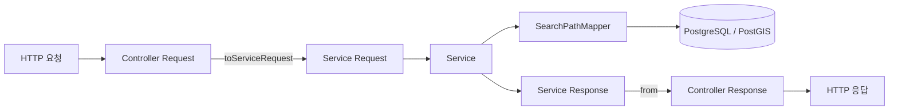
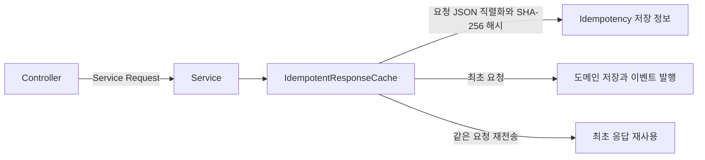

# 수색 경로 레이어 분리 리팩토링 설계

## 문서 목적

이 문서는 수색 경로 리팩토링을 진행하면서 확정한 기준을 기록한다. 작업 도중 같은 내용을 다시 해석하거나, 합의하지 않은 구조를 새로 적용하는 일을 막는 것이 목적이다.

이 문서는 Public API나 DB 계약을 새로 정의하지 않는다. 계약이 충돌하면 다음 기준 문서를 우선한다.

- Public API: `docs/api/api-spec.md`
- 도메인과 Lane 경계: `docs/spec/boundaries.md`
- DB 구조와 컬럼 의미: `docs/db-design/db-design-readable.md`
- 백엔드 패키지와 테스트 기준: `backend/AGENTS.md`

GitHub Issue를 작성할 때는 이 문서에서 확정한 선택과 변경 범위를 참고할 수 있다. 다만 문제를 발견한 과정과 문제라고 판단한 근거, 실제 테스트 결과는 Issue와 댓글에 별도로 기록한다.

## 현재 상태

수색 경로 코드는 `api`, `app`, `domain` 패키지로 나눠 정리했다. MyBatis는 별도의 Repository를 거치지 않고 `SearchPathMapper`가 `SearchPath`를 직접 저장하고 조회한다.

Controller DTO와 Service DTO를 분리했고, 멱등성 처리는 Service로 옮겼다. 세그먼트 수정 API는 `SearchPathController`에 합쳤으며 Android 앱용 Controller와 Service에는 `App`을 붙여 채널을 구분했다. 테스트는 Domain, Mapper, Service, Controller 네 종류로 정리했다.

## 목표

- Controller는 HTTP 요청과 응답만 다룬다.
- Service는 수색 경로 업무 로직과 트랜잭션을 다룬다.
- Controller DTO와 Service DTO를 분리한다.
- 멱등성 처리를 Service 경계로 옮긴다.
- Web API와 Android 앱 API는 채널별 Service를 유지하되, 처음부터 더 작은 Service로 나누지 않는다.
- 테스트 이름만 보고 어떤 레이어와 동작을 확인하는지 알 수 있게 한다.
- 외부 API URL, JSON 필드, 이벤트 이름, 오류 코드와 HTTP 상태는 바꾸지 않는다.

## 제외 범위

- MyBatis를 다른 영속성 기술로 교체하지 않는다.
- CQRS, 헥사고날 아키텍처, 별도 Use Case 계층을 도입하지 않는다.
- 모든 도메인 `record`를 한 번에 `class`로 바꾸지 않는다.
- DB 행과 모양이 다른 세그먼트, 제외 좌표, 생명주기 이벤트 객체는 이번 작업에서 억지로 합치지 않는다.
- 성능 개선이나 새로운 기능을 함께 넣지 않는다.

## 레이어 경계



| 구성 요소 | 책임 |
|---|---|
| Controller Request | JSON과 헤더 입력 수신, Bean Validation, Service Request 변환 |
| Service Request | Service 실행에 필요한 계정, 업무폰, 멱등성 키와 요청 값 전달 |
| Service | 권한에 필요한 정보 확인, 업무 규칙 실행, 트랜잭션과 멱등성 처리, 이벤트 발행 요청 |
| Mapper | MyBatis SQL 실행과 DB 결과 매핑 |
| Service Response | 도메인 객체와 조회 결과를 Service 반환 값으로 변환 |
| Controller Response | Service Response를 Public API JSON 형태로 변환 |

Controller는 Service DTO를 HTTP 응답으로 바로 내보내지 않는다. Service도 Controller DTO를 입력으로 받지 않는다.

## 채널별 구조

Web API와 Android 앱 API는 사용하는 기능과 접근 규칙이 다르므로 패키지와 Service를 분리한다. 공통 도메인 객체와 Mapper는 `domain/path`에서 함께 사용한다.

```text
api/controller/path
  SearchPathController
  request
  response

api/service/path
  SearchPathService
  request
  response

app/controller/path
  AppSearchPathController
  request
  response

app/service/path
  AppSearchPathService
  request
  response

domain/path
  SearchPath
  SearchPathMapper
  수색 경로 도메인 객체와 DB 매핑 객체
```

`api`와 `app`에 같은 이름의 `SearchPathService`를 두면 Spring Bean 이름이 겹칠 수 있다. 따라서 Android 앱용 Service는 `AppSearchPathService`를 유지한다. Controller도 같은 기준으로 `PathController`를 `AppSearchPathController`로 바꾼다.

## Service 분리 기준

기본은 채널별 `{Domain}Service` 하나다.

- Web API: `SearchPathService`
- Android 앱 API: `AppSearchPathService`

조회와 쓰기가 함께 있다는 이유만으로 `QueryService`와 `CommandService`를 미리 나누지 않는다. 다음과 같은 신호가 실제로 나타날 때만 별도 Service나 도메인 객체로 책임을 옮긴다.

- 하나의 메서드가 서로 다른 이유로 자주 변경되는 경우
- 서로 관계없는 의존성이 한 Service에 계속 늘어나는 경우
- 메서드마다 테스트 준비 방식이 크게 달라지는 경우
- 조회 성능을 바꾸는 작업이 쓰기 로직과 계속 충돌하는 경우
- 멱등성, 이벤트 저장, 재시도 같은 부수효과가 특정 기능에만 커지는 경우

애플리케이션 흐름을 따로 조율해야 하면 `{Domain}{Action}Service`처럼 책임이 드러나는 이름을 사용한다. 순수 계산이나 판단은 도메인 객체 또는 `Calculator`, `Policy`, `Validator`처럼 역할이 분명한 객체로 분리한다.

## DTO 기준

Controller DTO와 Service DTO는 모두 `class`로 작성한다. 기본 애노테이션은 다음과 같다.

- `@Getter`
- `@NoArgsConstructor`
- `@Builder`

`@Setter`는 사용하지 않는다. Controller Request는 `toServiceRequest(...)`로 변환하고, Controller Response는 `from(...)`으로 Service Response를 변환한다.

동작 이름은 한국어로 읽었을 때 대상이 먼저 보이도록 `수색 경로 + 동작` 순서를 사용한다.

| 동작 | 이름 기준 |
|---|---|
| 수색 경로 시작 | `SearchPathStart...` |
| 수색 경로 상태 변경 | `SearchPathStatusUpdate...` |
| 수색 경로 좌표 묶음 추가 | `SearchPathPointsAppend...` |
| 수색 경로 좌표 한 건 | `SearchPathPoint...` |
| 수색 경로 조회 | `SearchPathQuery...` |
| 수색 경로 세그먼트 수정 | `SearchPathSegmentCorrection...` |

Controller Request에는 `Request`, Service 입력에는 `ServiceRequest`를 붙인다. Controller Response와 Service Response는 각 패키지에서 역할을 구분하며, 변환 메서드로 경계를 드러낸다. 조회 결과의 하위 행은 `Row`를 사용한다.

외부 계약에 이미 쓰이는 `/api/search-paths/batch`, `APPEND_PATH_BATCH`, `PATH_APPENDED` 이름은 바꾸지 않는다. Java 클래스 이름을 읽기 쉽게 정리하더라도 Public API와 이벤트 계약은 그대로 유지한다.

## Controller 정리

- `SearchPathSegmentController`의 세그먼트 수정 API를 `SearchPathController`로 옮긴다.
- `SearchPathSegmentController`와 해당 테스트는 제거한다.
- Android 앱용 `PathController`는 `AppSearchPathController`로 이름을 바꾼다.
- Controller에 있는 fingerprint 생성, 임시 `Map`, 최초 응답 재사용 로직은 제거한다.
- Header와 인증 정보는 Controller에서 읽되, 업무 판단에 필요한 값은 Service Request에 담아 전달한다.

세그먼트는 수색 경로에 속한 정보다. 별도 Controller를 유지해야 할 독립된 API 경계가 없으므로 `SearchPathController`에서 함께 다룬다.

## 멱등성 처리

멱등성은 같은 요청이 여러 번 도착해도 DB 변경을 한 번만 실행하고 최초 응답을 다시 돌려주는 기능이다. Android 앱은 네트워크가 복구될 때 같은 현장 기록을 다시 보낼 수 있으므로 Service의 쓰기 작업에서 처리한다.



- Controller는 멱등성 키 누락 여부만 HTTP 입력 단계에서 확인할 수 있다.
- Service Request에 `accountId`, `policePhoneId`, `Idempotency-Key`를 담는다.
- Service의 쓰기 메서드에 `@Transactional`을 적용한다.
- `IdempotentResponseCache`가 Service Request를 JSON으로 직렬화하고 SHA-256 해시를 만든다.
- DTO의 기본 `toString()` 결과를 요청 해시로 사용하지 않는다.
- `accountId`는 사람을 식별한다. `policePhoneId`는 업무폰과 이벤트 전송 맥락을 기록하는 값이다.
- 기존 오류 코드와 HTTP 상태는 유지한다.

## 제거하거나 유지할 객체

### 제거

- `SearchPathSegmentController`
- `SearchPathSegmentControllerTest`
- `HeaderParsers`
- `EndSearchPathServiceRequest`
- `SegmentCorrectionResult`
- `LineStringGeometryJsonConverter`
- `LineStringCoordinatesDeserializer`
- `NoopPathEventPublisher`
- `SearchPathSegmentPersistenceRecord`
- `SearchPathSegmentReadRecord`
- `SearchPathExcludedPointPersistenceRecord`
- `SearchPathExcludedPointReadRecord`
- `SearchPathLifecycleEventPersistenceRecord`
- `SearchPathLifecycleEventReadRecord`

### 유지

- `PathEventPublisher`
- `SearchPathEventPublisher`
- `PathServiceConfig`

수색 경로 세그먼트, 제외 좌표, 생명주기 이벤트는 각각 하나의 도메인 `class`로 표현한다. MyBatis Mapper는 이 객체를 직접 저장하고 조회한다.

## 테스트 기준

수색 경로 테스트는 다음 네 종류로 나눈다.

| 테스트 | 실행 환경 | 확인할 내용 |
|---|---|---|
| Domain Test | Spring을 띄우지 않는 단위 테스트 | 계산, 상태 변경, 값 검증 |
| `SearchPathMapperTest` | `@SpringBootTest` | 실제 MyBatis SQL, PostgreSQL/PostGIS, 결과 매핑 |
| `SearchPathServiceTest`, `AppSearchPathServiceTest` | `@SpringBootTest` | 실제 Mapper와 DB를 사용한 업무 로직, 트랜잭션, 멱등성, 이벤트 저장 |
| `SearchPathControllerTest`, `AppSearchPathControllerTest` | `@WebMvcTest` | HTTP 요청과 응답, 헤더, 입력 검증, 상태 코드, 오류 응답 |

추가 기준은 다음과 같다.

- Controller Test에서만 `@MockitoBean`으로 Service를 대체한다.
- Service Test는 Controller를 직접 호출하지 않는다.
- Service Test에서 Mapper나 DB를 Fake 또는 Mock으로 바꾸지 않는다.
- Mapper Test는 Service를 호출하지 않는다.
- 공통 DB 데이터는 Spring `@Sql`과 `search-path-context.sql`, `search-path-other-phone.sql`로 준비한다.
- 테스트 이름에 `Red`, `RED`, `Failing`처럼 TDD 작업 단계를 남기지 않는다.
- `ContractTest`, `HarnessRunner` 같은 별도 분류를 만들지 않는다.
- 같은 동작을 여러 레이어에서 중복해서 확인하면 각 레이어의 책임만 남기고 정리한다.

## 완료 판단 기준

- Controller가 Service Request로 변환한 뒤 Service만 호출한다.
- Service가 Controller 패키지의 DTO를 import하지 않는다.
- Controller에 멱등성 응답 저장용 `Map`과 fingerprint 생성 코드가 남아 있지 않다.
- 세그먼트 수정 API가 `SearchPathController`에서 기존 URL과 응답 계약대로 동작한다.
- Android 앱용 Controller와 테스트 이름이 `AppSearchPathController`로 정리된다.
- Mapper Test, Service Test, Controller Test가 정한 범위대로 실행된다.
- 변경한 Java 파일의 Spotless 검사와 전체 Backend 테스트가 통과한다.

## GitHub Issue에서 참고하는 방법

이 문서는 Issue의 다음 부분을 작성할 때 참고한다.

- `원인 분석과 선택지`: Controller DTO와 Service DTO를 분리한 이유, Service를 미리 더 나누지 않은 이유
- `변경 내용과 트레이드오프`: Controller 병합, 멱등성 이동, 테스트 재분류와 제외 범위
- 변경 범위 확인: 외부 API와 이벤트 계약을 유지했는지 확인

다음 내용은 이 문서만 보고 작성하지 않는다.

- 문제를 처음 발견한 코드, 테스트, 로그 또는 사용자 행동
- 왜 지금 고쳐야 하는지 판단한 기준과 실제 영향
- 실행한 명령, 테스트 결과, API 응답, DB 행과 측정값

구현이 끝난 뒤에는 실제로 실행한 명령과 결과를 GitHub Issue 댓글에 남긴다. 문서에 적힌 계획을 실행한 것처럼 표현하지 않는다.
