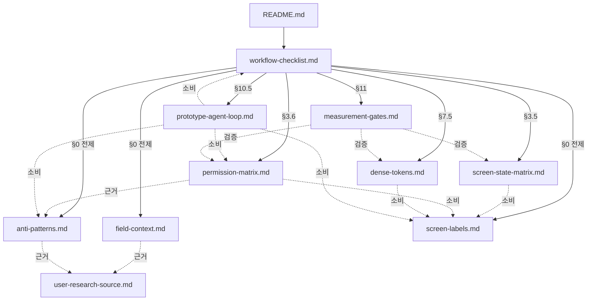

# Suri-Map 화면 설계 문서

상태: 초안. 이 디렉토리는 Suri-Map의 화면 설계와 디자인 시스템을 결정·검증하기 위한 문서를 모은다.

## 디렉토리 진입점

이 README가 진입점이다. 처음 합류한 사람은 아래 순서로 읽는다.

1. 이 파일 (구조와 의존 관계 파악)
2. [screen-design-workflow-checklist.md](./screen-design-workflow-checklist.md) (전체 작업 순서)
3. §0 전제로 등록된 부속 문서들 — `field-context.md`, `anti-patterns.md`, `screen-labels.md`
4. 자기 작업 단계의 부속 문서

## 문서 목록

| 파일 | 성격 | 역할 | 1차 결정 상태 |
|---|---|---|---|
| `README.md` | 진입점 | 디렉토리 개요, 의존 그래프, 읽는 순서 | — |
| `screen-design-workflow-checklist.md` | 워크플로우 | 화면 설계 단계와 체크 항목 | 완료 |
| `field-context.md` | 참조 | 현장 사용 맥락(야외/장갑/무전기/야간) 전제 + 정보 밀도 1차 산정 | 완료 (광주 baseline freeze) |
| `anti-patterns.md` | 참조 | 시각 anti-pattern 카탈로그와 실수 사례 로그 | 완료 |
| `screen-state-matrix.md` | 매트릭스 | 화면 × 상태 정의 + slot 매핑 | 우선순위 1~5 셀 정의 완료 / 6~9는 high-fi 단계 |
| `permission-matrix.md` | 매트릭스 | 권한 × 화면 액션 가시성 (PRD §8.4 정렬) | 완료 (§6 결정 사항 4건 박힘) |
| `screen-labels.md` | 참조 | UI 라벨 표기 규칙 (PRD 도메인 용어와 분리) | 완료 |
| `dense-tokens.md` | 명세 | KRDS-Ops dense variant 토큰 (KRDS base + 도메인 컬러 + 다크 폴리폰) | 완료 (high-fi 검증 필요) |
| `measurement-gates.md` | 검증 | 정량 측정 가능한 검수 게이트 G1~G6 | 완료 |
| `prototype-agent-loop.md` | 프로세스 | 프로토타입 생성 agent 루프와 프롬프트 골격 + 산출물 명명 | 완료 |
| `user-research-source.md` | 참조 | 인터뷰·관찰 자료 누적 (시연 baseline은 freeze, v2용) | 정책 freeze |
| `wireframes.md` | 명세 | 계약 기준 화면 IA 텍스트 명세 | 3차 완료 |
| `artifacts/lo/` | Low-fi mock | Hero 3개 HTML mock + 폴리폰 low-fi 화면 묶음 | 폴리폰 1차 완료 |

## 의존 그래프

실선: 체크리스트가 그 단계에서 참조하는 문서.
점선: 부속 문서 간 인용 관계.

## 변경 시 영향 표

한 문서를 수정하면 같이 봐야 할 문서.

| 수정한 문서 | 같이 볼 문서 |
|---|---|
| `screen-design-workflow-checklist.md` | 영향 받는 모든 부속 문서 (그래프 참조) |
| `field-context.md` | `anti-patterns.md`, `dense-tokens.md`, `measurement-gates.md` |
| `anti-patterns.md` | `prototype-agent-loop.md` (negative example로 사용), `screen-state-matrix.md` |
| `screen-state-matrix.md` | `measurement-gates.md`, `screen-labels.md` |
| `permission-matrix.md` | `measurement-gates.md` (G6-6), `prototype-agent-loop.md`, `anti-patterns.md` (§1.6.3, §1.6.6) |
| `screen-labels.md` | 모든 화면 산출물, `dense-tokens.md` (라벨 길이로 토큰 영향) |
| `dense-tokens.md` | `measurement-gates.md` (정보 밀도 게이트), `screen-state-matrix.md` |
| `measurement-gates.md` | `field-context.md` (게이트 기준), `dense-tokens.md` |
| `prototype-agent-loop.md` | `screen-design-workflow-checklist.md` §10/§10.5 |
| `user-research-source.md` | `field-context.md`, `anti-patterns.md` (출처 추적) |

## 디자인 시스템 조합 (한 줄 요약)

**KRDS** (base, 범정부 공통가이드) + **KRDS-Ops dense variant** (fork, 운영 dashboard·rugged field UI) + **네이버 지도** (지도 조작 패턴만 borrow) + **한국 경찰 도메인** (차량/도보 구간, 5종 마커, OP/DutyShift, 폴리폰 freshness 등 적용).

자세한 토큰은 [dense-tokens.md](./dense-tokens.md) 참조.

## 화면 산출물 정책 (Hero + Wireframe)

5주 MVP 일정에서 모든 화면을 바로 HTML mock으로 만드는 건 비현실적. 베스트 프랙티스:

- **Hero 3개**: 정체성·핵심 패턴 검증을 위한 HTML mock (현재 승인 후보 + variants + review)
  - `artifacts/lo/lo-web-situation-board-main-v1.3.html` (정보 dense dashboard)
  - `artifacts/lo/lo-polifon-search-map-v1.html` (rugged field UI)
  - `artifacts/lo/lo-polifon-marker-bottomsheet-v1.html` (빠른 입력)
- **폴리폰 나머지 화면**: `artifacts/lo/lo-polifon-wireframes-v1.html`에서 링크되는 HTML low-fi (P1 인증 — 관리 폴리폰 자동 확인 / P2 사건 선택 + P7 종료 다이얼로그 / P3 오프라인 패키지 / P4 미전송 진단 — 진입 = 처리 불가 toast 탭 / P5 alert variant 카탈로그 / P6-A 이전 근무 확인 / P6-B 인수인계 메모 / P8 강조 알림 / P9 마커 상세). 카탈로그 정리(2026-05-11): P1-A·P1-C ID/PW·바인딩 / P7 단독 / P10 권한 거부 화면은 Knox 관리 단말 운영에서 정상 사용자가 마주칠 일이 없거나 다른 화면에 흡수되어 카탈로그에서 제외.
- **Web 나머지 화면**: [wireframes.md](./wireframes.md) 텍스트 IA 명세 유지 (각 화면 5-15줄, 재사용 컴포넌트 명시)
- **High-fi**: 본 개발 진행하면서 필요해지면 KRDS-Ops 토큰 적용. 디자이너 또는 후속 단계
- **인터랙티브 프로토타입**: `artifacts/proto/index.html` — PRD §5.1 12단계 → 핵심 7단계 시연 흐름. localStorage 상태 공유.

진행 순서는 **기준 문서 → wireframes.md → 필요한 low-fi HTML → 본 개발**이다. 화면 설계 완료 후 본 개발 시작. 본 개발 중 화면 정교화 필요 시 그때 HTML mock 또는 Figma high-fi.

### 산출물 보관 정책

- 같은 화면의 HTML mock은 작업 디렉토리에 **최신 승인 후보 1개 + review 1개**만 유지한다.
- 이전 시도(v1, v1.1, v1.2 등)는 Git 이력으로 추적하고, 별도 파일로 누적 보관하지 않는다.
- 검수 중 임시 버전은 만들 수 있지만, handoff 전에는 최신 파일명만 남긴다.

## 외부 참조

- 상위 제품 문서: [docs/prd.md](../prd.md), [docs/architecture.md](../architecture.md), [docs/adr.md](../adr.md)
- Spec 기준 (정합성 1차 기준): [docs/spec/boundaries.md](../spec/boundaries.md), [docs/spec/harness-scenarios.md](../spec/harness-scenarios.md)
  - 화면 설계 결정은 PRD 도메인 정의와 spec 계약(`board_shell_slots`, SC-01~SC-12 시나리오)과 정렬되어야 한다.
- KRDS 출처: 프로젝트 루트의 `Korean Government UIUX Design System/` (한국 경찰 도메인 → 범정부 UI/UX 공통가이드 참고 가치 있음). 이 디렉토리의 `dense-tokens.md`는 KRDS를 base로 한 ops fork를 정의한다.
- 코드 작업용 agent loop는 별개 문서: [docs/tasks/agent-loop-guide.md](../tasks/agent-loop-guide.md), [docs/tasks/recommendations.md](../tasks/recommendations.md)

## 핵심 도메인 사실 (자주 틀리는 부분)

화면 설계 시 자주 잘못 가정되는 부분. 이 디렉토리의 모든 문서는 아래 사실에 정렬되어야 한다.

| 사실 | 근거 | 자주 하는 잘못 |
|---|---|---|
| 1팀 6명이 **팀 폴리폰 1대**를 공유 (개인당 폰 아님) | PRD FR-33, §8.4 | 폴리폰 수를 인원 수와 동일하게 가정 |
| OP는 **재수색·범위 변경 단위** (`RE_SEARCH`/`AREA_CHANGED`/`OTHER`). 인수인계 단위가 아님 | PRD FR-12, ADR-0029 | OP를 시프트/인수인계 단위로 오해 |
| 인수인계·근무 교대는 **`DutyShift`** | PRD FR-32, FR-33 | OP에 인수인계 의미 부여 |
| 현장 마커 생성은 **모든 계정** (앱 전용). 마커 수정·삭제만 권한 차등 (간부=모든 마커, 대원=자기 계정 생성분만) | PRD §8.4 권한 매트릭스 | 마커 생성을 일부 계정으로 제한 |
| 사건 가져오기 권한은 **실종팀 간부 + 지구대/파출소 팀장·당직자** (지원 부서 간부 아님) | PRD §8.4 | 지원 부서 간부도 사건 가져온다고 가정 |
| 수색 구역은 **OVERALL → UNIT → TEAM** 3계층. 실종팀이 OVERALL 그림 → UNIT 분할해 부대 배정 → 부대가 TEAM 분할해 팀 배정 | PRD §6.1, SC-04, ADR-0026 | OVERALL 안에 TEAM만 평면적으로 그림 / OVERALL을 mock에서 받는다고 가정 |
| 폴리폰에서 웹 상황판 접근 **불가** (데스크톱 전용) | PRD §8.8 | 폴리폰에서도 상황판 봄 |
| OP는 사건당 자동 OP1 + 수동 OP2~. 동시 활성 OP는 **1개** | PRD FR-32 | 여러 OP 동시 활성 |

상세는 PRD §0.1 용어, §8.4 권한 매트릭스 참조.
